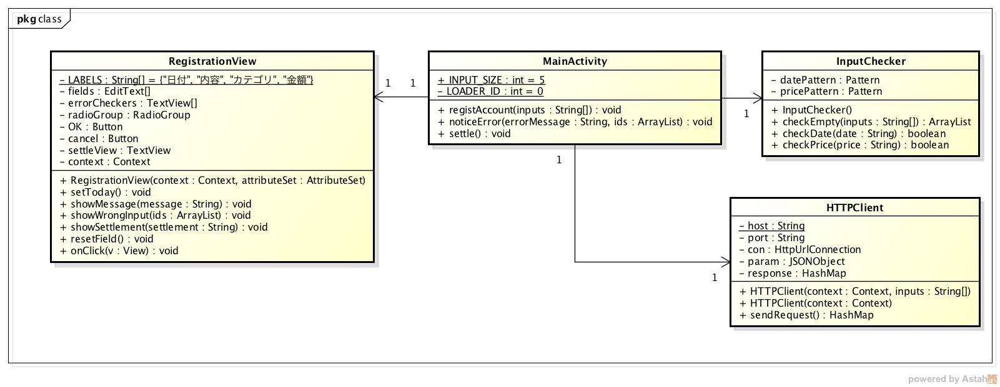
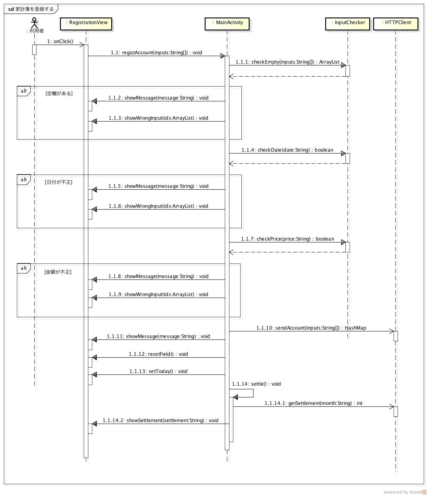

設計仕様
========

設計仕様では以下を定義する

- `モジュール構成 <http://localhost/adhafera_docs/design_spec.html#id2>`__
- `処理手順 <http://localhost/adhafera_docs/design_spec.html#id3>`__

モジュール構成
--------------

*クラス図*

- MVCモデルを利用する

- Model

  - データベースに登録するため本モジュールにはモデルは存在しない

- View

  - RegistrationView

    - 家計簿情報を入力する画面を表すクラス

- Controller

  - MainActivity

    - 画面の表示に関する処理を管理するコントローラ

- InputChecker

  - 正しく入力されているかをチェックするクラス
  - 全項目が入力されているかをチェックする
  - 日付，金額が正しく入力されているかをチェックする

- HTTPClient

  - データベースサーバへ家計簿情報を送信するクラス

処理手順
--------

- `家計簿を登録する <http://localhost/adhafera_docs/design_spec.html#id4>`__

家計簿を登録する
^^^^^^^^^^^^^^^^

1. 利用者が家計簿情報を入力して登録ボタンを押すと，onClickメソッドが実行される
2. registAccountメソッドを実行して受け取った家計簿情報を処理する
3. checkEmptyメソッドで空欄のチェックを行う
4. checkDateメソッドで日付のフォーマットのチェックを行う
5. checkPriceメソッドで金額のチェックを行う
6. 入力情報に問題が無ければ，sendAccountメソッドで家計簿情報を送信する
7. 送信結果が返ると，noticeResultメソッドで結果を表示する
8. showMessageメソッドで登録結果を利用者に通知する
