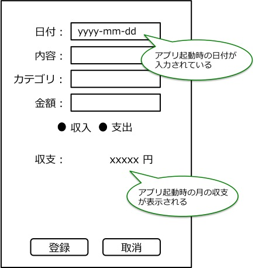
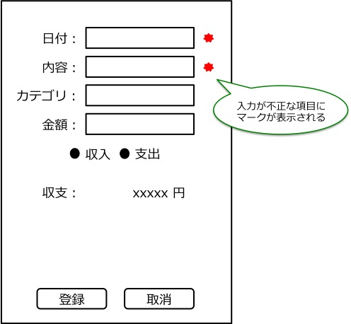

機能仕様
========

機能仕様では以下を定義する

- :ref:`ext-resource`
- :ref:`ext-ui`

.. _ext-resource:

データ構造
----------

本モジュールでは以下のデータを扱う

- :ref:`ext-resource-payment`

.. _ext-resource-payment

家計簿
^^^^^^

- 買い物などで発生した所持金の増減を表す

構成要素
""""""""

.. csv-table::
   :header: "要素", "意味"
   :widths: 10, 30

   "日付", "所持金の増減があった日時"
   "内容", "所持金の増減があった理由など"
   "カテゴリ", "費目（例：食費，水道光熱費）"
   "金額", "所持金の増減"

.. _ext-ui:

ユーザーインターフェース
------------------------

利用者はアプリを操作して家計簿情報を入力する

- 画面には以下が表示されている

  - 日付，内容，カテゴリ，金額の入力欄
  - 収支/支出選択ボタン
  - アプリ起動時の月の収支
  - 登録，取消ボタン

登録画面
^^^^^^^^

|

- 画面上部に家計簿情報を入力するテキストボックスが表示される

  - 日付入力欄にはアプリ起動時の日付が入力されている

- 収入/支出ボタンの下に収支が表示される

- 家計簿情報を全て入力して登録ボタンを押すと家計簿が登録される

- 入力をキャンセルしたい場合は取消ボタンを押す

登録成功時
^^^^^^^^^^

|

.. image:: images/interface_success.jpg
   :alt: 登録成功時

- 日付以外の入力が削除され，日付入力欄にはアプリ起動時の日付が入力されている

- 登録した家計簿を含めた収支が再計算されて表示される

登録失敗時
^^^^^^^^^^

|

- 入力が不正な項目にはテキストボックスの右に赤いマークが表示される
