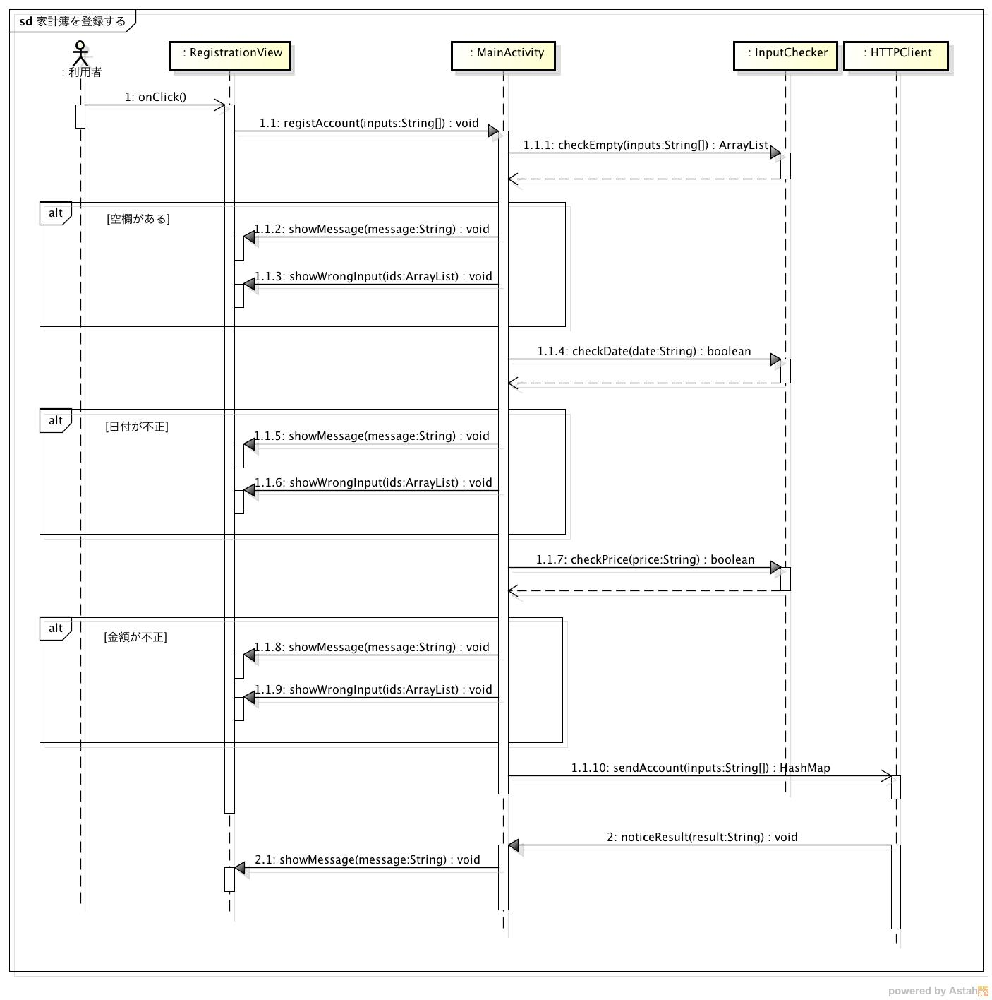
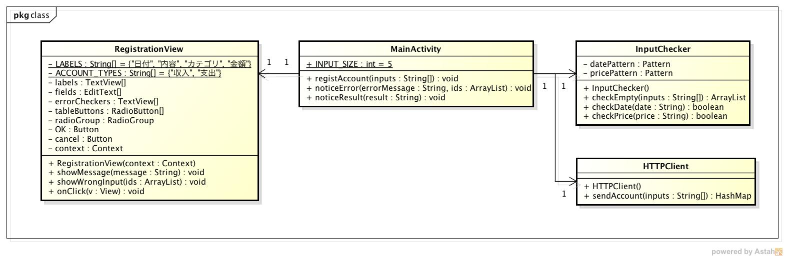

詳細仕様
========

- システムの詳細な振る舞いと構造を記載する

  - `振る舞い <http://localhost/adhafera_docs/register/internal.html#id2>`__
  - `構造 <http://localhost/adhafera_docs/register/internal.html#id4>`__

振る舞い
--------

- `家計簿を登録する <http://localhost/adhafera_docs/register/internal.html#id3>`__

家計簿を登録する
^^^^^^^^^^^^^^^^

**シーケンス図**

- 利用者が登録画面を開いてから家計簿を登録するまでの流れ

  1. 利用者が家計簿情報を入力して登録ボタンを押すと，onClickメソッドが実行される
  2. registAccountメソッドを実行して受け取った家計簿情報を処理する
  3. checkEmptyメソッドで空欄のチェックを行う
  4. checkDateメソッドで日付のフォーマットのチェックを行う
  5. checkPriceメソッドで金額のチェックを行う
  6. 入力情報に問題が無ければ，sendAccountメソッドで家計簿情報を送信する
  7. 送信結果が返ると，noticeResultメソッドで結果を表示する
  8. showMessageメソッドで登録結果を利用者に通知する

構造
----

**クラス図**

- MVCモデルを利用する

- Model

  - データベースに登録するため本モジュールにはモデルは存在しない

- View

  - RegistrationView

    - 家計簿情報を入力する画面を表すクラス

- Controller

  - MainActivity

    - 画面の表示に関する処理を管理するコントローラ

- InputChecker

  - 正しく入力されているかをチェックするクラス
  - 全項目が入力されているかをチェックする
  - 日付，金額が正しく入力されているかをチェックする

- HTTPClient

  - データベースサーバへ家計簿情報を送信するクラス
