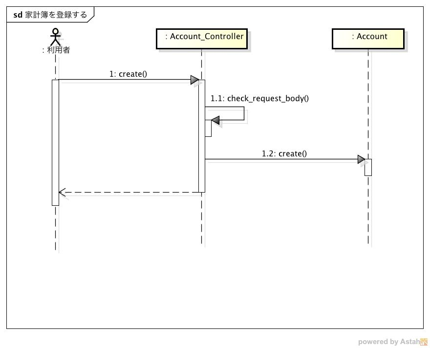
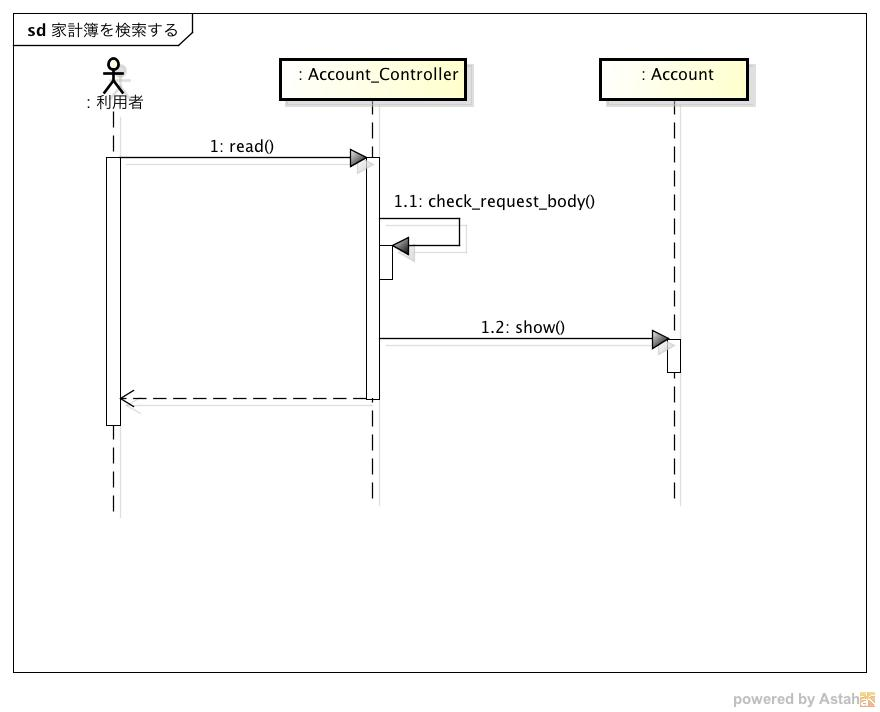
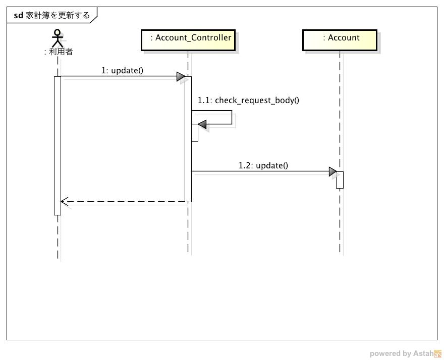
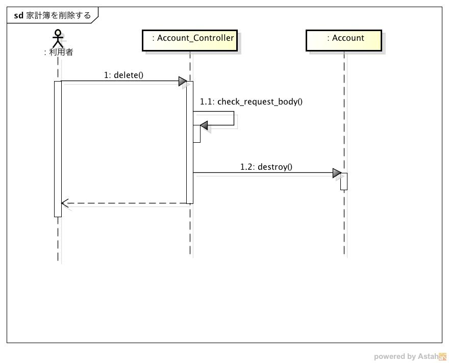
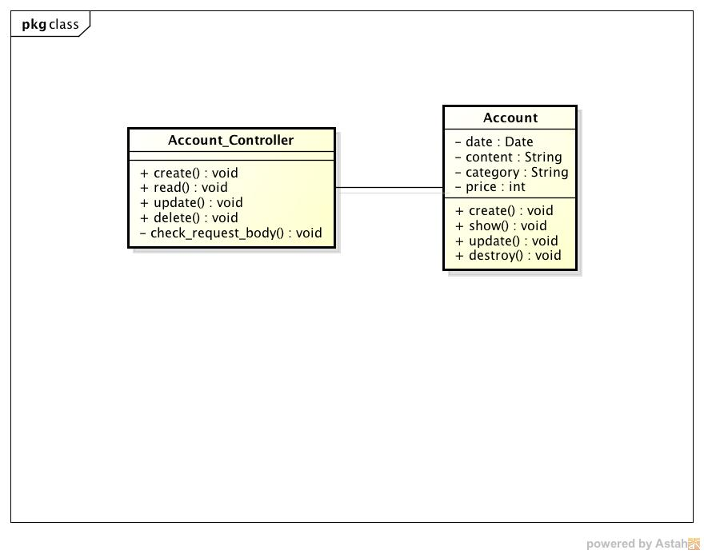

内部設計仕様
============

シーケンス
----------

家計簿を登録する
^^^^^^^^^^^^^^^^

1. Viewer, Registerからのリクエストを受信すると，Account_Controllerクラスのcreateメソッドが実行される
2. check_request_bodyメソッドで入力のチェックを行う
3. check_request_bodyの返り値に基づいて，以下の処理を実行する

   - trueの場合

     3-1. Accountクラスのcreateメソッドを実行して家計簿を登録する

     3-2. Viewer, Registerにステータスコード201を送信する

   - falseの場合

     3-1. Viewer, Registerにステータスコード400を送信する

家計簿を検索する
^^^^^^^^^^^^^^^^

1. Viewerからのリクエストを受信すると，Account_Controllerクラスのreadメソッドが実行される
2. check_request_bodyメソッドで入力のチェックを行う
3. check_request_bodyの返り値に基づいて，以下の処理を実行する

   - trueの場合

     3-1. Accountクラスのshowメソッドを実行して家計簿を取得する

     3-2. Viewerに検索結果とステータスコード200を送信する

   - falseの場合

     3-1. Viewerにステータスコード400を送信する

家計簿を更新する
^^^^^^^^^^^^^^^^

1. Viewerからのリクエストを受信すると，Account_Controllerクラスのupdateメソッドが実行される
2. check_request_bodyメソッドで入力のチェックを行う
3. check_request_bodyの返り値に基づいて，以下の処理を実行する

   - trueの場合

     3-1. Accountクラスのupdateメソッドを実行して家計簿を更新する

     3-2. Viewerに更新結果とステータスコード200を送信する

   - falseの場合

     3-1. Viewerにステータスコード400を送信する

家計簿を削除する
^^^^^^^^^^^^^^^^

1. Viewerからのリクエストを受信すると，Account_Controllerクラスのdeleteメソッドが実行される
2. check_request_bodyメソッドで入力のチェックを行う
3. check_request_bodyの返り値に基づいて，以下の処理を実行する

   - trueの場合

     3-1. Accountクラスのdestroyメソッドを実行して家計簿を削除する

     3-2. Viewerにステータスコード204を送信する

   - falseの場合

     3-1. Viewerにステータスコード400を送信する

クラス
------

- Account_Controller: リクエストを処理するコントローラ
  - create: 家計簿を登録するメソッド
  - read: 家計簿を検索するメソッド
  - update: 家計簿を更新するメソッド
  - delete: 家計簿を削除するメソッド
  - check_request_body: リクエストのボディやクエリをチェックするメソッド

- Account: expenseテーブル，incomeテーブルを操作するモデル
  - create: レコードを登録するメソッド
  - show: レコードを取得するメソッド
  - update: レコードを更新するメソッド
  - destroy: レコードを削除するメソッド
