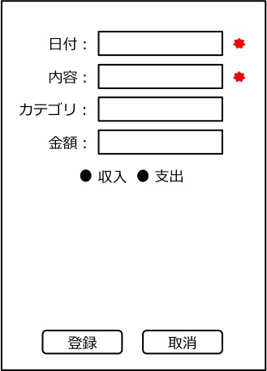

ユーザインターフェース
======================

- 外部インターフェースであるアプリ画面での表示について記載する

アプリ画面
----------

- `登録画面 <http://localhost/adhafera_docs/register/interface.html#id3>`__
- `登録失敗時 <http://localhost/adhafera_docs/register/interface.html#id4>`__

登録画面
^^^^^^^^

.. image:: images/interface.jpg
   :alt: 登録画面

**機能**

- 画面上部に家計簿情報を入力するテキストボックスが表示される

- 家計簿情報を全て入力して登録ボタンを押すと家計簿が登録される

- 入力をキャンセルしたい場合は取消ボタンを押す

登録失敗時
^^^^^^^^^^

- 入力が不正な項目にはテキストボックスの右に赤いマークが表示される
