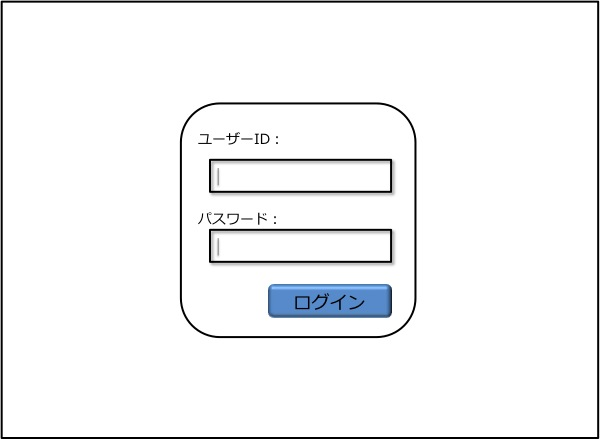
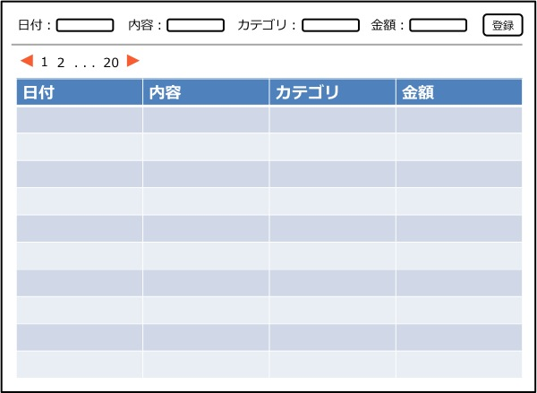
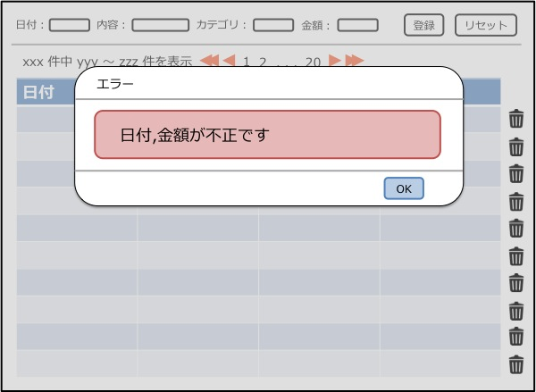

機能仕様
========

機能仕様では以下を定義する

- :ref:`alg-ext-resource`
- :ref:`alg-ext-ui`
- :ref:`alg-ext-api`

.. _alg-ext-resource:

リソース
--------

本システムでは以下のリソースを扱う

- :ref:`alg-ext-resource-user`
- :ref:`alg-ext-resource-application`
- :ref:`alg-ext-resource-payment`
- :ref:`alg-ext-resource-category`

.. _alg-ext-resource-user:

ユーザーリソース
^^^^^^^^^^^^^^^^

本アプリの利用者を表す

.. csv-table::
   :header: "属性名", "型", "意味", "フォーマット", "備考"
   :widths: 10, 10, 20, 20, 40

   "ユーザーID", "文字列(string)", "ユーザーを識別する文字列", "半角英数字",
   "パスワード", "文字列(string)", "ユーザー認証を行うための鍵", "半角英数字",

.. _alg-ext-resource-application:

アプリリソース
^^^^^^^^^^^^^^

本アプリを利用するアプリを表す

.. csv-table::
   :header: "属性名", "型", "意味", "フォーマット", "備考"
   :widths: 10, 10, 20, 20, 40

   "アプリID", "文字列(string)", "アプリを識別する文字列", "- 16文字
   - 半角英数字", "本アプリによって発行される"
   "アプリキー", "文字列(string)", "アプリが持つ秘密鍵", "- 16文字
   - 半角英数字", "本アプリによって発行される"

.. _alg-ext-resource-payment:

収支リソース
^^^^^^^^^^^^

所持金の増減を表す

.. csv-table::
   :header: "入力項目", "型", "意味", "フォーマット", "備考"
   :widths: 10, 10, 20, 20, 40

   "種類", "文字列(string)", "収入, 支出を表す文字列", "``income`` または ``expense``",
   "日付", "文字列(string)", "所持金の増減があった日時", "yyyy-mm-dd",
   "内容", "文字列(string)", "所持金の増減があった理由など", "任意の文字列",
   "カテゴリ", ":ref:`alg-ext-resource-category`", "カテゴリリソースの名前", "任意の文字列",
   "金額", "自然数(integer)", "所持金の増減量", "半角数字",

.. _alg-ext-resource-category:

カテゴリリソース
^^^^^^^^^^^^^^^^

収支のカテゴリを表す

.. csv-table::
   :header: "入力項目", "型", "意味", "フォーマット", "備考"
   :widths: 10, 10, 20, 20, 40

   "名前", "文字列(string)", "費目（例：食費，水道光熱費）", "任意の文字列",
   "意味", "文字列(string)", "どのような収支情報が分類されるかを表す", "任意の文字列",

.. _alg-ext-ui:

ユーザーインターフェース
------------------------

利用者はブラウザから収支の登録や確認を行うことができる

認証画面
^^^^^^^^

- 画面中央部に入力フォームが表示される
- ユーザーID, パスワードを入力して、ログインボタンを押すと認証が行われる
- 認証に成功すると管理画面に遷移する

管理画面
^^^^^^^^

- 画面の上部に登録用の入力フォームが表示される
- リセットボタンを押すと，入力フォームが全て空欄になる
- 入力フォームの下には表形式で収支の一覧が表示される
- 収支情報はページングされており，全件数と下記ページへのリンクが表示されている

  - 先頭ページ
  - 最終ページ
  - 次ページ
  - 前ページ
  - 表示中のページから前後4ページ

- 最新の収支から順番に表示される
- 1ページ50件の収支が表示される
- 収支情報の右側にあるボタンを押すと、対応する収支情報が削除される

管理画面（登録失敗時）
^^^^^^^^^^^^^^^^^^^^^^

- 登録失敗時，失敗した入力項目をポップアップで通知する

.. _alg-ext-api:

Web API
-------

以下のAPIを定義する

.. toctree::
   :maxdepth: 1

   apis/payment
   apis/category

共通定義
^^^^^^^^

.. _alg-ext-api-common-error:

エラーコード
""""""""""""

.. csv-table::
   :header: "エラーコード", "ステータスコード", "意味"

   "absent_param_[属性]", "400", "入力必須の項目がない"
   "invalid_param_[属性]", "400", "不正値のパラメータがある"
