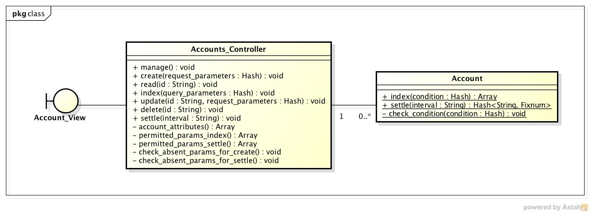
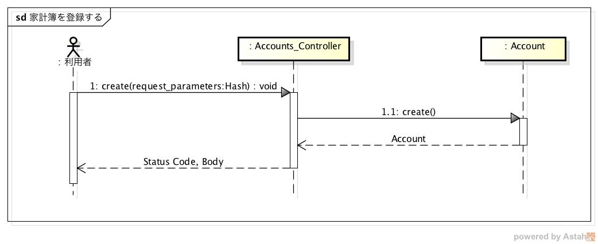
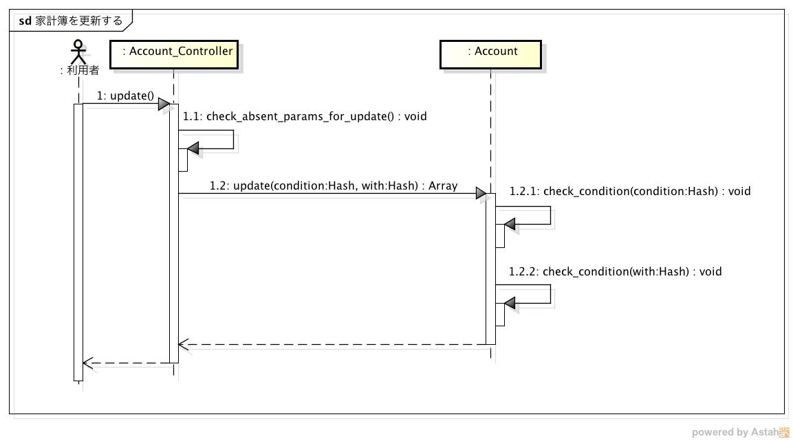
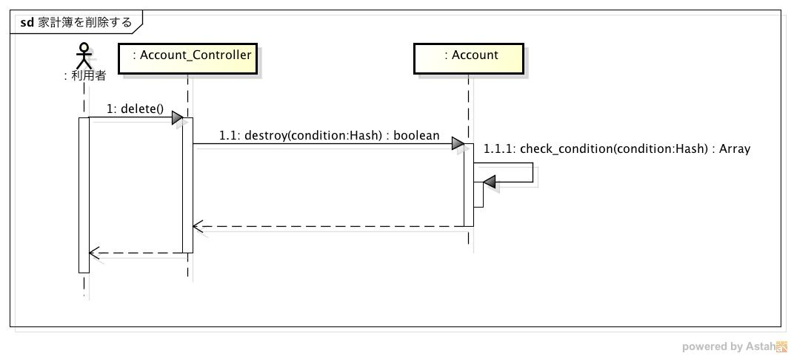
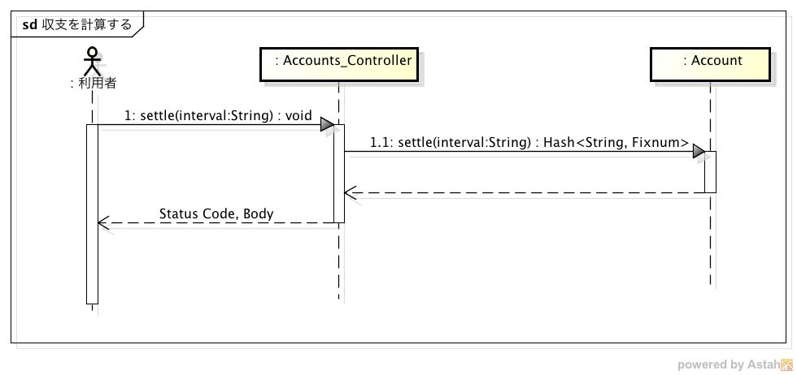

設計仕様
========

設計仕様では以下を定義する

- `モジュール構成 <http://localhost/algieba_docs/design_spec.html#id2>`__
- `処理手順 <http://localhost/algieba_docs/design_spec.html#id3>`__
- `データベース構成 <http://localhost/algieba_docs/design_spec.html#id9>`__

モジュール構成
--------------

MVCモデルを利用する

*クラス図*

- Model

  - Account: Accountsテーブルを操作するモデル

    - show: レコードを取得するメソッド
    - update: レコードを更新するメソッド
    - destroy: レコードを削除するメソッド
    - settle: 収支を計算するメソッド
    - check_condition: 家計簿の検索条件をチェックするメソッド

- View

  - Account_View: 家計簿の登録や表示を行うビュー

    - 利用者がhttp://<ホスト名>/accountsにアクセスすることで表示される

- Controller

  - Accounts_Controller: リクエストを処理するコントローラ

    - create: 家計簿を登録するメソッド
    - read: 家計簿を検索するメソッド
    - update: 家計簿を更新するメソッド
    - delete: 家計簿を削除するメソッド
    - settle: 収支を計算するメソッド

処理手順
--------

- `家計簿を登録する <http://localhost/algieba_docs/design_spec.html#id4>`__
- `家計簿を取得する <http://localhost/algieba_docs/design_spec.html#id5>`__
- `家計簿を更新する <http://localhost/algieba_docs/design_spec.html#id6>`__
- `家計簿を削除する <http://localhost/algieba_docs/design_spec.html#id7>`__
- `収支を見る <http://localhost/algieba_docs/design_spec.html#id8>`__

家計簿を登録する
^^^^^^^^^^^^^^^^

1. Viewer, Registerからのリクエストを受信すると，Accounts_Controllerクラスのcreateメソッドを実行する
2. Accountクラスのcreateメソッドを実行して家計簿を登録する
3. createメソッドの実行結果に基づいてそれぞれ以下の処理を行う

   - Accountクラスのインスタンスを取得した場合

     3-1. Viewer, Registerにステータスコード201を送信する

   - 例外が発生した場合

     3-1. Viewer, Registerにエラーコードとステータスコード400を送信する

家計簿を検索する
^^^^^^^^^^^^^^^^

.. image:: images/seq_read.jpg

1. Viewerからのリクエストを受信すると，Accounts_Controllerクラスのreadメソッドを実行する
2. Accountクラスのshowメソッドをパラメータを引数にして実行する
3. check_conditionを実行し，その結果に基づいてそれぞれ以下の処理を行う

   - 空配列の場合

     3-1. whereメソッドを実行して家計簿を取得する

     3-2. Viewerに検索結果とステータスコード200を送信する

   - 空配列でない場合（不正なパラメータがある場合）

     3-1. Viewerにエラーコードとステータスコード400を送信する

家計簿を更新する
^^^^^^^^^^^^^^^^

1. Viewerからのリクエストを受信すると，Accounts_Controllerクラスのupdateメソッドを実行する
2. Accountクラスのupdateメソッドをパラメータを引数にして実行する
3. check_conditionを実行し，その結果に基づいてそれぞれ以下の処理を行う

   - 空配列の場合

     3-1. whereメソッドを実行して家計簿を取得する

     3-2. 取得した家計簿それぞれに対して，updateメソッドを実行して家計簿を更新する

     3-3. Viewerに更新結果とステータスコード200を送信する

   - 空配列でない場合（不正なパラメータがある場合）

     3-1. Viewerにエラーコードとステータスコード400を送信する

家計簿を削除する
^^^^^^^^^^^^^^^^

1. Viewerからのリクエストを受信すると，Accounts_Controllerクラスのdeleteメソッドを実行する
2. Accountクラスのdestroyメソッドをパラメータを引数にして実行する
3. check_conditionを実行し，その結果に基づいてそれぞれ以下の処理を行う

   - 空配列の場合

     3-1. whereメソッドを実行して家計簿を取得する

     3-2. 取得した家計簿それぞれに対して，deleteメソッドを実行して家計簿を削除する

     3-3. Viewerにステータスコード204を送信する

   - 空配列でない場合（不正なパラメータがある場合）

     3-1. Viewerにエラーコードとステータスコード400を送信する

収支を見る
^^^^^^^^^^

1. Viewerからのリクエストを受信すると，Accounts_Controllerクラスのsettleメソッドが実行される
2. パラメータ"interval"をチェックし，その結果に基づいてそれぞれ以下の処理を行う

   - daily or monthly or yearlyの場合

     3-1. intervalに従って収支を計算する

     3-2. Viewerに計算結果とステータスコード200を送信する

   - それ以外の場合

     3-1. Viewerにエラーコードとステータスコード400を送信する

データベース構成
----------------

家計簿情報を登録するAccountテーブルを定義する

- Accountテーブル

+---------------+----------+-----------------------+----------+------------+
| カラム        | 型       | 内容                  | 主キー   | NOT NULL   |
+===============+==========+=======================+==========+============+
| account_type  | STRING   | 収入/支出を表すフラグ |          | ◯          |
+---------------+----------+-----------------------+----------+------------+
| date          | DATE     | 収入/支出があった日   |          | ◯          |
+---------------+----------+-----------------------+----------+------------+
| content       | STRING   | 収入/支出の内容       |          | ◯          |
+---------------+----------+-----------------------+----------+------------+
| category      | STRING   | 収入/支出のカテゴリ   |          | ◯          |
+---------------+----------+-----------------------+----------+------------+
| price         | INTEGER  | 収入/支出の金額       |          | ◯          |
+---------------+----------+-----------------------+----------+------------+
