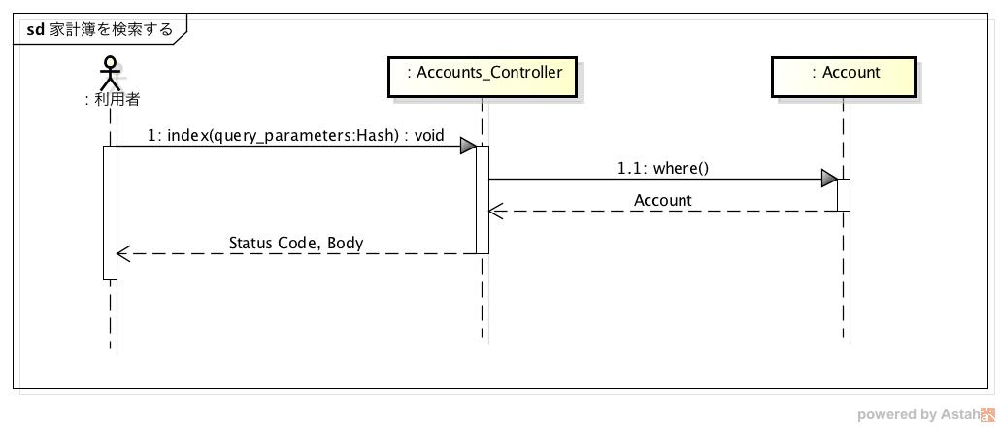

設計仕様
========

設計仕様では以下を定義する

- `モジュール構成 <http://localhost/algieba_docs/design_spec.html#id2>`__
- `シーケンス <http://localhost/algieba_docs/design_spec.html#id3>`__
- `データベース構成 <http://localhost/algieba_docs/design_spec.html#id10>`__

モジュール構成
--------------

MVCモデルを利用する

*クラス図*

.. image:: images/class.jpg
   :alt: クラス図

- Model

  - Account: Accountsテーブルを操作するモデル

    - create: レコードを作成するメソッド
    - find: レコードを取得するメソッド
    - index: レコードを検索するメソッド
    - settle: 収支を計算するメソッド
    - check_condition: 家計簿の検索条件をチェックするメソッド
    - update_attributes: 属性を更新するメソッド
    - delete: レコードを削除するメソッド

- View

  - Account_View: 家計簿の登録や表示を行うビュー

    - 利用者がhttp://<ホスト名>(:80)/にアクセスすることで表示される

- Controller

  - Accounts_Controller: リクエストを処理するコントローラ

    - manage: ブラウザに登録画面を表示するメソッド
    - create: 家計簿を登録するメソッド
    - read: 家計簿を取得するメソッド
    - index: 家計簿を検索するメソッド
    - update: 家計簿を更新するメソッド
    - delete: 家計簿を削除するメソッド
    - settle: 収支を計算するメソッド
    - account_attributes: Accountの属性名の配列を返すメソッド
    - check_absent_params_for_create: 作成時に必須パラメーターが存在しているかをチェックするメソッド

シーケンス
----------

- `家計簿を登録する <http://localhost/algieba_docs/design_spec.html#id4>`__
- `家計簿を取得する <http://localhost/algieba_docs/design_spec.html#id5>`__
- `家計簿を検索する <http://localhost/algieba_docs/design_spec.html#id6>`__
- `家計簿を更新する <http://localhost/algieba_docs/design_spec.html#id7>`__
- `家計簿を削除する <http://localhost/algieba_docs/design_spec.html#id8>`__
- `収支を計算する <http://localhost/algieba_docs/design_spec.html#id9>`__

家計簿を登録する
^^^^^^^^^^^^^^^^

.. image:: images/seq_create.jpg

1. リクエストを受けると，Accounts_Controllerクラスのcreateメソッドを実行する
2. check_absent_params_for_createメソッドで必須パラメーターをチェックする

   - 必須パラメーターがない場合

     3-1. BadRequestを発生させてステータスコード400とエラーコードを返す

   - 必須パラメーターがある場合

     3-2. Accountクラスのcreateメソッドを実行してAccountオブジェクトを作成，DBに保存する

     - 登録に成功した場合

       4-1. ステータスコード201と登録したAccountオブジェクトを返す

     - 登録に失敗した場合

       4-2. ActiveRecord::RecordInvalidを発生させて，ステータスコード400とエラーコードを返す

家計簿を取得する
^^^^^^^^^^^^^^^^

.. image:: images/seq_read.jpg

1. リクエストを受けると，Accounts_Controllerクラスのreadメソッドを実行する
2. findメソッドでAccountオブジェクトを取得する
3. ステータスコード200と取得したAccountオブジェクトを返す

家計簿を検索する
^^^^^^^^^^^^^^^^

1. リクエストを受けると，Accounts_Controllerクラスのindexメソッドを実行する
2. Accountクラスのindexメソッドをパラメータを引数にして実行する
3. check_conditionを実行して不正な値がないかチェックする

   - 不正な値がある場合

     4-1. ActiveRecord::RecordInvalidを発生させて，ステータスコード400とエラーコードを返す

   - 不正な値がない場合

     4-1. whereメソッドを実行してAccountオブジェクトの配列を取得する

     4-2. ステータスコード200と取得したAccountオブジェクトの配列を返す

家計簿を更新する
^^^^^^^^^^^^^^^^

.. image:: images/seq_update.jpg

1. リクエストを受けると，Accounts_Controllerクラスのupdateメソッドを実行する
2. update_attributesメソッドでAccountオブジェクトを更新する

   - 不正な値がある場合

     3. ActiveRecord::RecordInvalidを発生させて，ステータスコード400とエラーコードを返す

   - 不正な値がない場合

     3. ステータスコード200と更新したAccountオブジェクトを返す

家計簿を削除する
^^^^^^^^^^^^^^^^

.. image:: images/seq_delete.jpg

1. リクエストを受けると，Accounts_Controllerクラスのdeleteメソッドを実行する
2. Accountクラスのdeleteメソッドを実行して削除する
3. ステータスコード204を返す

収支を計算する
^^^^^^^^^^^^^^

.. image:: images/seq_settle.jpg

1. リクエストを受けると，Accounts_Controllerクラスのsettleメソッドを実行する
2. Accountクラスのsettleメソッドを実行して収支を計算する
3. パラメーター"interval"をチェックし，その結果に基づいてそれぞれ以下の処理を行う

   - daily or monthly or yearlyの場合

     4-1. intervalに従って収支を計算する

     4-2. ステータスコード200と計算結果を返す

   - それ以外の場合

     4-1. Exceptionを発生させて，ステータスコード400とエラーコードと返す

データベース構成
----------------

家計簿を登録するAccountテーブルを定義する

+---------------+----------+----------------------------------+----------+------------+
| カラム        | 型       | 内容                             | 主キー   | NOT NULL   |
+===============+==========+==================================+==========+============+
| id            | INTEGER  | 家計簿のID                       | ◯        |◯           |
+---------------+----------+----------------------------------+----------+------------+
| account_type  | STRING   | 収入/支出を表すフラグ            |          | ◯          |
+---------------+----------+----------------------------------+----------+------------+
| date          | DATE     | 収入/支出があった日              |          | ◯          |
+---------------+----------+----------------------------------+----------+------------+
| content       | STRING   | 収入/支出の内容                  |          | ◯          |
+---------------+----------+----------------------------------+----------+------------+
| category      | STRING   | 収入/支出のカテゴリ              |          | ◯          |
+---------------+----------+----------------------------------+----------+------------+
| price         | INTEGER  | 収入/支出の金額                  |          | ◯          |
+---------------+----------+----------------------------------+----------+------------+
| created_at    | DATETIME | 家計簿が登録された日時           |          | ◯          |
+---------------+----------+----------------------------------+----------+------------+
| updated_at    | DATETIME | 家計簿が登録or更新された日時     |          | ◯          |
+---------------+----------+----------------------------------+----------+------------+
