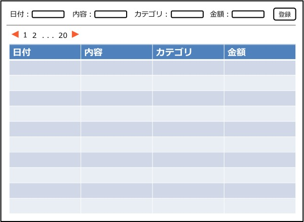

機能仕様
========

機能仕様では以下を定義する

- `データ構造 <http://localhost/algieba_docs/functional_spec.html#id2>`__
- `ユーザーインターフェース <http://localhost/algieba_docs/functional_spec.html#id6>`__
- `Web API <http://localhost/algieba_docs/functional_spec.html#web-api>`__

データ構造
----------

本システムでは以下のデータを扱う

- `ユーザー <http://localhost/algieba_docs/functional_spec.html#id3>`__
- `アプリ <http://localhost/algieba_docs/functional_spec.html#id4>`__
- `家計簿 <http://localhost/algieba_docs/functional_spec.html#id5>`__

ユーザー
^^^^^^^^

本アプリの利用者を表す

.. csv-table::
   :header: "属性名", "意味", "備考"
   :widths: 10, 30, 30

   "ユーザーID", "ユーザーを識別する文字列", "任意の半角英数字を使用可能"
   "パスワード", "ユーザー認証を行うための鍵", "任意の半角英数字を使用可能"

アプリ
^^^^^^

本アプリを利用するアプリを表す

.. csv-table::
   :header: "属性名", "意味", "備考"
   :widths: 10, 30, 30

   "アプリID", "アプリを識別する文字列", "本アプリによって発行される"
   "アプリキー", "アプリが持つ秘密鍵", "本アプリによって発行される"

家計簿
^^^^^^

買い物などで発生した所持金の増減を表す

.. csv-table::
   :header: "入力項目", "意味"
   :widths: 10, 30

   "種類", "'収入'もしくは'支出'"
   "日付", "所持金の増減があった日時"
   "内容", "所持金の増減があった理由など"
   "カテゴリ", "費目（例：食費，水道光熱費）"
   "金額", "所持金の増減量"

ユーザーインターフェース
------------------------

利用者はブラウザから家計簿の登録や確認を行うことができる

認証画面
^^^^^^^^

.. image:: images/login.jpg
   :alt: 認証画面

- 画面中央部に入力フォームが表示される
- ユーザーID, パスワードを入力して、ログインボタンを押すと認証が行われる
- 認証に成功すると管理画面に遷移する

管理画面
^^^^^^^^

- 画面の上部に登録用の入力フォームが表示される
- 入力フォームの下には表形式で家計簿の一覧が表示される
- 最新の家計簿から順番に表示される
- 1ページ50件の家計簿が表示される
- 登録成功時，画面遷移なしで表に登録した家計簿が表示される

Web API
-------

共通定義
^^^^^^^^

家計簿リソース
""""""""""""""

.. csv-table::
   :header: "属性", "フォーマット"
   :widths: 10, 30

   "account_type", "'income' または 'expense'"
   "date", "yyyy-mm-dd, yyyy/mm/dd, dd-mm-yyyy, dd/mm/yyyy, yyyymmdd"
   "content", "任意の英数字・日本語"
   "category", "任意の英数字・日本語"
   "price", "0以上の整数"

- *項目の値が空ハッシュや空配列の場合はその項目はないものとして見なす*

エラーコード
""""""""""""

.. csv-table::
   :header: "エラーコード", "ステータスコード", "意味"

   "absent_param_[属性]", "400", "入力必須の項目がない"
   "invalid_param_[属性]", "400", "不正値のパラメータがある"

API
^^^^

以下のAPIを定義する

- `家計簿を登録する <http://localhost/algieba_docs/functional_spec.html#id8>`__
- `家計簿を取得する <http://localhost/algieba_docs/functional_spec.html#id9>`__
- `家計簿を検索する <http://localhost/algieba_docs/functional_spec.html#id10>`__
- `家計簿を更新する <http://localhost/algieba_docs/functional_spec.html#id11>`__
- `家計簿を削除する <http://localhost/algieba_docs/functional_spec.html#id12>`__
- `収支を計算する <http://localhost/algieba_docs/functional_spec.html#id13>`__

家計簿を登録する
""""""""""""""""

.. http:post:: /accounts

   :jsonparam string account_type: ``income`` または ``expense``
   :jsonparam string date: 所持金の増減があった日時
   :jsonparam string content: 所持金の増減があった理由など
   :jsonparam string category: 費目（例：食費，水道光熱費）
   :jsonparam int price: 所持金の増減量

   :response JSONObject:
      - `家計簿リソース <http://localhost/algieba_docs/functional_spec.html#id6>`__

        - id
        - account_type
        - date
        - content
        - category
        - price
        - created_at
        - updated_at

   :status 201:
      - 家計簿の登録に成功
      - `家計簿リソース <http://localhost/algieba_docs/functional_spec.html#id6>`__ を返す
   :status 400:
      - 家計簿の登録に失敗
      - `エラーコード <http://localhost/algieba_docs/functional_spec.html#id7>`__ を返す

   **リクエスト例**

   .. sourcecode:: http

      POST /accounts HTTP/1.1
      Content-Type: application/json

      {
        "account_type": "income",
        "date": "1000-01-01",
        "content": "給料",
        "category": "給料",
        "price": 200000
      }

   **レスポンス例**

   .. sourcecode:: http

      HTTP/1.1 201 Created
      Content-Type: application/json

      {
        "id": 1,
        "account_type": "income",
        "date": "1000-01-01",
        "content": "給料",
        "category": "給料",
        "price": 200000,
        "created_at": "1000-01-01 00:00:00",
        "updated_at": "1000-01-01 00:00:00"
      }

家計簿を取得する
""""""""""""""""

.. http:get:: /accounts/[id]

   :response JSONObject:
      - `家計簿リソース <http://localhost/algieba_docs/functional_spec.html#id6>`__

        - id
        - account_type
        - date
        - content
        - category
        - price
        - created_at
        - updated_at

   :status 200:
      - 家計簿の取得に成功
      - `家計簿リソース <http://localhost/algieba_docs/functional_spec.html#id6>`__ を返す
   :status 404:
      - 家計簿の取得に失敗
      - 存在しないIDを指定

   **リクエスト例**

   .. sourcecode:: http

      GET /accounts/1 HTTP/1.1

   **レスポンス例**

   .. sourcecode:: http

      HTTP/1.1 200 OK
      Content-Type: application/json

      {
        "id": 1,
        "account_type": "income",
        "date": "1000-01-01",
        "content": "給料",
        "category": "給料",
        "price": 200000,
        "created_at": "1000-01-01 00:00:00",
        "updated_at": "1000-01-01 00:00:00"
      }

家計簿を検索する
""""""""""""""""

.. http:get:: /accounts

   :query account_type: ``income`` または ``expense``
   :query date_before: 指定された日付以前の家計簿を検索する
   :query date_after: 指定された日付以降の家計簿を検索する
   :query content_equal: 内容が完全に一致する家計簿を検索する
   :query content_include: 内容が部分的に一致する家計簿を検索する
   :query category: カテゴリが一致する家計簿を検索する
   :query price_upper: 指定された金額以上の家計簿を検索する
   :query price_lower: 指定された金額以下の家計簿を検索する

   :responseArray JSONObject:
      - `家計簿リソース <http://localhost/algieba_docs/functional_spec.html#id6>`__

        - id
        - account_type
        - date
        - content
        - category
        - price
        - created_at
        - updated_at

   :status 200:
      - 家計簿の検索に成功
      - `家計簿リソース <http://localhost/algieba_docs/functional_spec.html#id6>`__ の配列を返す
   :status 400:
      - 家計簿の検索に失敗
      - `エラーコード <http://localhost/algieba_docs/functional_spec.html#id7>`__ を返す

   **リクエスト例**

   .. sourcecode:: http

      GET /accounts?account_type=income HTTP/1.1

   **レスポンス例**

   .. sourcecode:: http

      HTTP/1.1 200 OK
      Content-Type: application/json

      [
        {
          "id": 1,
          "account_type": "income",
          "date": "1000-01-01",
          "content": "給料",
          "category": "給料",
          "price": 200000,
          "created_at": "1000-01-01 00:00:00",
          "updated_at": "1000-01-01 00:00:00"
        }
      ]

家計簿を更新する
""""""""""""""""

.. http:put:: /accounts/[id]

   :request JSONObject:
      - 更新する `家計簿リソース <http://localhost/algieba_docs/functional_spec.html#id6>`__ の属性と更新値

   :response JSONObject:
      - `家計簿リソース <http://localhost/algieba_docs/functional_spec.html#id6>`__

        - id
        - account_type
        - date
        - content
        - category
        - price
        - created_at
        - updated_at

   :status 201:
      - 家計簿の更新に成功
      - `家計簿リソース <http://localhost/algieba_docs/functional_spec.html#id6>`__ を返す
   :status 400:
      - 家計簿の更新に失敗
      - `エラーコード <http://localhost/algieba_docs/functional_spec.html#id7>`__ を返す
   :status 404:
      - 家計簿の更新に失敗
      - 存在しないIDを指定

   **リクエスト例**

   .. sourcecode:: http

      PUT /accounts/1 HTTP/1.1
      Content-Type: application/json

      {
        "date": "1000-01-02"
      }

   **レスポンス例**

   .. sourcecode:: http

      HTTP/1.1 200 OK
      Content-Type: application/json

      {
        "id": 1,
        "account_type": "income",
        "date": "1000-01-02",
        "content": "給料",
        "category": "給料",
        "price": 200000,
        "created_at": "1000-01-01 00:00:00",
        "updated_at": "1000-01-01 00:00:00"
      }

家計簿を削除する
""""""""""""""""

.. http:delete:: /accounts/[id]

   :status 204:
      - 家計簿の削除に成功
   :status 404:
      - 家計簿の削除に失敗

   **リクエスト例**

   .. sourcecode:: http

      DELETE /accounts/1 HTTP/1.1

   **レスポンス例**

   .. sourcecode:: http

      HTTP/1.1 204 No Content

収支を計算する
""""""""""""""

.. http:get:: /settlement

   :query interval:
      - 集計間隔
      - ``yearly``, ``monthly``, ``daily`` のいずれかを指定

   :status 200:
      - 収支の計算に成功
   :status 400:
      - 収支の計算に失敗
      - `エラーコード <http://localhost/algieba_docs/functional_spec.html#id7>`__ を返す

   **リクエスト例**

   .. sourcecode:: http

      GET /settlement?interval=monthly HTTP/1.1

   **レスポンス例**

   .. sourcecode:: http

      HTTP/1.1 200 OK
      Content-Type: application/json

      {
        "1000-01": 200000
      }
