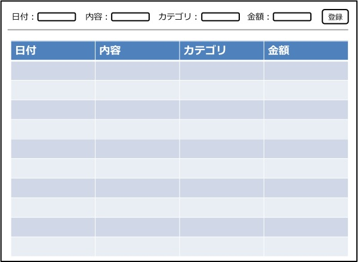

機能仕様
========

機能仕様では以下を定義する

- `データ構造 <http://localhost/algieba_docs/functional_spec.html#id2>`__
- `ユーザーインターフェース <http://localhost/algieba_docs/functional_spec.html#id4>`__
- `Web API <http://localhost/algieba_docs/functional_spec.html#web-api>`__

データ構造
----------

本システムでは以下のデータを扱う

- `家計簿 <http://localhost/algieba_docs/functional_spec.html#id3>`__

家計簿
^^^^^^

買い物などで発生した所持金の増減を表す

+------------+----------------------------------------+
| 入力項目   | 意味                                   |
+============+========================================+
| 種類       | "収入"もしくは"支出"                   |
+------------+----------------------------------------+
| 日付       | 所持金の増減があった日時               |
+------------+----------------------------------------+
| 内容       | 所持金の増減があった理由など           |
+------------+----------------------------------------+
| カテゴリ   | 費目（例：食費，水道光熱費）           |
+------------+----------------------------------------+
| 金額       | 所持金の増減量                         |
+------------+----------------------------------------+

ユーザーインターフェース
------------------------

利用者はブラウザから家計簿の登録や検索を行うことができる

- 画面の上部に登録用の入力フォームが表示される

- 入力フォームの下には表形式で家計簿の一覧が表示される

Web API
-------

共通定義
^^^^^^^^

家計簿リソース
""""""""""""""

  +--------------+------------------------------+
  | 属性         | フォーマット                 |
  +==============+==============================+
  | account_type | "income" または "expense"    |
  +--------------+------------------------------+
  |         date | yyyy-mm-dd                   |
  +--------------+------------------------------+
  |      content | 任意の英数字・日本語         |
  +--------------+------------------------------+
  |     category | 任意の英数字・日本語         |
  +--------------+------------------------------+
  |        price | 0以上の整数                  |
  +--------------+------------------------------+

  - *項目の値が空ハッシュや空配列の場合はその項目はないものとして見なす*

エラーコード
""""""""""""

  +-----------------------------+---------------------+-----------------------------+
  | エラーコード                | ステータスコード    | 意味                        |
  +=============================+=====================+=============================+
  | absent_param_[属性]         | 400                 | 入力必須の項目がない        |
  +-----------------------------+---------------------+-----------------------------+
  | invalid_param_[属性]        | 400                 | 不正値のパラメータがある    |
  +-----------------------------+---------------------+-----------------------------+

API
^^^^

以下のAPIを定義する

- `家計簿を登録する <http://localhost/algieba_docs/functional_spec.html#id8>`__
- `家計簿を取得する <http://localhost/algieba_docs/functional_spec.html#id9>`__
- `家計簿を検索する <http://localhost/algieba_docs/functional_spec.html#id10>`__
- `家計簿を更新する <http://localhost/algieba_docs/functional_spec.html#id11>`__
- `家計簿を削除する <http://localhost/algieba_docs/functional_spec.html#id12>`__
- `収支を見る <http://localhost/algieba_docs/functional_spec.html#id13>`__

家計簿を登録する
""""""""""""""""

HTTP Method: POST

Path: /accounts

Request:

  Body:

  - 必須

    - accounts

      - `家計簿リソース <http://localhost/algieba_docs/functional_spec.html#id6>`__

        - account_type
        - date
        - content
        - category
        - price

Response:
  Status Code: 201

  Body: 登録した `家計簿リソース <http://localhost/algieba_docs/functional_spec.html#id6>`__

家計簿を取得する
""""""""""""""""

HTTP Method: GET

Path: /accounts/[id]

Request:
  Path Parameter:
    - id: `家計簿リソース <http://localhost/algieba_docs/functional_spec.html#id6>`__ のID

Response:
  Status Code: 200

  Body: `家計簿リソース <http://localhost/algieba_docs/functional_spec.html#id6>`__

家計簿を検索する
""""""""""""""""

HTTP Method: GET

Path: /accounts

Request:
  Query:
    *クエリがない場合は全ての家計簿を取得する*

    - オプション

      - account_type
      - date
      - content
      - category
      - price

Response:
  Status Code: 200

  Body: 取得した `家計簿リソース <http://localhost/algieba_docs/functional_spec.html#id6>`__ の配列

家計簿を更新する
""""""""""""""""

HTTP Method: PUT

Path: /accounts/<id>

Request:
  Path Parameter:
    - id: `家計簿リソース <http://localhost/algieba_docs/functional_spec.html#id6>`__ のID

  Body:
    - オプション

      - account_type
      - date
      - content
      - category
      - price

Response:
  Status Code: 200

  Body: 更新した `家計簿リソース <http://localhost/algieba_docs/functional_spec.html#id6>`__

家計簿を削除する
""""""""""""""""

HTTP Method: DELETE

Path: /accounts/<id>

Request:
  Path Parameter:
    - id: `家計簿リソース <http://localhost/algieba_docs/functional_spec.html#id6>`__ のID

Response:
  Status Code: 204

収支を見る
""""""""""

HTTP Method: GET

Path: /settlement

Request:
  Query:
    - 必須

      - interval

        - yearly, monthly, dailyのどれか

Response:
  Status Code: 200

  Body: 収支のリスト
