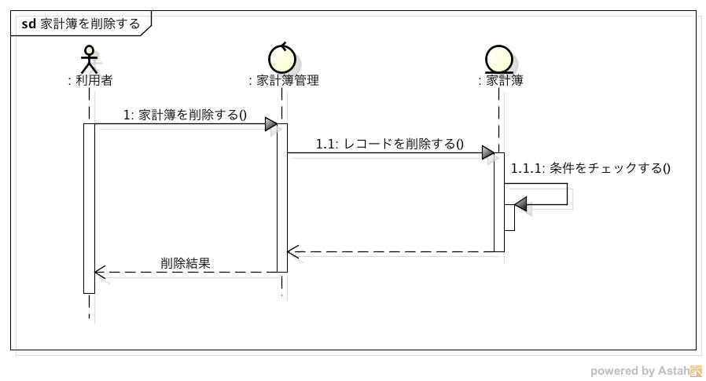
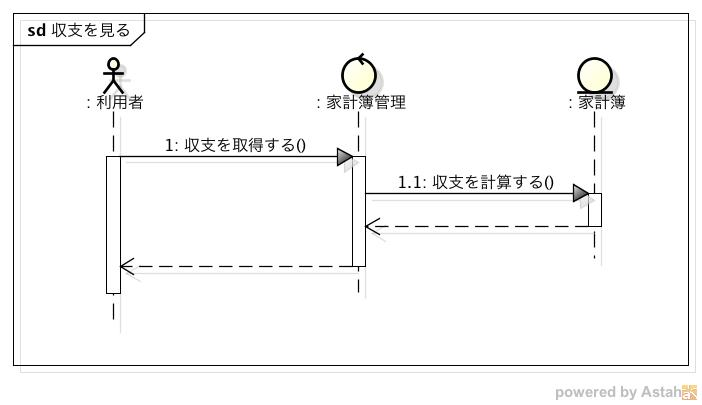

外部設計仕様
============

ユーザーインターフェース(UI)
----------------------------

- Viewer, Registerから受信したリクエストを処理するモジュールであるため，UIは存在しない

システムの振る舞い
------------------

家計簿を登録する
^^^^^^^^^^^^^^^^

1. 利用者がViewer, Registerで家計簿を登録すると，Managerにリクエストが送信される
2. リクエストの内容に従い家計簿をデータベースに登録する
3. 登録を実行した結果をViewer, Registerに送信する

家計簿を検索する
^^^^^^^^^^^^^^^^

1. 利用者がViewerで家計簿を検索すると，Managerにリクエストが送信される
2. リクエストを受信すると，Managerは入力のチェックを行う
3. チェックした結果に基づいて，以下の処理を実行する

   - 正しい入力である場合

     3-1. データベースから指定された条件を満たすレコードを取得する

     3-2. 取得したレコードをViewerに送信する

   - 不正な入力である場合

     3-1. エラー通知をViewerに送信する

家計簿を更新する
^^^^^^^^^^^^^^^^

1. 利用者がViewerで家計簿を更新すると，Managerにリクエストが送信される
2. リクエストを受信すると，Managerは入力のチェックを行う
3. チェックした結果に基づいて，以下の処理を実行する

   - 正しい入力である場合

     3-1. データベースの指定された条件を満たすレコードを更新する

     3-2. 更新されたレコードをViewerに送信する

   - 不正な入力である場合

     3-1. エラー通知をViewerに送信する

家計簿を削除する
^^^^^^^^^^^^^^^^

1. 利用者がViewerで家計簿を削除すると，Managerにリクエストが送信される
2. リクエストを受信すると，Managerは入力のチェックを行う
3. チェックした結果に基づいて，以下の処理を実行する

   - 正しい入力である場合

     3-1. データベースの指定された条件を満たすレコードを削除する

     3-2. 削除通知をViewerに送信する

   - 不正な入力である場合

     3-1. エラー通知をViewerに送信する

収支を見る
^^^^^^^^^^

1. 利用者がViewerで収支確認メニューを選択すると，Managerにリクエストが送信される
2. リクエストを受信すると，Managerは入力のチェックを行う
3. チェックした結果に基づいて，以下の処理を実行する

   - 正しい入力である場合

     3-1. 収支を計算する

     3-2. 計算結果をViewerに送信する

   - 不正な入力である場合

     3-1. エラー通知をViewerに送信する

システム構成
------------

- 入力に従い家計簿を管理するコントローラと，管理される家計簿のみで構成される
