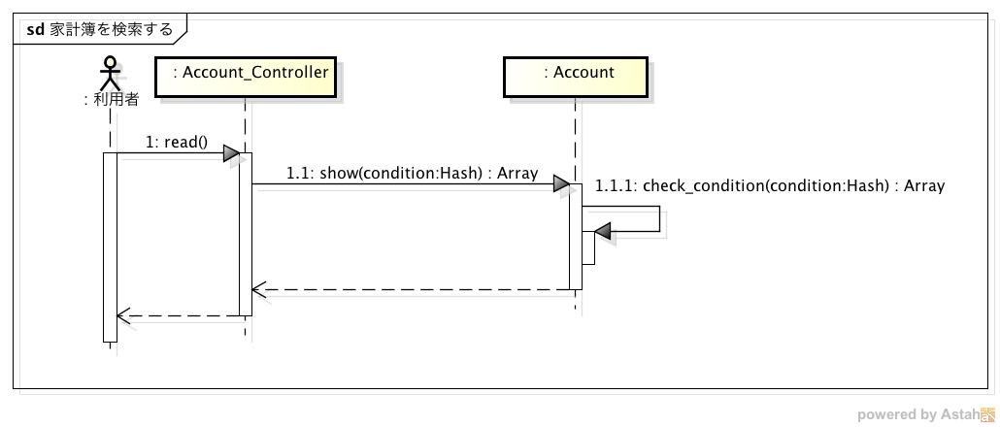
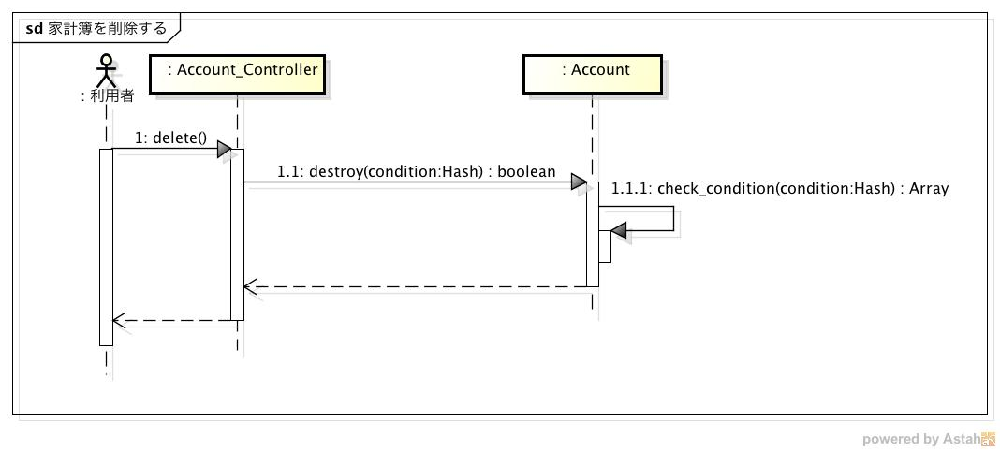
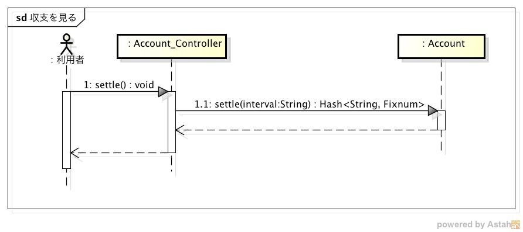

内部設計仕様
============

シーケンス
----------

家計簿を登録する
^^^^^^^^^^^^^^^^

.. image:: images/seq_create_int.jpg

1. Viewer, Registerからのリクエストを受信すると，Accounts_Controllerクラスのcreateメソッドを実行する
2. Accountクラスのcreateメソッドを実行して家計簿を登録する
3. createメソッドの実行結果に基づいてそれぞれ以下の処理を行う

   - Accountクラスのインスタンスを取得した場合

     3-1. Viewer, Registerにステータスコード201を送信する

   - 例外が発生した場合

     3-1. Viewer, Registerにエラーコードとステータスコード400を送信する

家計簿を検索する
^^^^^^^^^^^^^^^^

1. Viewerからのリクエストを受信すると，Accounts_Controllerクラスのreadメソッドを実行する
2. Accountクラスのshowメソッドをパラメータを引数にして実行する
3. check_conditionを実行し，その結果に基づいてそれぞれ以下の処理を行う

   - 空配列の場合

     3-1. whereメソッドを実行して家計簿を取得する

     3-2. Viewerに検索結果とステータスコード200を送信する

   - 空配列でない場合（不正なパラメータがある場合）

     3-1. Viewerにエラーコードとステータスコード400を送信する

家計簿を更新する
^^^^^^^^^^^^^^^^

.. image:: images/seq_update_int.jpg

1. Viewerからのリクエストを受信すると，Accounts_Controllerクラスのupdateメソッドを実行する
2. Accountクラスのupdateメソッドをパラメータを引数にして実行する
3. check_conditionを実行し，その結果に基づいてそれぞれ以下の処理を行う

   - 空配列の場合

     3-1. whereメソッドを実行して家計簿を取得する

     3-2. 取得した家計簿それぞれに対して，updateメソッドを実行して家計簿を更新する

     3-3. Viewerに更新結果とステータスコード200を送信する

   - 空配列でない場合（不正なパラメータがある場合）

     3-1. Viewerにエラーコードとステータスコード400を送信する

家計簿を削除する
^^^^^^^^^^^^^^^^

1. Viewerからのリクエストを受信すると，Accounts_Controllerクラスのdeleteメソッドを実行する
2. Accountクラスのdestroyメソッドをパラメータを引数にして実行する
3. check_conditionを実行し，その結果に基づいてそれぞれ以下の処理を行う

   - 空配列の場合

     3-1. whereメソッドを実行して家計簿を取得する

     3-2. 取得した家計簿それぞれに対して，deleteメソッドを実行して家計簿を削除する

     3-3. Viewerにステータスコード204を送信する

   - 空配列でない場合（不正なパラメータがある場合）

     3-1. Viewerにエラーコードとステータスコード400を送信する

収支を見る
^^^^^^^^^^

1. Viewerからのリクエストを受信すると，Accounts_Controllerクラスのsettleメソッドが実行される
2. パラメータ"interval"をチェックし，その結果に基づいてそれぞれ以下の処理を行う

   - daily or monthly or yearlyの場合

     3-1. intervalに従って収支を計算する

     3-2. Viewerに計算結果とステータスコード200を送信する

   - それ以外の場合

     3-1. Viewerにエラーコードとステータスコード400を送信する

クラス
------

.. image:: images/class_int.jpg

- Accounts_Controller: リクエストを処理するコントローラ

  - create: 家計簿を登録するメソッド
  - read: 家計簿を検索するメソッド
  - update: 家計簿を更新するメソッド
  - delete: 家計簿を削除するメソッド
  - settle: 収支を計算するメソッド

- Account: Accountsテーブルを操作するモデル

  - show: レコードを取得するメソッド
  - update: レコードを更新するメソッド
  - destroy: レコードを削除するメソッド
  - settle: 収支を計算するメソッド
  - check_condition: 家計簿の検索条件をチェックするメソッド
