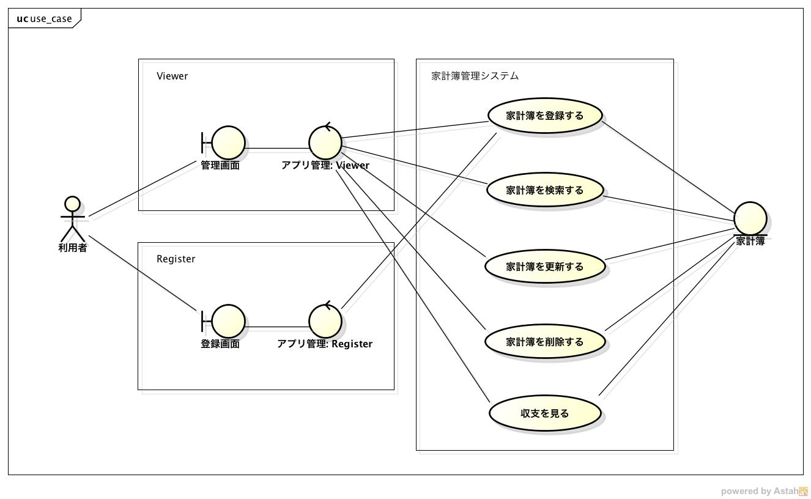

要求仕様
========

本システムは以下の５つの機能をWebAPIとして提供する

- `家計簿を登録する <http://localhost/algieba_docs/requirements_spec.html#id2>`__
- `家計簿を取得する <http://localhost/algieba_docs/requirements_spec.html#id3>`__
- `家計簿を更新する <http://localhost/algieba_docs/requirements_spec.html#id4>`__
- `家計簿を削除する <http://localhost/algieba_docs/requirements_spec.html#id5>`__
- `収支を計算する <http://localhost/algieba_docs/requirements_spec.html#id6>`__

*ユースケース図*

家計簿を登録する
----------------

- 入力された情報をもとに家計簿を作成して登録する

*ユースケースシナリオ*

1. 利用者は家計簿を作成するための情報を含んだHTTPリクエストを送信する
2. システムは受信したリクエストから情報を取得して家計簿を作成する

家計簿を取得する
----------------

- 入力された検索条件を満たす家計簿を取得する

*ユースケースシナリオ*

1. 利用者は検索条件を含んだHTTPリクエストを送信する
2. システムは受信したリクエストから検索条件を取得して，条件を満たす家計簿を取得する

家計簿を更新する
----------------

- 入力された検索条件を満たす家計簿に対して，指定された情報で更新を行う

*ユースケースシナリオ*

1. 利用者は検索条件と更新情報を含んだHTTPリクエストを送信する
2. システムは受験したリクエストから検索条件と更新情報を取得して更新を行う

家計簿を削除する
----------------

- 入力された検索条件を満たす家計簿を削除する

*ユースケースシナリオ*

1. 利用者は検索条件を含んだHTTPリクエストを送信する
2. システムは受信したリクエストから検索条件を取得して，条件を満たす家計簿を削除する

収支を計算する
--------------

- 登録されている家計簿から収支を計算する

*ユースケースシナリオ*

1. 利用者は期間（年次，月次，日次）を指定してHTTPリクエストを送信する
2. システムは受験したリクエストから期間で収支を計算する
