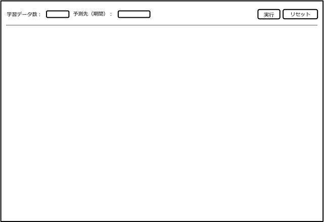

機能仕様
========

機能仕様では以下を定義する

- :ref:`alt-ext-ui`

.. _alt-ext-ui:

ユーザーインターフェース
------------------------

利用者はブラウザから分析を実行する

分析画面
^^^^^^^^

- 画面上部にパラメーター入力フォームが表示される
- 実行ボタンを押下すると分析が開始される
- 分析が終了すると登録されているメールアドレスに通知される
