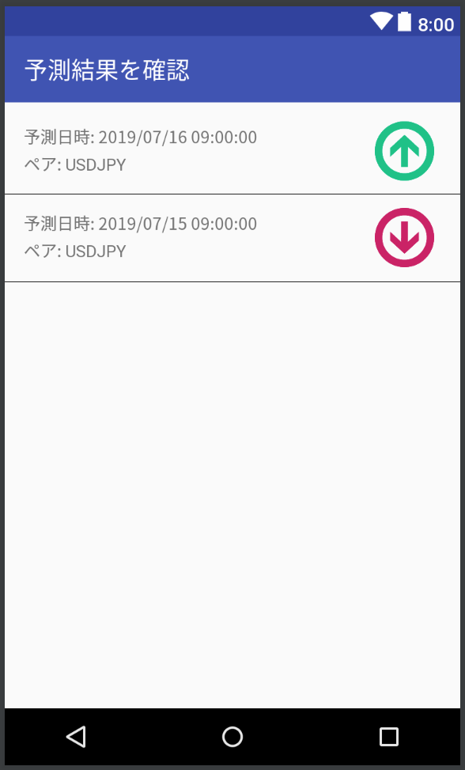

機能仕様
========

機能仕様では以下を定義する

- :ref:`ras-ext-resource`
- :ref:`ras-ext-ui`

.. _ras-ext-resource:

リソース
--------

本システムでは以下のリソースを扱う

- :ref:`ras-ext-res-prediction`

.. _ras-ext-res-prediction:

予測結果
^^^^^^^^

FXの予測結果を表す

.. csv-table::
   :header: 要素,型,意味
   :widths: 20,10,30

   予測日時,日時,予測処理を開始した日時,- 年/月/日 時:分:秒 の形式
   ペア,文字列,レートを予測するペア,"- 以下のいずれか

     - AUDJPY
     - CADJPY
     - CHFJPY
     - EURJPY
     - EURUSD
     - GBPJPY
     - NZDJPY
     - USDJPY"
   - 入力されたモデルによって自動的に決定する"
   予測結果,文字列,今後のレートを表した文字列,"- 以下のいずれか

     - 上昇
     - 下降
     - レンジ"

.. _ras-ext-ui:

ユーザーインターフェース
------------------------

利用者は以下の画面からレートの予測結果を確認する

- :ref:`ras-ext-ui-confirm`

.. _ras-ext-ui-confirm:

確認画面
^^^^^^^^

- 画面全体に予測結果の一覧が表示される

  - 左側に以下の情報が表示される

    - 予測日時
    - ペア

  - 右側に予測結果が表示される

- 最新の10件が表示される
- 予測日時の降順で表示される
