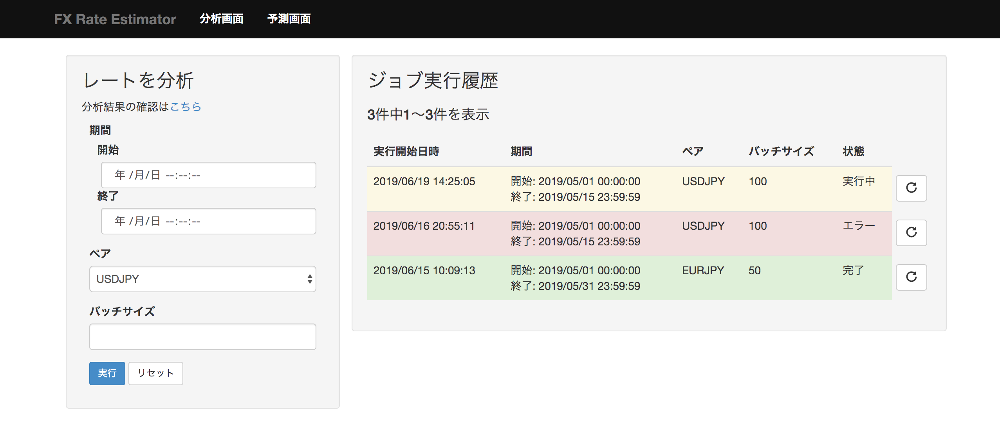
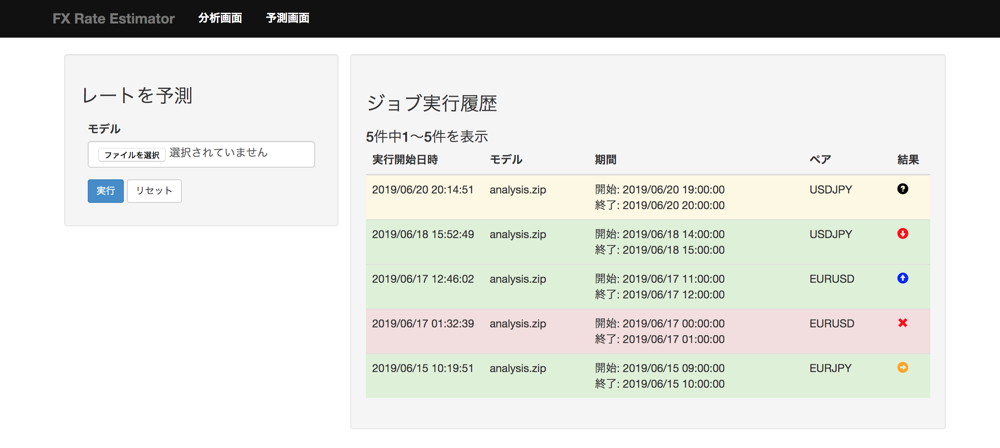

機能仕様
========

機能仕様では以下を定義する

- :ref:`reg-ext-resource`
- :ref:`reg-ext-ui`

.. _reg-ext-resource:

リソース
--------

本システムでは以下のリソースを扱う

- :ref:`reg-ext-res-analysis`
- :ref:`reg-ext-res-prediction`

.. _reg-ext-res-analysis:

分析ジョブ
^^^^^^^^^^

分析の実行単位を表す．分析を1度実行すると1ジョブが生成される

.. csv-table::
   :header: 属性名,型,意味,備考
   :widths: 20,10,30,40

   実行開始日時,日時,分析処理を開始した日時,- 年/月/日 時:分:秒 の形式
   開始日時,日時,分析に使用するデータの最初の日時,- 年/月/日 時:分:秒 の形式
   終了日時,日時,何日先を予測するかを指定する,- 年/月/日 時:分:秒 の形式
   バッチサイズ,自然数,1回の学習に使用するデータサイズ,- 半角数字
   状態,文字列,ジョブの状態,"- 以下のいずれか

     - 実行中
     - 完了
     - エラー"

.. _reg-ext-res-prediction:

予測ジョブ
^^^^^^^^^^

予測の実行単位を表す．予測を1度実行すると1ジョブが生成される

.. csv-table::
   :header: 属性名,型,意味,備考
   :widths: 20,10,30,40

   実行開始日時,日時,予測処理を開始した日時,- 年/月/日 時:分:秒 の形式
   モデル,文字列,入力されたモデルのファイル名,
   開始日時,日時,予測に使用するデータの最初の日時,- 年/月/日 時:分:秒 の形式
   終了日時,日時,予測に使用するデータの最後の日時,- 年/月/日 時:分:秒 の形式
   予測結果,文字列,今後のレートを表した文字列,"- 以下のいずれか

     - 上昇
     - 下降
     - レンジ"
   状態,文字列,ジョブの状態,"- 以下のいずれか

     - 実行中
     - 完了
     - エラー"

.. _reg-ext-ui:

ユーザーインターフェース
------------------------

利用者はブラウザからレートの分析や予測を行う

- レートの分析は :ref:`reg-ext-ui-analysis` で行う
- レートの予測は :ref:`reg-ext-ui-prediction` で行う

.. _reg-ext-ui-analysis:

分析画面
^^^^^^^^

- 画面左部にパラメーター入力フォームが表示される

  - 期間入力フォームを選択するとカレンダーが表示され，開始日時と終了日時を指定できる

    .. image:: images/analysis_calendar.png
       :alt: カレンダー
       :scale: 35

  - 実行ボタンを押下すると分析が開始される
  - 入力フォームの値に不正なものが含まれている場合はエラーダイアログが表示される

    .. image:: images/analysis_failure.png
       :alt: エラーダイアログ
       :scale: 35

  - 分析が終了すると登録されているメールアドレスに通知される

    - メール本文には以下の情報が記載されている

      - 分析開始日時
      - 分析完了日時
      - 各種パラメーター

    - メールには圧縮ファイルが添付されており以下のファイルが含まれている

      - レート予測モデル

- 画面右部に実行したジョブ情報の一覧が表示される

  - 25ジョブごとにページングされている
  - 実行開始日時の降順でソートされている
  - 実行中のジョブは黄色，完了したジョブの行は緑色，エラーになったジョブは赤色で表示される
  - ジョブ情報の右側のボタンを押下すると，そのジョブと同じパラメーターで分析を実行する

.. _reg-ext-ui-prediction:

予測画面
^^^^^^^^

- 画面左部にモデル入力フォームが表示される

  - モデルには分析を実行して受け取った圧縮ファイルを指定する
  - 実行ボタンを押下すると予測が開始される

- 画面右部に実行したジョブ情報の一覧が表示される

  - 25ジョブごとにページングされている
  - 実行開始日時の降順でソートされている
  - 実行中のジョブは黄色，完了したジョブの行は緑色，エラーになったジョブは赤色で表示される
  - 完了したジョブの場合は予測結果がアイコンで表示される

    - 実行中の場合は「?」アイコンが表示される
