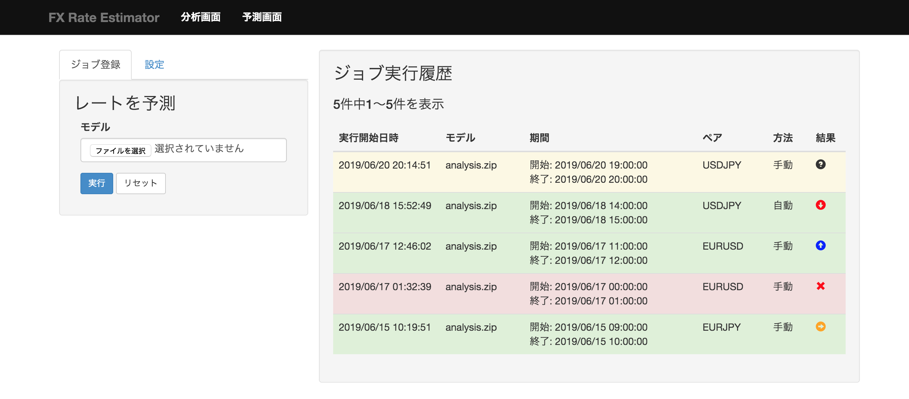
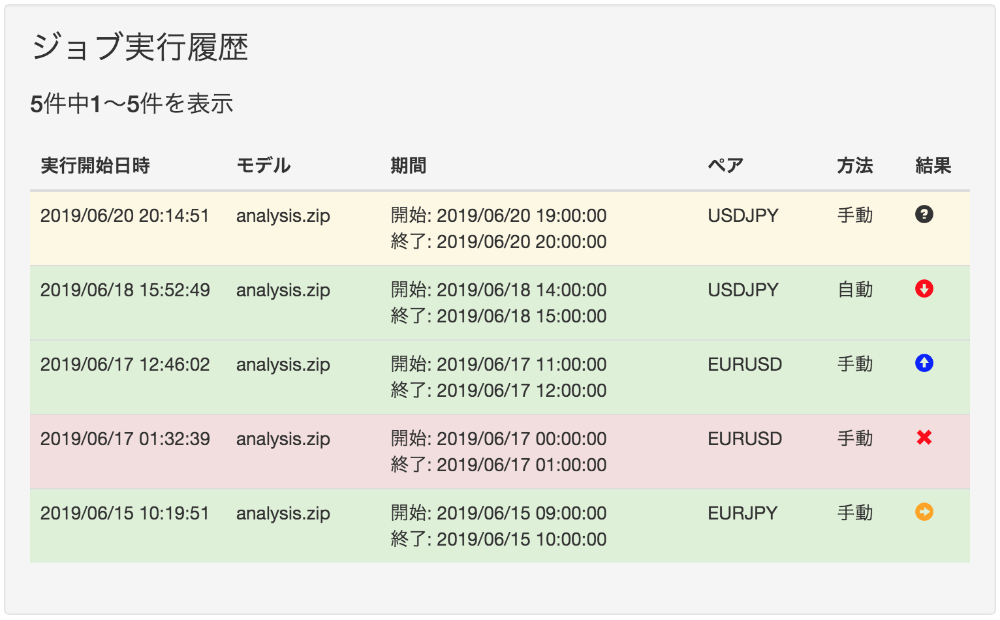

機能仕様
========

機能仕様では以下を定義する

- :ref:`reg-ext-resource`
- :ref:`reg-ext-ui`
- :ref:`reg-ext-api`

.. _reg-ext-resource:

リソース
--------

本システムでは以下のリソースを扱う

- :ref:`reg-ext-res-analysis`
- :ref:`reg-ext-res-prediction`

.. _reg-ext-res-analysis:

分析ジョブ
^^^^^^^^^^

分析の実行単位を表す．分析を1度実行すると1ジョブが生成される

.. csv-table::
   :header: 属性名,型,意味,備考
   :widths: 20,10,30,40

   実行開始日時,日時,分析処理を開始した日時,- 年/月/日 時:分:秒 の形式
   開始日時,日時,分析に使用するデータの最初の日時,- 年/月/日 時:分:秒 の形式
   終了日時,日時,何日先を予測するかを指定する,- 年/月/日 時:分:秒 の形式
   ペア,文字列,レートを分析するペア,"- 以下のいずれか

     - AUDJPY
     - CADJPY
     - CHFJPY
     - EURJPY
     - EURUSD
     - GBPJPY
     - NZDJPY
     - USDJPY"
   バッチサイズ,自然数,1回の学習に使用するデータサイズ,- 半角数字
   状態,文字列,ジョブの状態,"- 以下のいずれか

     - 実行中
     - 完了
     - エラー"

.. _reg-ext-res-prediction:

予測ジョブ
^^^^^^^^^^

予測の実行単位を表す．予測を1度実行すると1ジョブが生成される

.. csv-table::
   :header: 属性名,型,意味,備考
   :widths: 20,10,30,40

   予測ジョブID,文字列,予測ジョブを一意に示すID,- 32文字の英数字
   実行開始日時,日時,予測処理を開始した日時,- 年/月/日 時:分:秒 の形式
   モデル,文字列,入力されたモデルのファイル名,
   開始日時,日時,予測に使用するデータの最初の日時,- 年/月/日 時:分:秒 の形式
   終了日時,日時,予測に使用するデータの最後の日時,- 年/月/日 時:分:秒 の形式
   ペア,文字列,予測するペア,"- :ref:`reg-ext-res-analysis` 参照
   - 入力されたモデルによって自動的に決定する"
   方法,文字列,予測の実行方法,"- 以下のいずれか

     - 手動
     - 自動"
   予測結果,文字列,今後のレートを表した文字列,"- 以下のいずれか

     - 上昇
     - 下降
     - レンジ"
   状態,文字列,ジョブの状態,- :ref:`reg-ext-res-analysis` 参照

.. _reg-ext-ui:

ユーザーインターフェース
------------------------

利用者はブラウザからレートの分析や予測を行う

- レートの分析は :ref:`reg-ext-ui-analysis` で行う
- レートの予測は :ref:`reg-ext-ui-prediction` で行う

.. _reg-ext-ui-analysis:

分析画面
^^^^^^^^

.. image:: images/analysis.png
   :alt: 分析画面

- 画面左部にパラメーター入力フォームが表示される

  - 期間入力フォームを選択するとカレンダーが表示され，開始日時と終了日時を指定できる

    .. image:: images/analysis_calendar.png
       :alt: カレンダー
       :scale: 35

  - 実行ボタンを押下すると分析が開始される
  - 入力フォームの値に不正なものが含まれている場合はエラーダイアログが表示される

    .. image:: images/analysis_failure.png
       :alt: エラーダイアログ
       :scale: 35

  - 分析が終了すると登録されているメールアドレスに通知される

    - メール本文には以下の情報が記載されている

      - 分析開始日時
      - 分析完了日時
      - 各種パラメーター

    - メールには圧縮ファイルが添付されており以下のファイルが含まれている

      - レート予測モデル
      - メタデータ
      - 訓練データ

  - レート予測モデルや学習過程を確認したい場合は「こちら」を押下するとモデルをアップロードするためのダイアログが表示される

    .. image:: images/analysis_dialog.png
       :alt: モデル選択ダイアログ
       :scale: 35

    - ファイル選択フォームではメールに添付されている圧縮ファイルを選択する
    - 「確認」ボタンを押下すると選択したファイルがアップロードされ，別タブで確認画面が表示される

      - 確認画面では `TensorBoard <https://www.tensorflow.org/tensorboard>`_ を利用してモデルやそのパラメーターを可視化している

    - 「キャンセル」ボタンを押下するとアップロードせずにダイアログを閉じる

- 画面右部に実行したジョブ情報の一覧が表示される

  - 25ジョブごとにページングされている
  - 実行開始日時の降順でソートされている
  - 実行中のジョブは黄色，完了したジョブの行は緑色，エラーになったジョブは赤色で表示される
  - ジョブ情報の右側のボタンを押下すると，そのジョブと同じパラメーターで分析を実行する

.. _reg-ext-ui-prediction:

予測画面
^^^^^^^^

- 画面の上部には分析画面と予測画面へのリンクが表示される
- 画面の左部には予測ジョブの登録や定期予測の設定を行うためのフォームが表示される

  - タブでフォームを切り替えることができる
  - 初期状態ではジョブ登録用フォームが表示される

- 画面右部に実行したジョブ情報の一覧が表示される

ジョブ登録フォーム仕様
""""""""""""""""""""""

- モデル選択フォームに予測に利用するファイルを選択する
- 実行ボタンを押下すると予測を行うジョブが登録される

定期予測設定フォーム
""""""""""""""""""""

- 定期予測を有効にする場合と無効にする場合でフォームが異なる
- 初期状態では有効にする場合のフォームが表示されている
- フォームに表示されている状態ボタンを選択することでフォームを切り替えることができる

有効にする場合
''''''''''''''

- 定期予測に利用するファイルを選択するためのフォームが表示される
- 設定ボタンを押下すると有効にする設定を行い，以下のダイアログを表示する

  .. image:: images/prediction_setting_active_message.png
     :alt: 通知ダイアログ

  - どのペアに対して有効にしたかが通知される

無効にする場合
''''''''''''''

- 無効にするペアを選択するためのセレクトボックスが表示される
- 設定ボタンを押下すると無効にする設定を行い，以下のダイアログを表示する

  .. image:: images/prediction_setting_inactive_message.png
     :alt: 通知ダイアログ
     :scale: 25

  - どのペアに対する予測を無効にしたかが通知される

予測ジョブ一覧画面仕様
""""""""""""""""""""""

- 25ジョブごとにページングされている
- 実行開始日時の降順でソートされている
- 実行中のジョブは黄色，完了したジョブの行は緑色，エラーになったジョブは赤色で表示される
- 完了したジョブの場合は予測結果がアイコンで表示される

  - 実行中の場合は「?」アイコンが表示される

.. _reg-ext-api:

Web API
-------

以下のAPIを定義する

.. toctree::
   :maxdepth: 1

   external/api/prediction

共通仕様
^^^^^^^^

.. _reg-ext-api-common-error:

リクエスト
""""""""""

- WebAPI のパスには全て先頭に ``/regulus/api`` を付与すること

  - 本API仕様書に記載されているパスは全て上記のパス以下を記載する

  - 例：収支を検索する場合

    .. sourcecode:: http

       GET /regulus/api/predictions HTTP/1.1

エラーコード
""""""""""""

.. csv-table::
   :header: エラーコード,ステータスコード,意味

   invalid_param_[属性],400,不正値のパラメータがある

**レスポンス例**

.. sourcecode:: http

   HTTP/1.1 400 BadRequest
   Content-Type: application/json

   {
     "errors": [
       {
         "error_code": "invalid_param_page"
       }
     ]
   }
