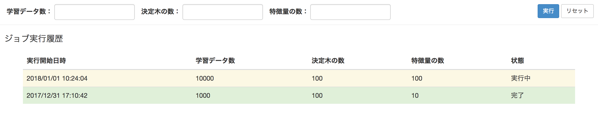

機能仕様
========

機能仕様では以下を定義する

- :ref:`alt-ext-resource`
- :ref:`alt-ext-ui`

.. _alt-ext-resource:

リソース
--------

本システムでは以下のリソースを扱う

- :ref:`alt-ext-resource-job`

.. _alt-ext-resource-job:

ジョブリソース
^^^^^^^^^^^^^^

分析の実行単位を表す．分析を1度実行すると1ジョブリソースが生成される

.. csv-table::
   :header: "属性名", "型", "意味", "フォーマット", "備考"
   :widths: 20, 10, 20, 30, 20

   "実行開始日時", "文字列(string)", "分析を開始した日時", "年/月/日 時:分:秒",
   "学習データ数", "自然数(integer)", "分析に利用したデータ数", "半角数字",
   "決定木の数", "自然数(integer)", "生成するランダムフォレストの木の数", "半角数字",
   "特徴量の数", "自然数(integer)", "分析に利用する特徴量の数", "半角数字",
   "状態", "文字列(string)", "ジョブの状態", "「実行中」，「完了」のいずれか",

.. _alt-ext-ui:

ユーザーインターフェース
------------------------

利用者はブラウザから分析を実行する

分析画面
^^^^^^^^

- 画面上部にパラメーター入力フォームが表示される

  - 実行ボタンを押下すると分析が開始される
  - 分析が終了すると登録されているメールアドレスに通知される

- 入力フォームの下に実行したジョブ情報の一覧が表示される

  - 実行開始日時の降順でソートされている
  - 実行中のジョブは黄色，完了したジョブの行は緑色で表示される
