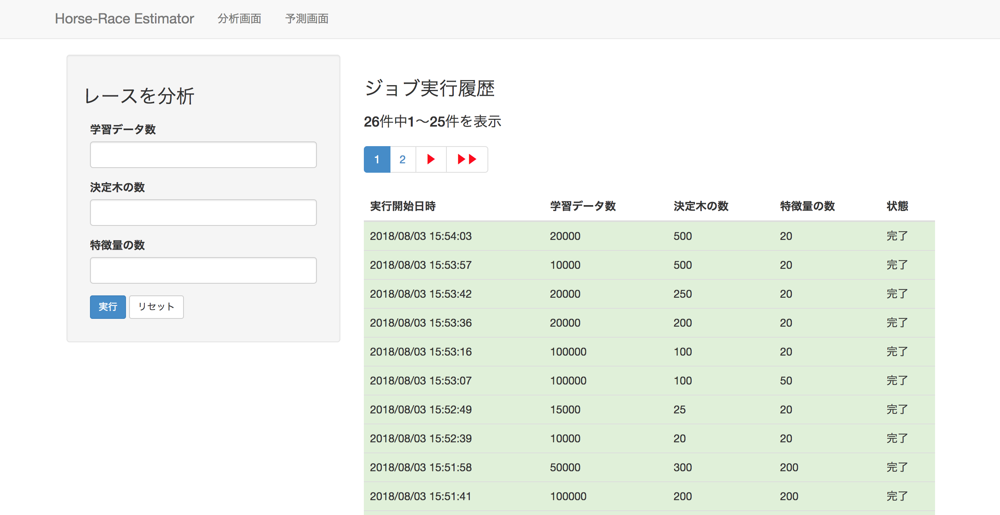
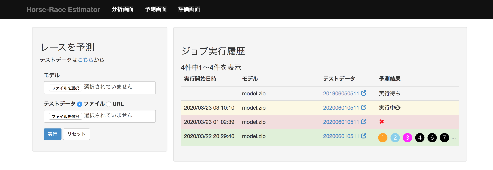
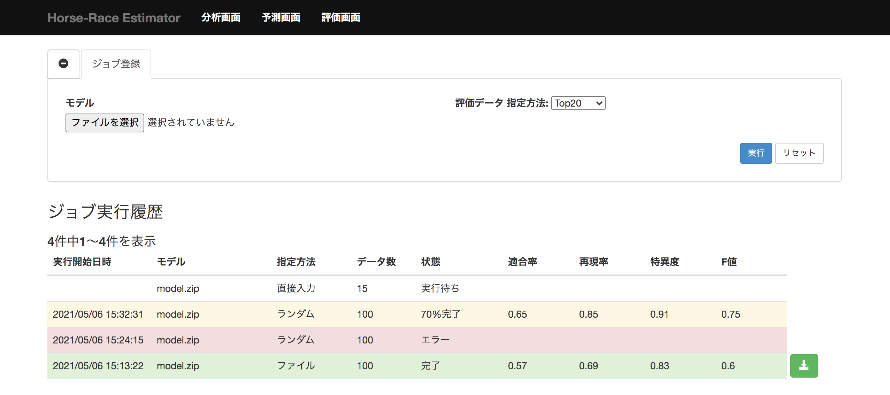
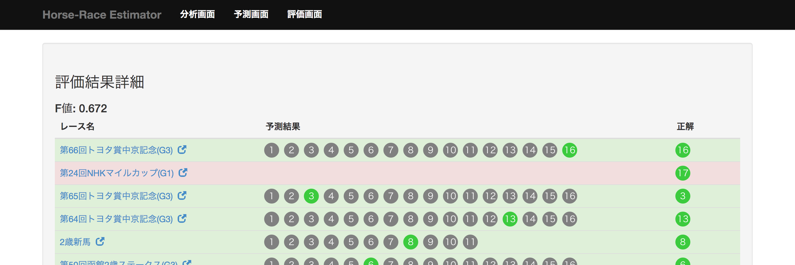

機能仕様
========

機能仕様では以下を定義する

- :ref:`alt-ext-resource`
- :ref:`alt-ext-ui`

.. _alt-ext-resource:

リソース
--------

本システムでは以下のリソースを扱う

- :ref:`alt-ext-res-analysis`
- :ref:`alt-ext-res-prediction`
- :ref:`alt-ext-res-evaluation`
- :ref:`alt-ext-res-eva-data`

.. _alt-ext-res-analysis:

分析ジョブ
^^^^^^^^^^

分析の実行単位を表す．分析を1度実行すると1ジョブリソースが生成される

.. csv-table::
   :header: 属性名,型,意味,備考
   :widths: 20,10,30,40

   実行開始日時,string,分析を開始した日時,- 年/月/日 時:分:秒 の形式
   学習データ数,integer,分析に利用したデータ数,- 1以上
   決定木の数,integer,生成するランダムフォレストの木の数,- 1以上
   特徴量の数,integer,分析に利用する特徴量の数,"- 半角数字
   - システム内部で自動的に決定される"
   状態,string,ジョブの状態,"- 以下のいずれか

     - 実行中
     - 完了
     - エラー"

.. _alt-ext-res-prediction:

予測ジョブ
^^^^^^^^^^

予測の実行単位を表す．予測を1度実行すると1ジョブリソースが生成される

.. csv-table::
   :header: 属性名,型,意味,備考
   :widths: 20,10,30,40

   実行開始日時,string,予測を開始した日時,- 年/月/日 時:分:秒 の形式
   モデル,string,入力されたモデルのファイル名,
   テストデータ,string,予測するレースデータのファイル名，またはURL,
   状態,string,ジョブの状態,"- 以下のいずれか

     - 実行中
     - 完了
     - エラー"
   結果,array[integer],1着と予測された馬番の配列,- 空配列，または1以上の数値の要素

.. _alt-ext-res-evaluation:

評価ジョブ
^^^^^^^^^^

評価の実行単位を表す．評価を1度実行すると1ジョブリソースが生成される

.. csv-table::
   :header: 属性名,型,意味,備考
   :widths: 20,10,30,40

   実行開始日時,string,予測を開始した日時,- 年/月/日 時:分:秒 の形式
   モデル,string,入力されたモデルのファイル名,
   状態,string,ジョブの状態,"- 以下のいずれか

     - 実行中
     - 完了
     - エラー"
   精度,float,評価したモデルの予測精度,- 0以上の小数
   結果,array[ :ref:`alt-ext-res-eva-result` ], :ref:`alt-ext-res-eva-result` 参照,

.. _alt-ext-res-eva-data:

評価データ
^^^^^^^^^^

評価に利用したデータを表す

.. csv-table::
   :header: 属性名,型,意味,備考
   :widths: 20,10,30,40

   レース名,string,評価したレース名前,
   URL,string,評価したレースのURL,- httpsスキームのURL
   予測結果,array[integer],1着と予想した馬番の一覧,- 空配列，または1以上の数値の要素
   正解,integer,実際に1着となった馬番,- 1以上

.. _alt-ext-ui:

ユーザーインターフェース
------------------------

利用者はブラウザからレースの分析，予測，評価を行う

- レースの分析は :ref:`alt-ext-ui-analysis` で行う
- レースの予測は :ref:`alt-ext-ui-prediction` で行う
- モデルの評価は :ref:`alt-ext-ui-evaluation` で行う

  - 評価結果の詳細は :ref:`alt-ext-ui-eva-result` で確認する

.. _alt-ext-ui-analysis:

分析画面
^^^^^^^^

- 画面左部にパラメーター入力フォームが表示される

  - 実行ボタンを押下すると分析が開始される

    - 入力フォームに不正な値（文字列，負数など）を入力すると以下のダイアログを表示して入力が間違っていることを通知する

      .. image:: images/analysis_failure.png
         :alt: エラーダイアログ
         :scale: 25

  - 分析が終了すると登録されているメールアドレスに完了を通知するメールが送信される

    - メール本文には以下の情報が記載されている

      - 分析開始日時
      - 分析完了日時
      - 以下のパラメーター

        - 学習データ数
        - 決定木の数
        - 特徴量の数

    - メールには圧縮ファイルが添付されており以下のファイルが含まれている

      - レース予測モデル
      - 分析に使用したデータ

- 画面右部に実行したジョブ情報の一覧が表示される

  - 25ジョブごとにページングされている
  - 実行開始日時の降順でソートされている
  - 実行中のジョブは黄色，完了したジョブの行は緑色，エラーになったジョブは赤色で表示される
  - ジョブ情報の右側のボタンを押下すると，そのジョブと同じパラメーターで分析を実行する

.. _alt-ext-ui-prediction:

予測画面
^^^^^^^^

- 画面左部にデータ入力フォームが表示される

  - フォーム上部の「こちら」を押下すると，レースデータが登録されている外部サイトへアクセスする

    - 外部サイトは別タブで表示される

  - モデルには分析を実行して受け取った圧縮ファイルに含まれている予測モデルを指定する
  - テストデータにはファイルを指定するか，データが表示されているサイトのURLを指定できる
  - 実行ボタンを押下すると予測が開始される

- 画面右部に実行したジョブ情報の一覧が表示される

  - 25ジョブごとにページングされている
  - 実行開始日時の降順でソートされている
  - 実行中のジョブは黄色で表示され，結果列には「実行中」と表示される
  - 完了したジョブの行は緑色で表示され，結果列には1着と予測されたエントリーの馬番が表示される

    - 馬番は昇順でソートされている
    - 馬番の数が7つ以上の場合は7番目以降が省略される

      - ポインタを乗せると馬番が全て表示される

  - エラーになったジョブの行は赤色で表示され，結果列には赤色で「×」マークが表示される
  - テストデータがサイトのURLの場合はクリックすると別タブにそのページが表示される

.. _alt-ext-ui-evaluation:

評価画面
^^^^^^^^

- 画面左部にデータ入力フォームが表示される

  - モデルには分析を実行して受け取った圧縮ファイルに含まれている予測モデルを指定する
  - 実行ボタンを押下すると予測が開始される
  - 評価が終了すると登録されているメールアドレスに完了を通知するメールが送信される

    - メール本文には以下の情報が記載されている

      - 評価開始日時
      - 評価完了日時
      - モデルファイル名

    - メールには圧縮ファイルが添付されており以下のファイルが含まれている

      - 評価結果が記載されたファイル

- 画面右部に実行したジョブ情報の一覧が表示される

  - 25ジョブごとにページングされている
  - 実行開始日時の降順でソートされている
  - 実行中のジョブは黄色，完了したジョブの行は緑色，エラーになったジョブは赤色で表示される
  - 実行中のジョブは黄色，完了したジョブの行は緑色で表示される
  - ジョブが完了すると行の右側に :ref:`alt-ext-ui-eva-result` を表示するためのボタンが表示される

    - :ref:`alt-ext-ui-eva-result` は別タブに表示される

.. _alt-ext-ui-eva-result:

評価結果画面
^^^^^^^^^^^^

- タイトルの下に精度が表示される
- テーブルには評価結果が表示されている

  - ランクの高い順番にソートされている
  - レース名をクリックすると外部サイトの対象のページを別タブで開く
  - 予測が間違っている行は赤，正しい行は緑色で表示される
  - 予測結果の内，正解と同じ馬番は緑，それ以外は灰色で表示される
