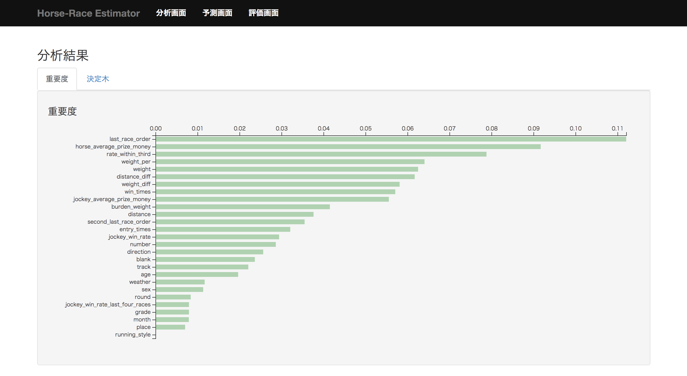

機能仕様
========

機能仕様では以下を定義する

- :ref:`alt-ext-resource`
- :ref:`alt-ext-ui`
- :ref:`alt-ext-api`

.. _alt-ext-resource:

リソース
--------

本システムでは以下のリソースを扱う

- :ref:`alt-ext-res-analysis`
- :ref:`alt-ext-res-ana-result`
- :ref:`alt-ext-res-ana-res-importance`
- :ref:`alt-ext-res-prediction`
- :ref:`alt-ext-res-evaluation`
- :ref:`alt-ext-res-eva-data`
- :ref:`alt-ext-res-pre-result`

.. _alt-ext-res-analysis:

分析ジョブ
^^^^^^^^^^

分析の実行単位を表す．分析を1度実行すると1ジョブリソースが生成される

.. csv-table::
   :header: 属性名,型,意味,備考
   :widths: 20,10,30,40

   analysis_id,string,分析ジョブを一意に示すID,"- 32文字の英数字
   - 以下の文字からなる

     - 0〜9
     - a〜f"
   performed_at,string,分析を開始した日時,- 年/月/日 時:分:秒 の形式
   num_data,integer,分析に利用したデータ数,- 1以上
   num_feature,integer,分析に利用する特徴量の数,"- 1以上
   - システム内部で自動的に決定される"
   num_entry,integer,分析で使用するレースのエントリー数,"- 1以上
   - 固定しない場合は null"
   state,string,ジョブの状態,"- 以下のいずれか

     - waiting
     - processing
     - completed
     - error"
   parameter, :ref:`alt-ext-res-ana-parameter`, :ref:`alt-ext-res-ana-parameter` 参照,
   result, :ref:`alt-ext-res-ana-result`, :ref:`alt-ext-res-ana-result` 参照,

.. _alt-ext-res-ana-parameter:

分析パラメーター
^^^^^^^^^^^^^^^^

分析時のパラメーターを表す

.. csv-table::
   :header: 属性名,型,意味,備考
   :widths: 20,10,30,40

   num_tree,integer,生成するランダムフォレストの木の数,"- 1以上
   - デフォルト 100"
   max_depth,integer,木の深さの最大値,"- 1以上
   - デフォルト null"
   min_samples_split,integer,中間ノードに存在するデータの最小値"- 1以上
   - デフォルト 2"
   min_samples_split,integer,葉ノードに存在するデータの最小値,"- 1以上
   - デフォルト 1"
   max_features,string,1つの木に利用する素性の数の最大値,"- 以下のいずれか

     - all: 全ての素性を利用する
     - sqrt: num_featureの平方根の数だけ利用する
     - log2: num_featureの2の自然対数だけ利用する

   - デフォルト: sqrt"
   max_leaf_node,integer,葉ノードの数の最大値,"- 1以上
   - デフォルト null"

.. _alt-ext-res-ana-result:

分析結果
^^^^^^^^

レースの分析結果を表す

.. csv-table::
   :header: 属性名,型,意味,備考
   :widths: 20,10,30,40

   importances,array[ :ref:`alt-ext-res-ana-res-importance` ],各素性の重要度の配列

.. _alt-ext-res-ana-res-importance:

重要度
^^^^^^

素性の重要度を表す

.. csv-table::
   :header: 属性名,型,意味,備考
   :widths: 20,10,30,40

   feature_name,string,素性の名前, :ref:`den-int-sch-features` 参照
   value,float,重要度の値,0より大きい実数

.. _alt-ext-res-prediction:

予測ジョブ
^^^^^^^^^^

予測の実行単位を表す．予測を1度実行すると1ジョブリソースが生成される

.. csv-table::
   :header: 属性名,型,意味,備考
   :widths: 20,10,30,40

   prediction_id,string,予測ジョブを一意に示すID,"- 32文字の英数字
   - 以下の文字からなる

     - 0〜9
     - a〜f"
   performed_at,string,予測を開始した日時,- 年/月/日 時:分:秒 の形式
   model,string,入力されたモデルのファイル名,
   test_data,string,予測するレースデータのファイル名，またはURL,
   state,string,ジョブの状態,"- 以下のいずれか

     - waiting
     - processing
     - completed
     - error"
   result,array[ :ref:`alt-ext-res-pre-result` ],予測結果の配列,

.. _alt-ext-res-evaluation:

評価ジョブ
^^^^^^^^^^

評価の実行単位を表す．評価を1度実行すると1ジョブリソースが生成される

.. csv-table::
   :header: 属性名,型,意味,備考
   :widths: 20,10,30,40

   evaluation_id,string,評価ジョブを一意に示すID,- 16文字の英数字
   performed_at,string,予測を開始した日時,- 年/月/日 時:分:秒 の形式
   model,string,入力されたモデルのファイル名,
   data_source,string,評価データの情報源,"- 以下のいずれか

     - remote: 外部サイトからアクセス人気上位
     - file: 指定されたファイル
     - text: 指定されたテキスト
     - randomm: システムがランダムに選択"
   num_data,integer,評価データの数,"- データソースによって以下のように設定される

      - remote: 20が自動設定される
      - file: ファイルに記載されているIDの数が自動設定される
      - text: 入力されたIDの数が自動設定される
      - random: ユーザーが指定した数値が設定される"
   state,string,ジョブの状態,"- 以下のいずれか

     - waiting
     - processing
     - completed
     - error"
   precision,float,評価したモデルの適合率,- 0以上1以下の小数
   recall,float,評価したモデルの再現率,- 0以上1以下の小数
   f_measure,float,評価したモデルのF値,- 0以上1以下の小数
   data,array[ :ref:`alt-ext-res-eva-data` ], :ref:`alt-ext-res-eva-data` 参照,

.. _alt-ext-res-eva-data:

評価データ
^^^^^^^^^^

評価に利用したデータを表す

.. csv-table::
   :header: 属性名,型,意味,備考
   :widths: 20,10,30,40

   race_id,string,評価したレースのID, :ref:`den-ext-res-race` 参照
   race_name,string,評価したレースの名前,
   race_url,string,評価したレースのURL,- httpsスキームのURL
   prediction_results,array[ :ref:`alt-ext-res-pre-result` ],予測結果の配列,
   ground_truth,integer,実際に1着となった馬番,- 1以上

.. _alt-ext-res-pre-result:

予測結果
^^^^^^^^

レースの予測結果を表す

.. csv-table::
   :header: 属性名,型,意味,備考
   :widths: 20,10,30,40

   number,integer,エントリーの馬番,- 1以上
   won,boolean,1着かどうかを表すラベル,- true または false

.. _alt-ext-ui:

ユーザーインターフェース
------------------------

利用者はブラウザからレースの分析，予測，評価を行う

- レースの分析は :ref:`alt-ext-ui-analysis` で行う

  - 分析結果の詳細は :ref:`alt-ext-ui-ana-result` で行う

- レースの予測は :ref:`alt-ext-ui-prediction` で行う
- モデルの評価は :ref:`alt-ext-ui-evaluation` で行う

  - 評価結果の詳細は :ref:`alt-ext-ui-eva-result` で確認する

.. _alt-ext-ui-analysis:

分析画面
^^^^^^^^

.. image:: images/analysis.png
   :alt: 分析画面

- 画面左部にパラメーター入力フォームが表示される

  - 必須入力項目には赤い*が付いている
  - 実行ボタンを押下すると分析が開始される

    - 入力フォームに不正な値（文字列，負数など）を入力すると以下のダイアログを表示して入力が間違っていることを通知する

      .. image:: images/analysis_failure.png
         :alt: エラーダイアログ
         :scale: 25

  - 分析が終了すると登録されているメールアドレスに完了を通知するメールが送信される

    - メール本文には以下の情報が記載されている

      - 分析開始日時
      - 分析完了日時
      - 以下のパラメーター

        - 学習データ数
        - 決定木の数
        - 特徴量の数

    - メールには以下の圧縮ファイルが添付されている

      - レースの予測に必要なファイル

        - レース予測モデル（バイナリファイル）
        - 分析ジョブ情報（yml形式のテキストファイル）

      - 作成したモデルの分析に必要なファイル

        - 決定木情報（yml形式のテキストファイル）
        - 前処理前のデータ（csv形式のテキストファイル）
        - 前処理後のデータ（csv形式のテキストファイル）

- 画面右部に実行したジョブ情報の一覧が表示される

  - 25ジョブごとにページングされている
  - 最新のジョブが先頭になるようにソートされている
  - 5秒間隔で一覧の状態が自動更新される
  - 実行待ち状態のジョブは実行開始日時が空白となる
  - 実行中のジョブは黄色，完了したジョブの行は緑色，エラーになったジョブは赤色で表示される
  - 実行中の場合は「状態」列にアイコンが表示される
  - エントリー数を指定したジョブには「エントリー数」列に値が表示される
  - ジョブ情報の右側のボタンを押下すると，そのジョブと同じパラメーターで分析を実行する
  - 完了したジョブは状態列に :ref:`alt-ext-ui-ana-result` を表示するためのボタンが表示される

    - :ref:`alt-ext-ui-ana-result` は別タブに表示される

.. _alt-ext-ui-ana-result:

分析結果画面
^^^^^^^^^^^^

- 重要度を表した棒グラフが表示される

  - 上から下へ重要度がソートされる
  - 棒にマウスオーバーすると値が表示される

.. _alt-ext-ui-prediction:

予測画面
^^^^^^^^

.. image:: images/prediction.png
   :alt: 予測画面

- 画面左部にデータ入力フォームが表示される

  - フォーム上部の「こちら」を押下すると，レースデータが登録されている外部サイトへアクセスする

    - 外部サイトは別タブで表示される

  - モデルには分析を実行して受け取った圧縮ファイルを指定する
  - テストデータにはファイルを指定するか，データが表示されているサイトのURLを指定できる
  - 実行ボタンを押下すると予測が開始される

- 画面右部に実行したジョブ情報の一覧が表示される

  - 25ジョブごとにページングされている
  - 最新のジョブが先頭になるようにソートされている
  - 5秒間隔で一覧の状態が自動更新される
  - 実行待ち状態のジョブは実行開始日時が空白となる
  - 実行中のジョブは黄色で表示され，結果列には「実行中」と表示される
  - 完了したジョブの行は緑色で表示され，結果列には1着と予測されたエントリーの馬番が表示される

    - 馬番は昇順でソートされている
    - 馬番の数が7つ以上の場合は7番目以降が省略される

      - ポインタを乗せると馬番が全て表示される

  - エラーになったジョブの行は赤色で表示され，結果列には赤色で「×」マークが表示される
  - テストデータがサイトのURLの場合はクリックすると別タブにそのページが表示される

.. _alt-ext-ui-evaluation:

評価画面
^^^^^^^^

.. image:: images/evaluation.png
   :alt: 評価画面

- 画面左部にデータ入力フォームが表示される

  - モデルには分析実行後，メールに添付されている圧縮ファイルに含まれている予測モデルを指定する
  - 評価データには評価で使用したいデータを指定する

    - 指定方法は以下をセレクトボックスから選択する

      - Top20: 外部サイトからアクセスの多いレース上位20件を利用する
      - ファイル: レースIDが改行区切りで記載されたファイルを指定する

        - 選択するとセレクトボックスの下にファイル入力フォームが表示される

      - 直接入力: レースIDをフォームに改行区切りで入力する

        - 選択するとセレクトボックスの下にレースIDを入力するテキストボックスが表示される

      - ランダム: システムがランダムに評価データを選択する

        - 選択するとセレクトボックスの下に評価するレース数とエントリー数を入力するテキストボックスが表示される
        - レース数を指定しない場合は100レースとなる

    - デフォルトでは Top20 が選択されている
    - 分析時にエントリー数を指定したモデルを指定した場合は Top20 を選択するとエラーとなる

  - 実行ボタンを押下すると評価が開始される

- 画面右部に実行したジョブ情報の一覧が表示される

  - 25ジョブごとにページングされている
  - 最新のジョブが先頭になるようにソートされている
  - 5秒間隔で一覧の状態が自動更新される
  - 実行待ち状態のジョブは実行開始日時が空白となる
  - 実行中のジョブは黄色，完了したジョブの行は緑色，エラーになったジョブは赤色で表示される
  - 実行中のジョブは状態列に進捗がパーセンテージで表示される
  - 進行中，完了のジョブは状態列に :ref:`alt-ext-ui-eva-result` を表示するためのボタンが表示される

    - :ref:`alt-ext-ui-eva-result` は別タブに表示される

  - 評価データが以下の場合はレースIDが書かれたファイルをダウンロードするボタンが表示される

    - Top20
    - ランダム

  - 評価データファイルは実行開始時間から1ヶ月以上経過すると削除される

.. _alt-ext-ui-eva-result:

評価結果画面
^^^^^^^^^^^^

.. image:: images/evaluation_result.png
   :alt: 評価結果画面

- タイトルの下にF値が表示される
- テーブルには評価結果が表示されている

  - :ref:`alt-ext-ui-evaluation` で選択した指定方法により以下でソートされている

    - Top20: ランクの高い順番
    - ファイル: ファイルに記載されている順番
    - 直接入力: フォームに入力した順番

  - 5秒間隔で評価結果が自動更新される
  - 評価データには最初に予測したデータから順番に番号が割り振られる
  - レース名をクリックすると外部サイトの対象のページを別タブで開く
  - 予測が完了した評価データの行には予測結果が表示されている

    - 予測が間違っている，またはエラーとなった行は赤，予測が正しい行は緑色で表示される
    - 予測結果の内，正解と同じ馬番は緑，それ以外は灰色で表示される

  - 予測が完了していない評価データの行は黄色で表示される

.. _alt-ext-api:

Web API
-------

以下のAPIを定義する

.. toctree::
   :maxdepth: 1

   external/api/analysis

共通仕様
^^^^^^^^

.. _alt-ext-api-common-error:

リクエスト
""""""""""

- WebAPI のパスには全て先頭に ``/alterf/api`` を付与すること

  - 本API仕様書に記載されているパスは全て上記のパス以下を記載する

  - 例：分析情報を取得する場合

    .. sourcecode:: http

       GET /alterf/api/analyses/15f61ba31273e7c342dd0934f894f0a0 HTTP/1.1

エラーコード
""""""""""""

404(NotFound)
'''''''''''''

- レスポンスボディは返さない

**レスポンス例**

.. sourcecode:: http

   HTTP/1.1 404 NotFound
