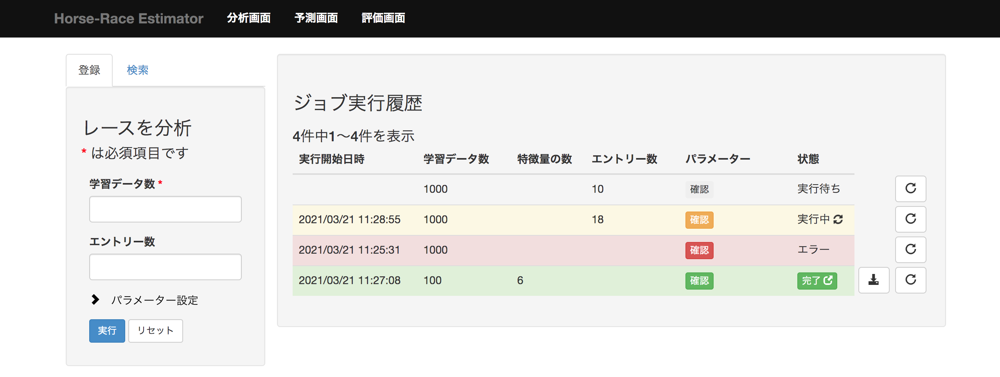

機能仕様
========

機能仕様では以下を定義する

- :ref:`alt-ext-resource`
- :ref:`alt-ext-ui`

.. _alt-ext-resource:

リソース
--------

本システムでは以下のリソースを扱う

- :ref:`alt-ext-res-analysis`
- :ref:`alt-ext-res-prediction`
- :ref:`alt-ext-res-evaluation`
- :ref:`alt-ext-res-eva-data`
- :ref:`alt-ext-res-pre-result`

.. _alt-ext-res-analysis:

分析ジョブ
^^^^^^^^^^

分析の実行単位を表す．分析を1度実行すると1ジョブリソースが生成される

.. csv-table::
   :header: 属性名,型,意味,備考
   :widths: 20,10,30,40

   実行開始日時,string,分析を開始した日時,- 年/月/日 時:分:秒 の形式
   学習データ数,integer,分析に利用したデータ数,- 1以上
   決定木の数,integer,生成するランダムフォレストの木の数,- 1以上
   特徴量の数,integer,分析に利用する特徴量の数,"- 1以上
   - システム内部で自動的に決定される"
   エントリー数,integer,分析で使用するレースのエントリー数,"- 1以上
   - 固定しない場合は null"
   状態,string,ジョブの状態,"- 以下のいずれか

     - 実行中
     - 完了
     - エラー"

.. _alt-ext-res-prediction:

予測ジョブ
^^^^^^^^^^

予測の実行単位を表す．予測を1度実行すると1ジョブリソースが生成される

.. csv-table::
   :header: 属性名,型,意味,備考
   :widths: 20,10,30,40

   実行開始日時,string,予測を開始した日時,- 年/月/日 時:分:秒 の形式
   モデル,string,入力されたモデルのファイル名,
   テストデータ,string,予測するレースデータのファイル名，またはURL,
   状態,string,ジョブの状態,"- 以下のいずれか

     - 実行中
     - 完了
     - エラー"
   結果,array[ :ref:`alt-ext-res-pre-result` ],予測結果の配列,

.. _alt-ext-res-evaluation:

評価ジョブ
^^^^^^^^^^

評価の実行単位を表す．評価を1度実行すると1ジョブリソースが生成される

.. csv-table::
   :header: 属性名,型,意味,備考
   :widths: 20,10,30,40

   実行開始日時,string,予測を開始した日時,- 年/月/日 時:分:秒 の形式
   モデル,string,入力されたモデルのファイル名,
   データソース,string,評価データの情報源,"- 以下のいずれか

     - Top20: 外部サイトからアクセス人気上位
     - ファイル: 指定されたファイル
     - 直接入力: 指定されたテキスト"
   状態,string,ジョブの状態,"- 以下のいずれか

     - 実行中
     - 完了
     - エラー"
   適合率,float,評価したモデルの適合率,- 0以上1以下の小数
   再現率,float,評価したモデルの再現率,- 0以上1以下の小数
   F値,float,評価したモデルのF値,- 0以上1以下の小数
   結果,array[ :ref:`alt-ext-res-eva-data` ], :ref:`alt-ext-res-eva-data` 参照,

.. _alt-ext-res-eva-data:

評価データ
^^^^^^^^^^

評価に利用したデータを表す

.. csv-table::
   :header: 属性名,型,意味,備考
   :widths: 20,10,30,40

   レースID,string,評価したレースのID, :ref:`den-ext-res-race` 参照
   レース名,string,評価したレースの名前,
   URL,string,評価したレースのURL,- httpsスキームのURL
   予測結果,array[ :ref:`alt-ext-res-pre-result` ],予測結果の配列,
   正解,integer,実際に1着となった馬番,- 1以上

.. _alt-ext-res-pre-result:

予測結果
^^^^^^^^

レースの予測結果を表す

.. csv-table::
   :header: 属性名,型,意味,備考
   :widths: 20,10,30,40

   馬番,integer,エントリーの馬番,- 1以上
   予測結果,boolean,1着かどうかを表すラベル,- true または false

.. _alt-ext-ui:

ユーザーインターフェース
------------------------

利用者はブラウザからレースの分析，予測，評価を行う

- レースの分析は :ref:`alt-ext-ui-analysis` で行う
- レースの予測は :ref:`alt-ext-ui-prediction` で行う
- モデルの評価は :ref:`alt-ext-ui-evaluation` で行う

  - 評価結果の詳細は :ref:`alt-ext-ui-eva-result` で確認する

.. _alt-ext-ui-analysis:

分析画面
^^^^^^^^

- 画面左部にパラメーター入力フォームが表示される

  - 必須入力項目には赤い*が付いている
  - 実行ボタンを押下すると分析が開始される

    - 入力フォームに不正な値（文字列，負数など）を入力すると以下のダイアログを表示して入力が間違っていることを通知する

      .. image:: images/analysis_failure.png
         :alt: エラーダイアログ
         :scale: 25

  - 分析が終了すると登録されているメールアドレスに完了を通知するメールが送信される

    - メール本文には以下の情報が記載されている

      - 分析開始日時
      - 分析完了日時
      - 以下のパラメーター

        - 学習データ数
        - 決定木の数
        - 特徴量の数

    - メールには圧縮ファイルが添付されており以下のファイルが含まれている

      - レース予測モデル
      - 分析に使用したデータ

        - 前処理前のデータ
        - 前処理後のデータ

      - 決定木の画像(png)

- 画面右部に実行したジョブ情報の一覧が表示される

  - 25ジョブごとにページングされている
  - 実行開始日時の降順でソートされている
  - 実行中のジョブは黄色，完了したジョブの行は緑色，エラーになったジョブは赤色で表示される
  - 実行中の場合は「状態」列にアイコンが表示される
  - エントリー数を指定したジョブには「エントリー数」列に値が表示される
  - ジョブ情報の右側のボタンを押下すると，そのジョブと同じパラメーターで分析を実行する

.. _alt-ext-ui-prediction:

予測画面
^^^^^^^^

.. image:: images/prediction.png
   :alt: 予測画面

- 画面左部にデータ入力フォームが表示される

  - フォーム上部の「こちら」を押下すると，レースデータが登録されている外部サイトへアクセスする

    - 外部サイトは別タブで表示される

  - モデルには分析を実行して受け取った圧縮ファイルに含まれている予測モデルを指定する
  - テストデータにはファイルを指定するか，データが表示されているサイトのURLを指定できる
  - 実行ボタンを押下すると予測が開始される

- 画面右部に実行したジョブ情報の一覧が表示される

  - 25ジョブごとにページングされている
  - 実行開始日時の降順でソートされている
  - 実行中のジョブは黄色で表示され，結果列には「実行中」と表示される
  - 完了したジョブの行は緑色で表示され，結果列には1着と予測されたエントリーの馬番が表示される

    - 馬番は昇順でソートされている
    - 馬番の数が7つ以上の場合は7番目以降が省略される

      - ポインタを乗せると馬番が全て表示される

  - エラーになったジョブの行は赤色で表示され，結果列には赤色で「×」マークが表示される
  - テストデータがサイトのURLの場合はクリックすると別タブにそのページが表示される

.. _alt-ext-ui-evaluation:

評価画面
^^^^^^^^

.. image:: images/evaluation.png
   :alt: 評価画面

- 画面左部にデータ入力フォームが表示される

  - モデルには分析実行後，メールに添付されている圧縮ファイルに含まれている予測モデルを指定する
  - 評価データには評価で使用したいデータを指定する

    - 指定方法は以下をセレクトボックスから選択する

      - Top20: 外部サイトから人気のレース上位20件を利用する
      - ファイル: レースIDが改行区切りで記載されたファイルを指定する

        - 選択するとセレクトボックスの下にファイル入力フォームが表示される

      - 直接入力: レースIDをフォームに改行区切りで入力する

        - 選択するとセレクトボックスの下にレースIDを入力するテキストボックスが表示される

    - デフォルトでは Top20 が選択されている

  - 実行ボタンを押下すると評価が開始される

- 画面右部に実行したジョブ情報の一覧が表示される

  - 25ジョブごとにページングされている
  - 実行開始日時の降順でソートされている
  - 実行中のジョブは黄色，完了したジョブの行は緑色，エラーになったジョブは赤色で表示される
  - 実行中のジョブは状態列に進捗がパーセンテージで表示される
  - 進行中，完了のジョブは行の右側に :ref:`alt-ext-ui-eva-result` を表示するためのボタンが表示される

    - :ref:`alt-ext-ui-eva-result` は別タブに表示される

.. _alt-ext-ui-eva-result:

評価結果画面
^^^^^^^^^^^^

.. image:: images/evaluation_result.png
   :alt: 評価結果画面

- タイトルの下にF値が表示される
- テーブルには評価結果が表示されている

  - :ref:`alt-ext-ui-evaluation` で選択した指定方法により以下でソートされている

    - Top20: ランクの高い順番
    - ファイル: ファイルに記載されている順番
    - 直接入力: フォームに入力した順番

  - 評価データには最初に予測したデータから順番に番号が割り振られる
  - レース名をクリックすると外部サイトの対象のページを別タブで開く
  - 予測が完了した評価データの行には予測結果が表示されている

    - 予測が間違っている，またはエラーとなった行は赤，予測が正しい行は緑色で表示される
    - 予測結果の内，正解と同じ馬番は緑，それ以外は灰色で表示される

  - 予測が完了していない評価データの行は黄色で表示される
