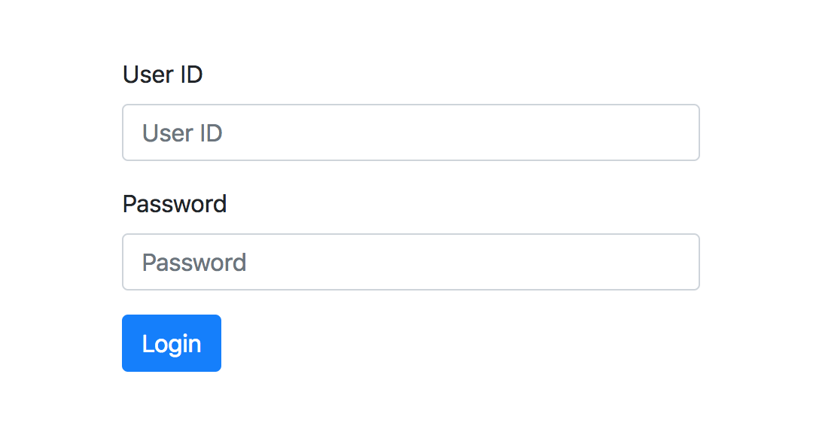
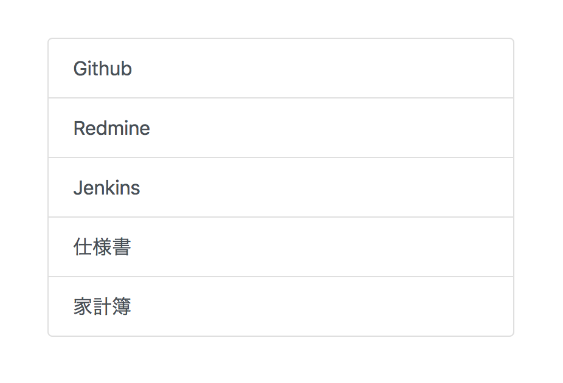

Welcome to Leonis's documentation!
==================================

本仕様書はLeonis0813で管理されているサービスの仕様を記載するものである

- サービスを利用するには事前に :ref:`account-info` を登録し，認証を行う必要がある
- 認証方法は以下の2通りである

  - :ref:`ui-login` からログインする
  - HTTPリクエストヘッダーに認証情報を付与する

.. _ui-login:

ログイン画面
------------

- ユーザーIDとパスワードを入力するフォームが表示されている
- ユーザーIDとパスワードを入力後，ログインボタンを押下すると認証が行われる

  - ログインに失敗するとログイン画面が表示される
  - ログインが成功すると以下のいずれかのページに遷移する

    リダイレクトURLが設定されている場合: リダイレクト先のページ
    リダイレクトURLが設定されていない場合: :ref:`ui-portal`

.. _ui-portal:

ポータルサイト
--------------

- 開発，運用で利用するサイトや，各サービスへのリンクが表示されている
- 表示されるリンクはサービスを提供するサイトによって異なるが，以下のリンクは共通して表示されている

  - Github
  - Redmine
  - Jenkins

.. _account-info:

アカウント情報
--------------

本サービスを利用可能な主体者はユーザー，アプリの2種類であり，それぞれ以下の情報を登録できる（ただし，アプリID，アプリキーは本サービスによって発行される）

- ユーザー

  - ユーザーID
  - パスワード

- アプリ

  - アプリID
  - アプリキー

サービス一覧
------------

.. toctree::
   :maxdepth: 2

   payment_manager/index
   fx-rate_estimator/index
   horse-race_estimator/index
