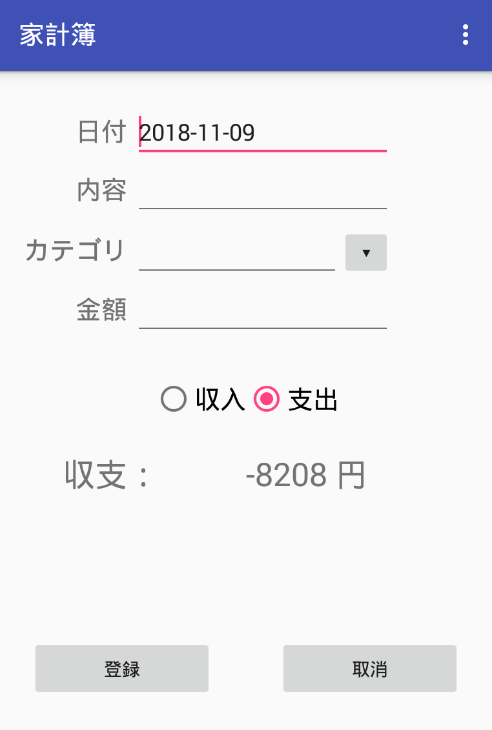
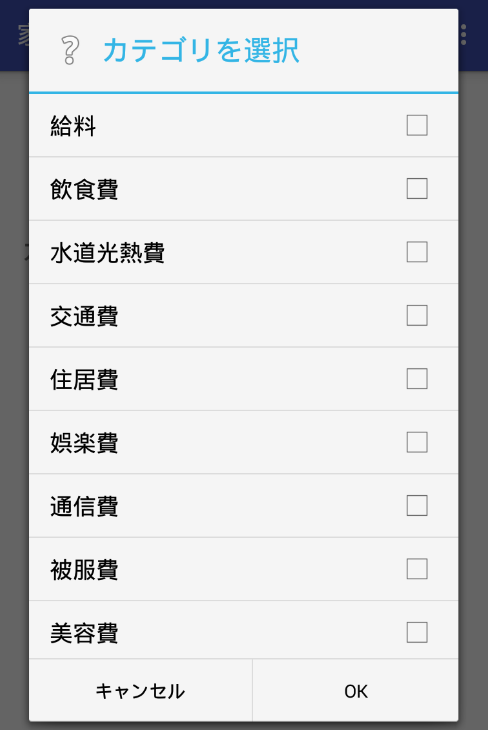

機能仕様
========

機能仕様では以下を定義する

- :ref:`adh-ext-resource`
- :ref:`adh-ext-ui`

.. _adh-ext-resource:

データ構造
----------

本モジュールでは以下のデータを扱う

- :ref:`adh-ext-resource-payment`

.. _adh-ext-resource-payment:

収支
^^^^

- 買い物などで発生した所持金の増減を表す

構成要素
""""""""

.. csv-table::
   :header: "要素", "意味"
   :widths: 10, 30

   "日付", "所持金の増減があった日時"
   "内容", "所持金の増減があった理由など"
   "カテゴリ", "費目（例：食費，水道光熱費）"
   "金額", "所持金の増減"

.. _adh-ext-ui:

ユーザーインターフェース
------------------------

利用者は以下の画面から収支情報を管理できる

- :ref:`adh-ext-ui-register`
- :ref:`adh-ext-ui-index`

.. _adh-ext-ui-register:

登録画面
^^^^^^^^

- 画面上部に収支情報を入力するテキストボックスが表示される

  - 日付入力欄にはアプリ起動時の日付が入力されている
  - カテゴリ入力欄には :ref:`adh-ext-ui-categories` を表示するボタンが配置されている

- デフォルトでは支出が選択されている
- 収入/支出ボタンの下にアプリを起動した月の収支が表示される
- 収支情報を全て入力して登録ボタンを押すと収支が登録される

  - 登録に成功すると，「収支情報を登録しました」というメッセージが表示される

    - 日付以外の入力が削除され，日付入力欄にはアプリ起動時の日付が入力されている
    - 登録した収支を含めた収支が再計算されて表示される

  - 登録に失敗すると，「○○が不正です」といったメッセージが表示される

    - 入力が不正だった項目名が表示される
    - 入力が不正な項目にはテキストボックスの右に赤いマークが表示される

- 入力をキャンセルしたい場合は取消ボタンを押す

.. _adh-ext-ui-categories:

カテゴリ選択画面
""""""""""""""""

- 画面中央にカテゴリを選択するためのダイアログが表示される
- カテゴリは複数選択可能
- OK，またはキャンセルボタンを押下すると :ref:`adh-ext-ui-register` に遷移する

  - OKボタンを押下した場合はカテゴリ入力欄にカテゴリ名が表示されている
  - 複数選択した場合はカンマ区切りでカテゴリ名が表示される

.. _adh-ext-ui-index:

検索画面
^^^^^^^^

  - 画面上部に検索フォームが表示されており，以下の条件を入力できる

    - 期間

      - 片方が入力されていなければ，最も古い，または新しい収支情報までが対象となる
      - どちらも入力されていなければ，全ての収支情報が対象となる

    - 内容

      - 指定した内容を含むか一致する収支情報を検索するかを選択できる

    - カテゴリ

      - カテゴリを複数指定できる
      - 画面は :ref:`adh-ext-ui-categories` を参照

    - 金額

      - 最小値が入力されていなければ，0円以上が対象となる
      - 最大値が入力されていなければ，最も金額の高い収支情報までが対象となる
      - どちらも入力されていなければ，全ての収支情報が対象となる

  - 検索ボタンを押下すると，条件に該当する収支情報が検索フォームの下に表示される

    - 最初は日付の新しい収支情報から順番に10件表示されている
    - 最下部に表示されている「さらに表示する」と記載されたボタンを押下すると，次の10件が下に表示される
