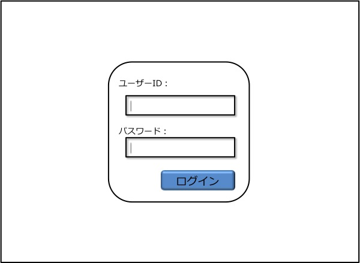
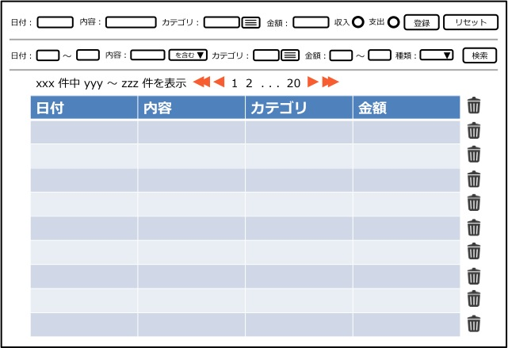

機能仕様
========

機能仕様では以下を定義する

- :ref:`alg-ext-resource`
- :ref:`alg-ext-ui`
- :ref:`alg-ext-api`

.. _alg-ext-resource:

リソース
--------

本システムでは以下のリソースを扱う

- :ref:`alg-ext-resource-user`
- :ref:`alg-ext-resource-application`
- :ref:`alg-ext-resource-payment`
- :ref:`alg-ext-resource-category`

.. _alg-ext-resource-user:

ユーザーリソース
^^^^^^^^^^^^^^^^

本アプリの利用者を表す

.. csv-table::
   :header: "属性名", "型", "意味", "フォーマット", "備考"
   :widths: 10, 10, 20, 20, 40

   "ユーザーID", "文字列(string)", "ユーザーを識別する文字列", "半角英数字",
   "パスワード", "文字列(string)", "ユーザー認証を行うための鍵", "半角英数字",

.. _alg-ext-resource-application:

アプリリソース
^^^^^^^^^^^^^^

本アプリを利用するアプリを表す

.. csv-table::
   :header: "属性名", "型", "意味", "フォーマット", "備考"
   :widths: 10, 10, 20, 20, 40

   "アプリID", "文字列(string)", "アプリを識別する文字列", "- 16文字
   - 半角英数字", "本アプリによって発行される"
   "アプリキー", "文字列(string)", "アプリが持つ秘密鍵", "- 16文字
   - 半角英数字", "本アプリによって発行される"

.. _alg-ext-resource-payment:

収支リソース
^^^^^^^^^^^^

所持金の増減を表す

.. csv-table::
   :header: "入力項目", "型", "意味", "フォーマット", "備考"
   :widths: 10, 10, 20, 20, 40

   "種類", "文字列(string)", "収入, 支出を表す文字列", "``income`` または ``expense``",
   "日付", "文字列(string)", "所持金の増減があった日時", "yyyy-mm-dd",
   "内容", "文字列(string)", "所持金の増減があった理由など", "任意の文字列",
   "カテゴリ", ":ref:`alg-ext-resource-category`", "カテゴリリソースの名前", "任意の文字列",
   "金額", "自然数(integer)", "所持金の増減量", "半角数字",

.. _alg-ext-resource-category:

カテゴリリソース
^^^^^^^^^^^^^^^^

収支のカテゴリを表す

.. csv-table::
   :header: "入力項目", "型", "意味", "フォーマット", "備考"
   :widths: 10, 10, 20, 20, 40

   "名前", "文字列(string)", "費目（例：食費，水道光熱費）", "任意の文字列",
   "意味", "文字列(string)", "どのような収支情報が分類されるかを表す", "任意の文字列",

.. _alg-ext-ui:

ユーザーインターフェース
------------------------

利用者はブラウザから収支の登録や確認を行うことができる

認証画面
^^^^^^^^

- 画面中央部に入力フォームが表示される
- ユーザーID, パスワードを入力して、ログインボタンを押すと認証が行われる
- 認証に成功すると管理画面に遷移する

管理画面
^^^^^^^^

- 画面の上部に登録と検索用の入力フォームが表示される

入力フォーム共通仕様
""""""""""""""""""""

- 日付入力フォームを選択すると，カレンダーが表示される

  .. image:: images/management_calendar.jpg
     :alt: カレンダー
     :scale: 50

- カテゴリ入力フォームの右側の選択ボタンを押すと，カテゴリ一覧が表示される

  .. image:: images/management_category.jpg
     :alt: カテゴリ一覧
     :scale: 50

  - 登録されている収支情報から抽出されたカテゴリが表示される
  - 「OK」ボタンを押下すると，選択したカテゴリがフォームに表示される

    - 複数個選択した場合は，カンマ区切りで表示される
    - 「Cancel」ボタンを押下すると，ダイアログが閉じて管理画面に戻る

登録フォーム仕様
""""""""""""""""

- 登録ボタンを押下すると，フォームに入力した内容で収支情報が登録される

  - 不正な入力があった場合は，下記のダイアログが表示される

    .. image:: images/management_failure.jpg
       :scale: 50

- リセットボタンを押下すると，入力フォームが全て空欄になる

検索フォーム仕様
""""""""""""""""

- 日付入力フォームでは期間を指定可能

  - どちらかを指定しなければ，それ以前，または以降の収支情報を全て取得する

- 内容入力フォームでは内容を指定する

  - 「を含む」を選択すると，指定した言葉を内容に含む収支情報を検索する
  - 「と一致する」を選択すると，指定した言葉と内容が完全一致する収支情報を検索する

- 金額入力フォームでは金額の範囲を指定可能

  - どちらかを指定しなければ，それ以上，または以下の収支情報を全て取得する

- 種類選択フォームでは「収支」，「支出」を選択して特定の種類の収支情報のみを取得する

- 検索ボタンを押下すると，検索条件を満たす収支情報が一覧表示画面に表示される

一覧表示画面仕様
""""""""""""""""

- 収支情報はページングされており，全件数と下記ページへのリンクが表示されている

  - 先頭ページ
  - 最終ページ
  - 次ページ
  - 前ページ
  - 表示中のページから前後4ページ

- 最新の収支から順番に表示される

  - 表のヘッダの各セルの右側のボタンを押すと，収支情報がソートされる

- 1ページ50件の収支が表示される

  - テキストボックスに入力することで表示件数を指定可能
  - デフォルト: 50件

- 収支情報の右側にあるボタンを押すと、削除を確認するダイアログが表示される

  .. image:: images/management_confirm.jpg
     :alt: 削除確認画面
     :scale: 50

  - 「はい」ボタンを押下すると対応する収支情報が削除される
  - 「いいえ」ボタンを押下すると削除せずに管理画面に戻る

.. _alg-ext-api:

Web API
-------

以下のAPIを定義する

.. toctree::
   :maxdepth: 1

   apis/payment
   apis/category

共通仕様
^^^^^^^^

.. _alg-ext-api-common-error:

リクエスト
""""""""""

- WebAPI のパスには全て先頭に ``/algieba/api`` を付与すること

  - 本API仕様書に記載されているパスは全て上記のパス以下を記載する

  - 例：収支を検索する場合

    .. sourcecode:: http

       GET /algieba/api/payments HTTP/1.1

エラーコード
""""""""""""

.. csv-table::
   :header: "エラーコード", "ステータスコード", "意味"

   "absent_param_[属性]", "400", "入力必須の項目がない"
   "invalid_param_[属性]", "400", "不正値のパラメータがある"
