機能仕様
========

機能仕様では以下を定義する

- :ref:`alg-ext-resource`
- :ref:`alg-ext-ui`
- :ref:`alg-ext-api`

.. _alg-ext-resource:

リソース
--------

本システムでは以下のリソースを扱う

- :ref:`alg-ext-res-payment`
- :ref:`alg-ext-res-category`
- :ref:`alg-ext-res-dictionary`
- :ref:`alg-ext-res-tag`

.. _alg-ext-res-payment:

収支リソース
^^^^^^^^^^^^

所持金の増減を表す

.. csv-table::
   :header: 属性名,型,意味,備考
   :widths: 10,30,30,30

   payment_id,string,収支を一意に示すID,"- 32文字の英数字
   - 以下の文字からなる

     - 0〜9
     - a〜f

   - システムによって自動設定される
   - 変更不可"
   payment_type,string,収支情報の種類,"- 以下のいずれか

     - income: 収入
     - expense: 支出"
   date,string,所持金の増減があった日付,- yyyy-mm-dd の形式
   content,string,所持金の増減があった理由など,- 任意の文字列
   categories,array[ :ref:`alg-ext-res-category` ], :ref:`alg-ext-res-category` を参照,
   tags,array[ :ref:`alg-ext-res-tag` ], :ref:`alg-ext-res-tag` を参照,- 空配列の設定可
   price,integer,所持金の増減量,- 1以上

.. _alg-ext-res-category:

カテゴリリソース
^^^^^^^^^^^^^^^^

収支のカテゴリを表す

.. csv-table::
   :header: 属性名,型,意味,備考
   :widths: 10,20,30,40

   category_id,string,カテゴリを一意に示すID,"- 32文字の英数字
   - 以下の文字からなる

     - 0〜9
     - a〜f

   - システムによって自動設定される
   - 変更不可"
   name,string,費目（例：食費，水道光熱費）,- 任意の文字列
   description,string,説明,- 任意の文字列

.. _alg-ext-res-dictionary:

辞書リソース
^^^^^^^^^^^^

収支の辞書を表す． :ref:`alg-ext-res-payment` の内容がどういうカテゴリかをあらかじめ設定しておくことができる

.. csv-table::
   :header: 属性名,型,意味,備考
   :widths: 10,20,30,40

   dictionary_id,string,辞書を一意に示すID,"- 32文字の英数字
   - 以下の文字からなる

     - 0〜9
     - a〜f

   - システムによって自動設定される
   - 変更不可"
   phrase,string,カテゴリを設定したいフレーズ,- 任意の文字列
   condition,string,内容とカテゴリを紐付けるかどうかを決める条件,"- 以下のいずれか

     - equal: 完全一致するフレーズにカテゴリを設定する
     - include: 部分一致するフレーズにカテゴリを設定する"
   categories,array[:ref:`alg-ext-res-category` ], :ref:`alg-ext-res-category` を参照,

.. _alg-ext-res-tag:

タグリソース
^^^^^^^^^^^^

:ref:`alg-ext-res-payment` に設定するタグを表す．複数のタグを設定することができる

.. csv-table::
   :header: 属性名,型,意味,備考
   :widths: 10,20,30,40

   tag_id,string,タグを一意に示すID,"- 32文字の英数字
   - 以下の文字からなる

     - 0〜9
     - a〜f

   - システムによって自動設定される
   - 変更不可"
   name,string,タグ名,"- 最大10文字
   - カンマは利用不可"

.. _alg-ext-ui:

ユーザーインターフェース
------------------------

利用者はブラウザから収支の登録や確認、統計情報の確認を行うことができる

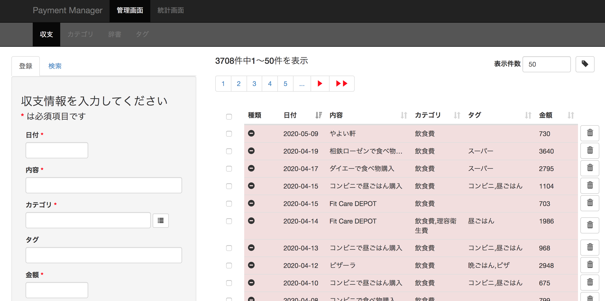

- ページ上部に以下のページへのリンクが表示されている

  - :ref:`alg-ext-ui-management`

    - 以下のリソースの登録や検索ができる

      - :ref:`alg-ext-res-payment`
      - :ref:`alg-ext-res-category`
      - :ref:`alg-ext-res-dictionary`
      - :ref:`alg-ext-res-tag`

    - デフォルトでは :ref:`alg-ext-res-payment` を登録する画面が表示される

  - :ref:`alg-ext-ui-statistics`

    - 統計情報の確認ができる
    - デフォルトでは :ref:`alg-ext-ui-sta-period` が表示される

- デフォルトでは :ref:`alg-ext-ui-management` が表示される

.. _alg-ext-ui-management:

管理画面
^^^^^^^^

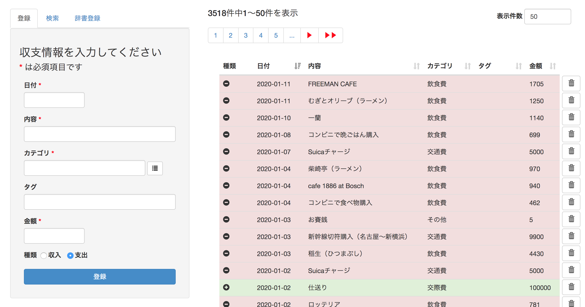

- 画面上部には以下のリソースを管理する画面へのリンクが表示される

  - :ref:`alg-ext-res-payment`
  - :ref:`alg-ext-res-category`
  - :ref:`alg-ext-res-dictionary`
  - :ref:`alg-ext-res-tag`

- 画面左部にはリソースの登録や検索を行うためのフォームが表示される

  - タブでフォームを切り替えることができる

- 画面右部にはリソースの一覧が表示される

.. _alg-ext-ui-man-common:

フォーム共通仕様
""""""""""""""""

.. _alg-ext-ui-man-com-form-date:

日付入力フォーム
''''''''''''''''

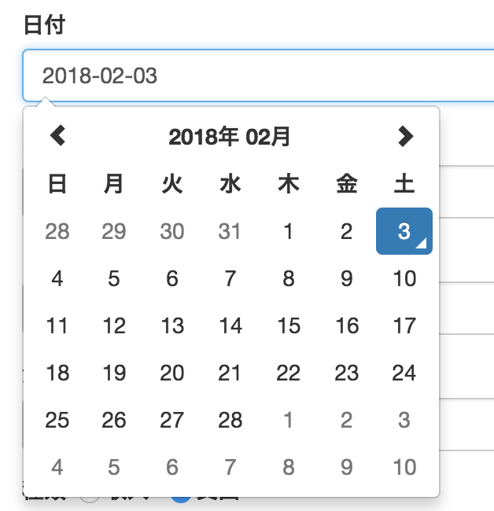

- 日付入力フォームをクリックするとカレンダーが表示される
- 日付を選択すると，テキストボックスに「yyyy-mm-dd」の形式で日付が入力される

.. _alg-ext-ui-man-com-form-category:

カテゴリ入力フォーム
''''''''''''''''''''

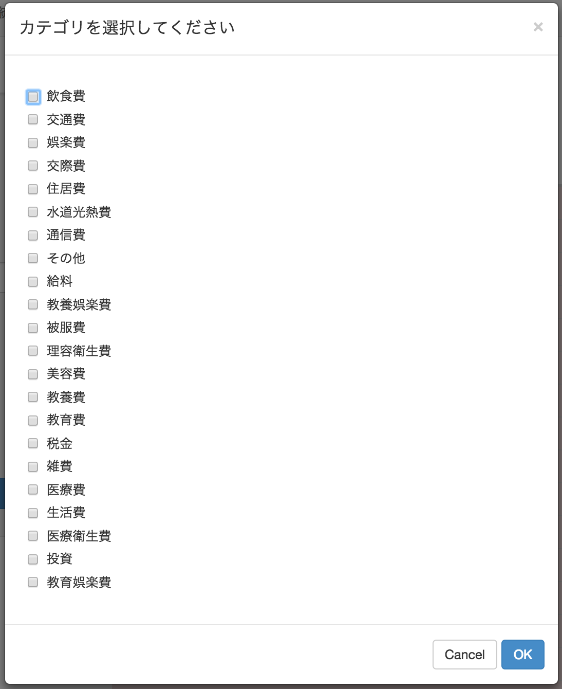

- カテゴリ入力フォームの右側のボタンを押下すると，カテゴリ名の一覧が表示されたダイアログが表示される

  - 登録されている :ref:`alg-ext-res-payment` から抽出されたカテゴリが表示される
  - 「OK」ボタンを押下すると，テキストボックスに選択したカテゴリ名が入力される

    - 複数個選択した場合は，カンマ区切りで入力される

  - 「Cancel」ボタンを押下すると，ダイアログが閉じて管理画面に戻る

.. _alg-ext-ui-man-com-form-tag:

タグ入力フォーム
''''''''''''''''

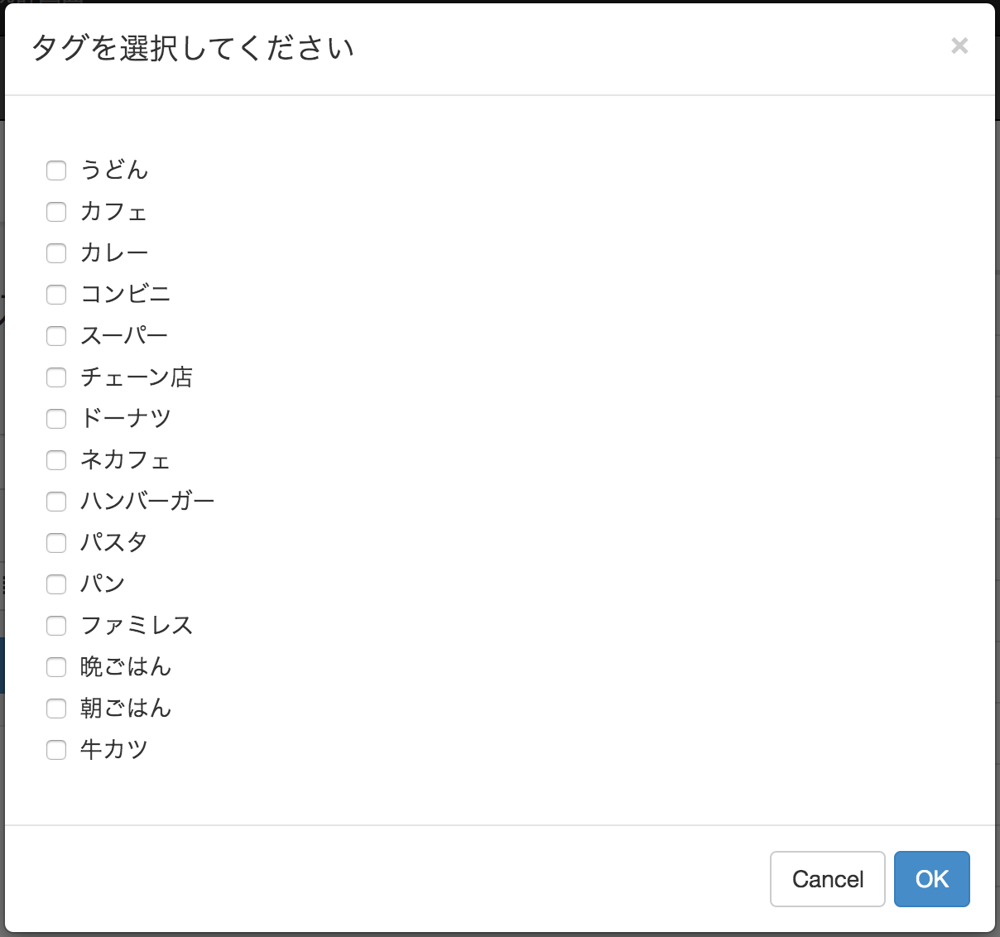

- カテゴリ入力フォームの右側のボタンを押下すると，タグ名の一覧が表示されたダイアログが表示される

  - テキストボックスは編集不可
  - 登録されている :ref:`alg-ext-res-payment` から抽出されたタグが表示される
  - 「OK」ボタンを押下すると，テキストボックスに選択したタグ名が入力される

    - 複数個選択した場合は，カンマ区切りで入力される

  - 「Cancel」ボタンを押下すると，ダイアログが閉じる

.. _alg-ext-ui-man-com-error:

不正入力エラー
''''''''''''''

- 必須項目が入力されていない場合は以下のダイアログが表示される

  .. image:: images/management_common_absent_error.png
     :scale: 50

- 入力値が仕様を満たしていない場合は以下のダイアログが表示される

  .. image:: images/management_common_invalid_error.png
     :scale: 50

- カテゴリやタグ入力フォームに同じ値が含まれている場合は以下のダイアログが表示される

  .. image:: images/management_common_same_value_error.png
     :scale: 50

- 既に同じリソースが登録されている場合は以下のダイアログが表示される

  .. image:: images/management_common_duplicated_error.png
     :scale: 50

.. _alg-ext-ui-man-payment:

収支管理画面
""""""""""""

- :ref:`alg-ext-res-payment` の登録や検索を行うことができる

登録フォーム
''''''''''''

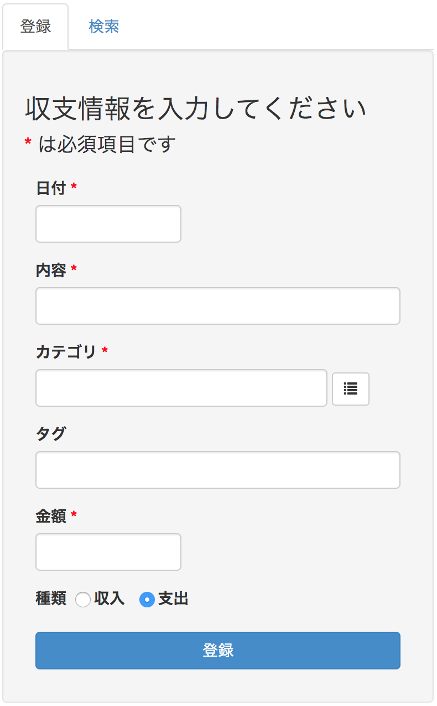

- 以下の入力フォームが表示されている

  - 日付

    - 必須項目
    - :ref:`alg-ext-ui-man-com-form-date` 参照

  - 内容

    - 必須項目
    - フォーカスを外すと入力された内容から :ref:`alg-ext-res-dictionary` を検索する

      - 該当するものがあればカテゴリ入力フォームにカテゴリ名を設定する
      - 複数該当した場合の優先度は以下の順番

        - 条件が「一致する」の辞書
        - フレーズの文字数が長い辞書

  - カテゴリ

    - 必須項目
    - :ref:`alg-ext-ui-man-com-form-category` 参照

  - タグ

    - カンマ区切りで複数設定可能

  - 金額

    - 必須項目
    - 数字のみ入力可能

  - 種類

    - 必須項目
    - デフォルトでは支出が選択されている

- 登録ボタンを押下するとフォームに入力した内容で :ref:`alg-ext-res-payment` が登録される

  - 登録に成功した場合は :ref:`alg-ext-res-dictionary` を登録するためのダイアログが表示される

    .. image:: images/management_payment_create_dialog_dictionary.png
       :scale: 50

    - 初期状態として以下の情報が入力されている

      - フレーズ: 登録した :ref:`alg-ext-res-payment` の内容

        - 条件には「と一致する」が選択されている
        - フレーズや条件は変更可能

      - カテゴリ: 登録した :ref:`alg-ext-res-payment` のカテゴリ名

        - カテゴリは変更不可

    - 既に初期状態が同じ :ref:`alg-ext-res-dictionary` が登録されている場合はダイアログが表示されない
    - :ref:`alg-ext-res-dictionary` の登録に成功した場合，画面が更新されて :ref:`alg-ext-ui-man-pay-table` に登録した :ref:`alg-ext-res-payment` が追加される

  - 登録に失敗した場合はエラーを表示する

    - :ref:`alg-ext-ui-man-com-error` 参照

検索フォーム
''''''''''''

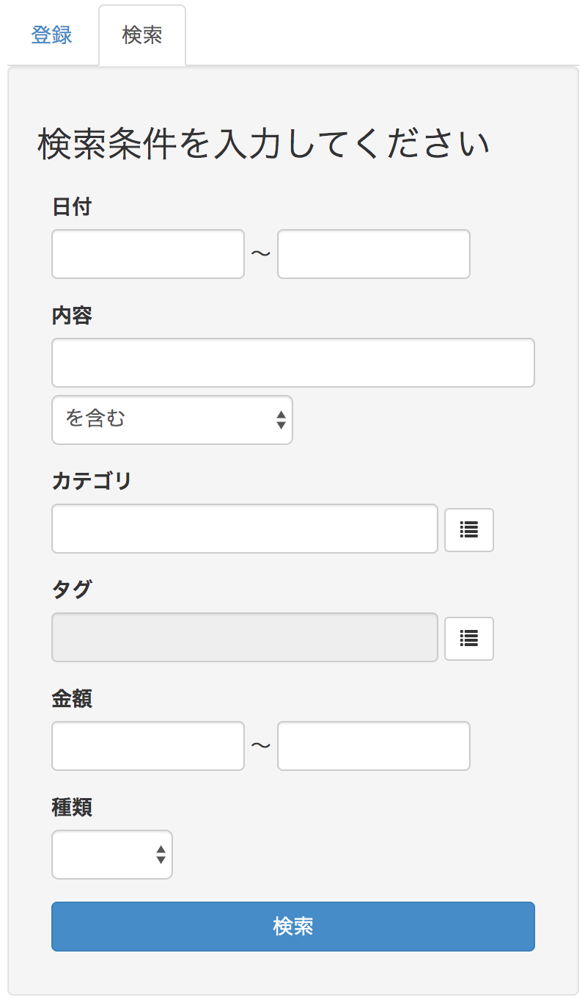

- 以下の入力フォームが表示されている

  - 期間

    - :ref:`alg-ext-ui-man-com-form-date` 参照
    - どちらかを指定した場合，それ以前，または以降の :ref:`alg-ext-res-payment` を全て取得する

  - 内容

    - 「を含む」を選択すると，指定した文字列を内容に含む :ref:`alg-ext-res-payment` を検索する
    - 「と一致する」を選択すると，指定した文字列と内容が完全一致する :ref:`alg-ext-res-payment` を検索する

  - カテゴリ

    - :ref:`alg-ext-ui-man-com-form-category` 参照
    - 複数選択した場合はいずれかに該当する :ref:`alg-ext-res-payment` を検索する

  - タグ

    - :ref:`alg-ext-ui-man-com-form-tag` 参照
    - 複数選択した場合はいずれかに該当する :ref:`alg-ext-res-payment` を検索する

  - 金額

    - どちらかを指定した場合，それ以上，または以下の :ref:`alg-ext-res-payment` を全て取得する

  - 種類

    - 「収支」，「支出」を選択して特定の種類の :ref:`alg-ext-res-payment` のみを取得する

- 検索ボタンを押下すると，検索条件を満たす :ref:`alg-ext-res-payment` が :ref:`alg-ext-ui-man-pay-table` に表示される

.. _alg-ext-ui-man-pay-table:

一覧画面
''''''''

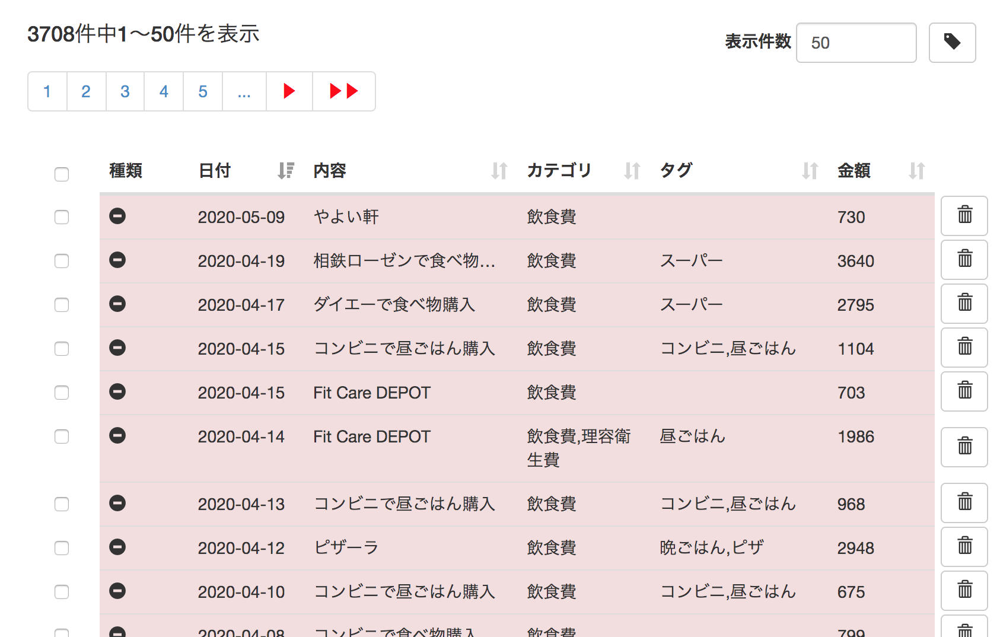

- テーブルはページングされている

  - デフォルトでは日付が新しい :ref:`alg-ext-res-payment` が50件表示される
  - ヘッダの各セルの右側のボタンを押すと， :ref:`alg-ext-res-payment` がソートされる
  - テキストボックスに表示件数を入力することで変更可能

- テーブル上部に全件数と下記ページへのリンクが表示されている

  - 先頭ページ
  - 最終ページ
  - 次ページ
  - 前ページ
  - 表示中のページから前後4ページ

- 各行の右側にあるボタンを押すと、削除を確認するダイアログが表示される

  .. image:: images/management_payment_table_delete.png
     :alt: 削除確認画面
     :scale: 50

  - 「はい」ボタンを押下すると対応する :ref:`alg-ext-res-payment` が削除される

    - 削除が完了すると画面が更新される

  - 「いいえ」ボタンを押下すると削除せずに管理画面に戻る

- 以下の情報は10文字以降が省略される

  - 内容
  - カテゴリ
  - タグ

- テーブル上部のボタンを押下するとタグを設定するダイアログが表示される

  .. image:: images/management_payment_table_assign_tag.png
     :alt: タグ設定daiarogu
     :scale: 50

  - セレクトボックスには登録されているタグの一覧が設定されている
  - 一覧からタグ名を選択してOKボタンを押下すると，チェックを付けた収支情報にタグが設定される
  - Cancelボタンを押下するとダイアログが閉じる
  - 1つもチェックを付けていない状態でボタンを押下すると以下のダイアログが表示される

    .. image:: images/management_payment_table_assign_tag_error.png
       :alt: エラーダイアログ
       :scale: 30

.. _alg-ext-ui-man-category:

カテゴリ管理画面
""""""""""""""""

- :ref:`alg-ext-res-category` の検索を行うことができる

検索フォーム
''''''''''''

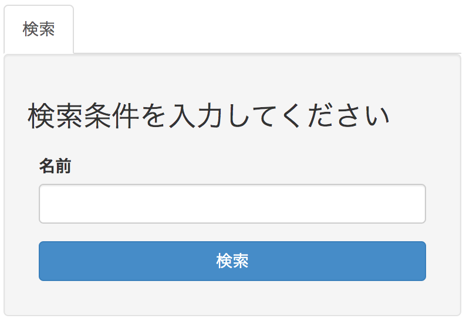

- 以下の入力フォームが表示されている

  - 費目

    - 完全一致する :ref:`alg-ext-res-category` を検索する

- 検索ボタンを押下すると，検索条件を満たす :ref:`alg-ext-res-category` が :ref:`alg-ext-ui-man-cat-table` に表示される

.. _alg-ext-ui-man-cat-table:

一覧画面
''''''''

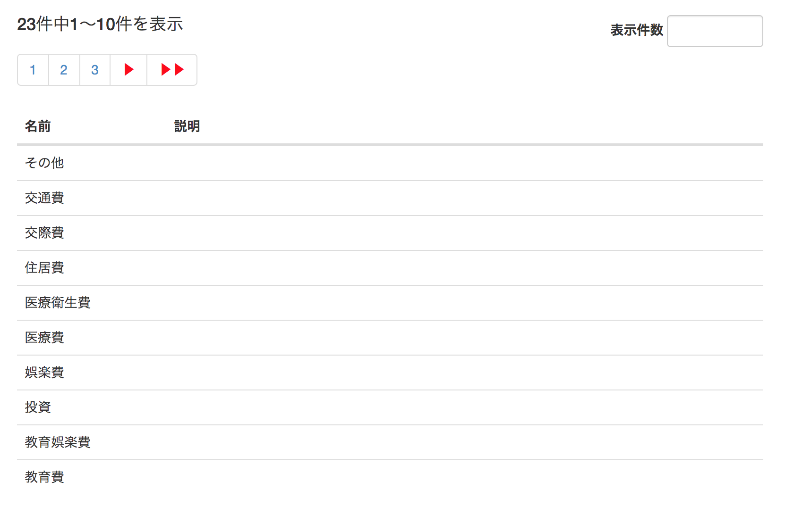

- テーブルはページングされている

  - デフォルトでは費目でソートされた :ref:`alg-ext-res-category` が50件表示される
  - テキストボックスに表示件数を入力することで変更可能

- テーブル上部に全件数と下記ページへのリンクが表示されている

  - 先頭ページ
  - 最終ページ
  - 次ページ
  - 前ページ
  - 表示中のページから前後4ページ

- 以下の情報は30文字以降が省略される

  - 説明

.. _alg-ext-ui-man-dictionary:

辞書管理画面
""""""""""""

- :ref:`alg-ext-res-dictionary` の登録や検索を行うことができる

登録フォーム
''''''''''''

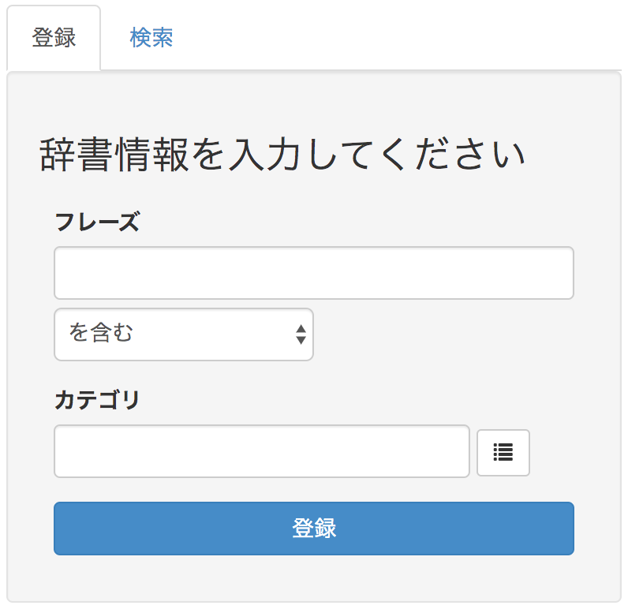

- 以下の入力フォームが表示されている

  - フレーズ

    - 必須項目
    - 以下の条件を指定可能

      - 「を含む」: フレーズを含む内容に対してカテゴリを設定する
      - 「と一致する」: フレーズと一致する内容に対してカテゴリを設定する

  - カテゴリ

    - 必須項目
    - :ref:`alg-ext-ui-man-com-form-category` 参照
    - テキストボックスは編集不可

- 登録ボタンを押下するとフォームに入力した内容で :ref:`alg-ext-res-dictionary` が登録される

  - 登録に成功した場合，画面が更新されて :ref:`alg-ext-ui-man-dic-table` に登録した :ref:`alg-ext-res-dictionary` が追加される
  - 登録に失敗した場合はエラーを表示する

    - :ref:`alg-ext-ui-man-com-error` 参照

検索フォーム
''''''''''''

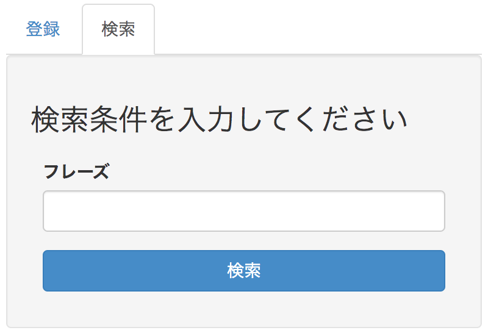

- 以下の入力フォームが表示されている

  - フレーズ

    - 指定した文字列をフレーズに含む :ref:`alg-ext-res-dictionary` を検索する

- 検索ボタンを押下すると，検索条件を満たす :ref:`alg-ext-res-dictionary` が :ref:`alg-ext-ui-man-dic-table` に表示される

.. _alg-ext-ui-man-dic-table:

一覧画面
''''''''

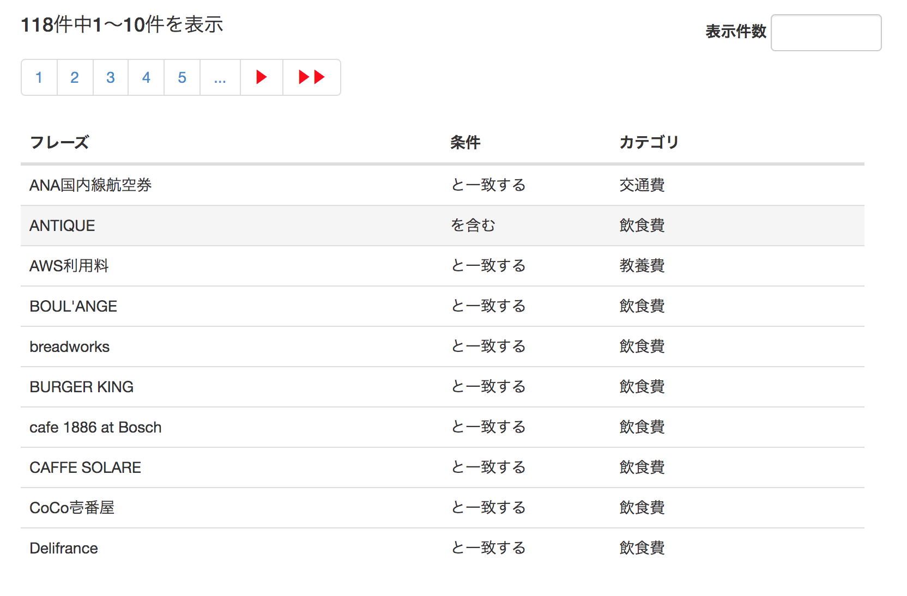

- テーブルはページングされている

  - デフォルトではフレーズでソートされた :ref:`alg-ext-res-dictionary` が50件表示される
  - ヘッダの各セルの右側のボタンを押すと， :ref:`alg-ext-res-dictionary` がソートされる
  - テキストボックスに表示件数を入力することで変更可能
  - カテゴリが複数ある場合はカンマ区切りで表示される

- テーブル上部に全件数と下記ページへのリンクが表示されている

  - 先頭ページ
  - 最終ページ
  - 次ページ
  - 前ページ
  - 表示中のページから前後4ページ

- 以下の情報は20文字以降が省略される

  - フレーズ
  - カテゴリ

.. _alg-ext-ui-man-tag:

タグ管理画面
""""""""""""

- :ref:`alg-ext-res-tag` の登録，設定や検索を行うことができる

登録フォーム
''''''''''''

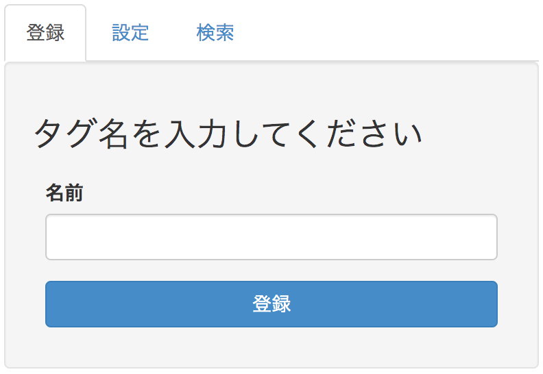

- 以下の入力フォームが表示されている

  - 名前

    - 必須項目

- 登録ボタンを押下するとフォームに入力した内容で :ref:`alg-ext-res-tag` が登録される

  - 登録に成功した場合，画面が更新されて :ref:`alg-ext-ui-man-tag-table` に登録した :ref:`alg-ext-res-tag` が追加される
  - 登録に失敗した場合はエラーを表示する

    - :ref:`alg-ext-ui-man-com-error` 参照

検索フォーム
''''''''''''

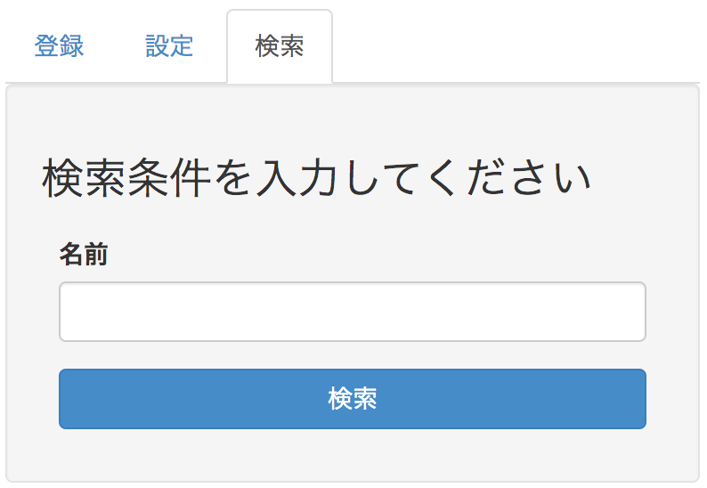

- 以下の入力フォームが表示されている

  - 名前

    - 指定した文字列を名前に含む :ref:`alg-ext-res-tag` を検索する

- 検索ボタンを押下すると，検索条件を満たす :ref:`alg-ext-res-tag` が :ref:`alg-ext-ui-man-tag-table` に表示される

.. _alg-ext-ui-man-tag-table:

一覧画面
''''''''

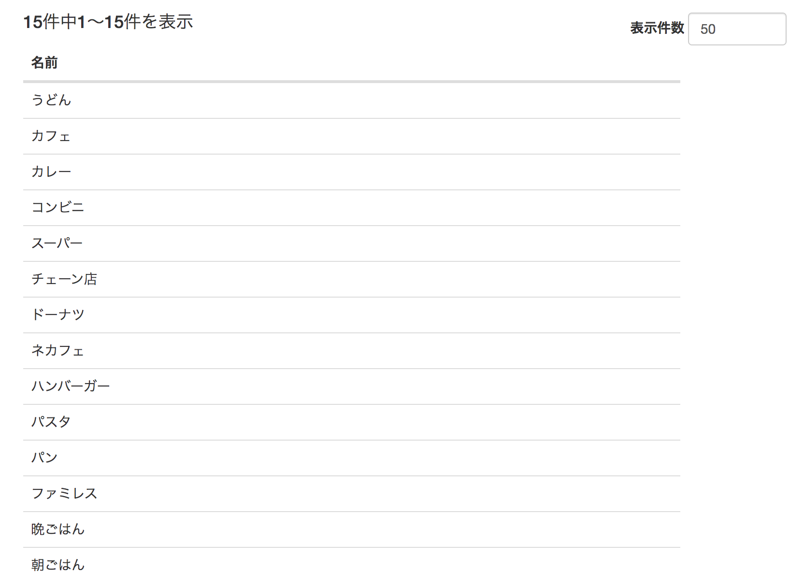

- テーブルはページングされている

  - デフォルトでは名前でソートされた :ref:`alg-ext-res-tag` が50件表示される
  - テキストボックスに表示件数を入力することで変更可能

- テーブル上部に全件数と下記ページへのリンクが表示されている

  - 先頭ページ
  - 最終ページ
  - 次ページ
  - 前ページ
  - 表示中のページから前後4ページ

.. _alg-ext-ui-statistics:

統計画面
^^^^^^^^

統計画面では以下のグラフを表示する

- :ref:`alg-ext-ui-sta-period`
- :ref:`alg-ext-ui-sta-category`

.. _alg-ext-ui-sta-period:

期間別収支
""""""""""

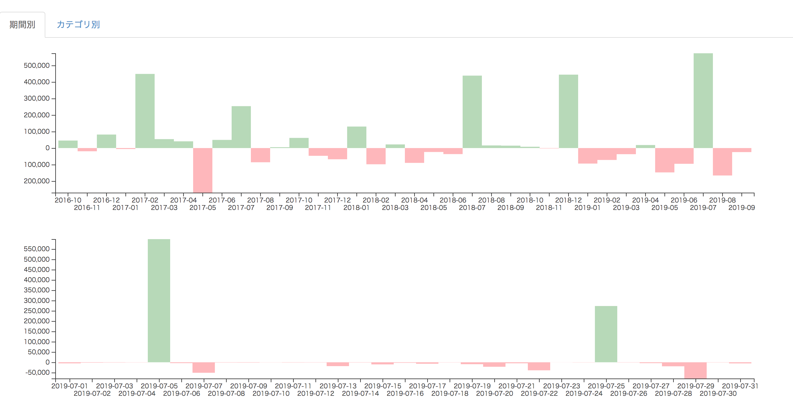

- 月別の収支を表す棒グラフが3年間分表示される

  - マウスポインタを棒の上に置くと金額が表示される
  - 横軸のラベルをクリックするとその月の日別の収支のグラフが下に表示される

    - 日別の収支の棒グラフも同様に，マウスポインタを棒の上に置くと金額が表示される

.. _alg-ext-ui-sta-category:

カテゴリ別収支
""""""""""""""

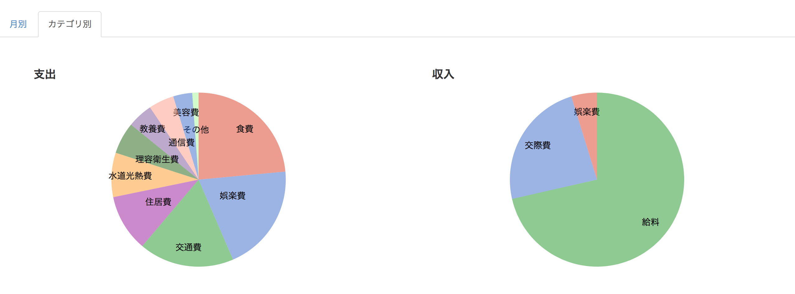

- カテゴリ別の収支の割合を表す円グラフを表示する
- 収支・支出それぞれ1つずつグラフを表示する

.. _alg-ext-api:

Web API
-------

以下のAPIを定義する

.. toctree::
   :maxdepth: 1

   external/api/payment
   external/api/category
   external/api/dictionary
   external/api/tag
   external/api/settlement

共通仕様
^^^^^^^^

.. _alg-ext-api-common-error:

リクエスト
""""""""""

- WebAPI のパスには全て先頭に ``/algieba/api`` を付与すること

  - 本API仕様書に記載されているパスは全て上記のパス以下を記載する

  - 例：収支を検索する場合

    .. sourcecode:: http

       GET /algieba/api/payments HTTP/1.1

エラーコード
""""""""""""

ステータスコードによってレスポンスが異なる

400(BadRequest)
'''''''''''''''

- レスポンスボディとして以下のキーを含むJSONオブジェクトの配列を返す

  .. csv-table::
     :header: キー名,設定される値,備考

     error_code,エラーコード,
     parameter,エラーが発生したパラメーター名,
     resource,パラメーターの関連リソース名,リソースの属性でないパラメーターの場合はnull

- エラーコードは以下のいずれかを返す

  .. csv-table::
     :header: エラーコード,意味

     absent_parameter,入力必須のパラメーターが指定されていない
     invalid_parameter,不正値のパラメーターがある
     include_same_value,配列要素のパラメーターに同じ値が含まれている
     duplicated_resource,同じリソースが既に登録されている

**レスポンス例**

.. sourcecode:: http

   HTTP/1.1 400 BadRequest
   Content-Type: application/json

   {
     "errors": [
       {
         "error_code": "absent_parameter",
         "parameter": "date",
         "resource": "payment"
       }
     ]
   }

404(NotFound)
'''''''''''''

- レスポンスボディは返さない

**レスポンス例**

.. sourcecode:: http

   HTTP/1.1 404 NotFound
