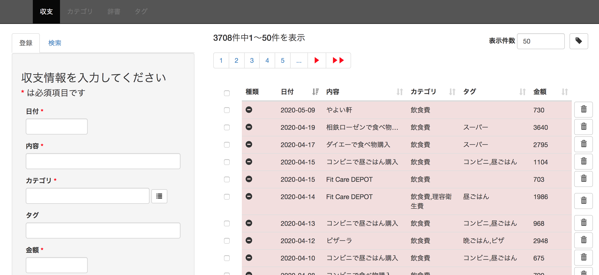
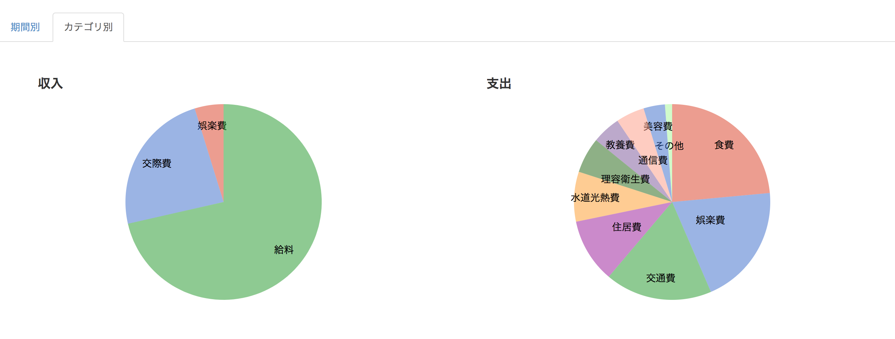

機能仕様
========

機能仕様では以下を定義する

- :ref:`alg-ext-resource`
- :ref:`alg-ext-ui`
- :ref:`alg-ext-api`

.. _alg-ext-resource:

リソース
--------

本システムでは以下のリソースを扱う

- :ref:`alg-ext-res-payment`
- :ref:`alg-ext-res-category`
- :ref:`alg-ext-res-dictionary`
- :ref:`alg-ext-res-tag`

.. _alg-ext-res-payment:

収支リソース
^^^^^^^^^^^^

所持金の増減を表す

.. csv-table::
   :header: 属性名,型,意味,備考
   :widths: 10,20,30,40

   payment_id,string,収支を一意に示すID,"- 32文字の英数字
   - 以下の文字からなる

     - 0〜9
     - a〜f

   - システムによって自動設定される
   - 変更不可"
   payment_type,string,収支情報の種類,"- 以下のいずれか

     - income: 収入
     - expense: 支出"
   date,string,所持金の増減があった日付,- yyyy-mm-dd の形式
   content,string,所持金の増減があった理由など,- 任意の文字列
   categories,array[ :ref:`alg-ext-res-category` ], :ref:`alg-ext-res-category` を参照,
   tags,array[ :ref:`alg-ext-res-tag` ], :ref:`alg-ext-res-tag` を参照,- 空配列の設定可
   price,integer,所持金の増減量,- 1以上

.. _alg-ext-res-category:

カテゴリリソース
^^^^^^^^^^^^^^^^

収支のカテゴリを表す

.. csv-table::
   :header: 属性名,型,意味,備考
   :widths: 10,20,30,40

   category_id,string,カテゴリを一意に示すID,"- 32文字の英数字
   - 以下の文字からなる

     - 0〜9
     - a〜f

   - システムによって自動設定される
   - 変更不可"
   name,string,費目（例：食費，水道光熱費）,- 任意の文字列
   description,string,どのような収支情報が分類されるかを表す,- 任意の文字列

.. _alg-ext-res-dictionary:

辞書リソース
^^^^^^^^^^^^

収支の辞書を表す． :ref:`alg-ext-res-payment` の内容がどういうカテゴリかをあらかじめ設定しておくことができる

.. csv-table::
   :header: 属性名,型,意味,備考
   :widths: 10,20,30,40

   dictionary_id,string,辞書を一意に示すID,"- 32文字の英数字
   - 以下の文字からなる

     - 0〜9
     - a〜f

   - システムによって自動設定される
   - 変更不可"
   phrase,string,カテゴリを設定したいフレーズ,- 任意の文字列
   condition,string,内容とカテゴリを紐付けるかどうかを決める条件,"- 以下のいずれか

     - equal: 完全一致するフレーズにカテゴリを設定する
     - include: 部分一致するフレーズにカテゴリを設定する"
   categories,array[:ref:`alg-ext-res-category` ], :ref:`alg-ext-res-category` を参照,

.. _alg-ext-res-tag:

タグリソース
^^^^^^^^^^^^

:ref:`alg-ext-res-payment` に設定するタグを表す．複数のタグを設定することができる

.. csv-table::
   :header: 属性名,型,意味,備考
   :widths: 10,20,30,40

   tag_id,string,タグを一意に示すID,"- 32文字の英数字
   - 以下の文字からなる

     - 0〜9
     - a〜f

   - システムによって自動設定される
   - 変更不可"
   name,string,タグ名,"- 最大10文字
   - カンマは利用不可"

.. _alg-ext-ui:

ユーザーインターフェース
------------------------

利用者はブラウザから収支の登録や確認、統計情報の確認を行うことができる

- 収支の登録や検索，辞書の登録は :ref:`alg-ext-ui-management` で行う
- 統計情報の確認は :ref:`alg-ext-ui-statistics` で行う

.. _alg-ext-ui-management:

管理画面
^^^^^^^^

- 画面の上部に管理画面と統計画面へのリンクが表示される
- 画面の左側には収支情報の登録や検索，辞書情報の登録フォームが表示される

  - タブでフォームを切り替えることができ，初期状態では収支情報の登録フォームが表示される

- 画面の右側には収支情報の一覧が表示される

フォーム共通仕様
""""""""""""""""

日付入力ボックス
''''''''''''''''

.. image:: images/ui_calendar.png
   :alt: カレンダー
   :scale: 50

- 日付入力ボックスをクリックするとカレンダーが表示される
- 日付を選択すると，テキストボックスに「yyyy-mm-dd」の形式で日付が入力される

カテゴリ選択ダイアログ
''''''''''''''''''''''

- カテゴリ入力フォームの右側のボタンを押下すると，カテゴリの一覧が表示されたダイアログが表示される

    - 登録されている収支情報から抽出されたカテゴリが表示される
    - 「OK」ボタンを押下すると，テキストボックスに選択したカテゴリが入力される

      - 複数個選択した場合は，カンマ区切りで入力される

    - 「Cancel」ボタンを押下すると，ダイアログが閉じて管理画面に戻る

.. _alg-ext-ui-error:

不正入力エラー
''''''''''''''

- 不正な入力があった場合は，下記のダイアログが表示される

  .. image:: images/ui_management_failure.png
     :scale: 50

登録フォーム仕様
""""""""""""""""

.. image:: images/management_create_payment.png
   :alt: 登録フォーム
   :scale: 50

- 日付，内容，カテゴリ，タグ，金額，種類を入力して登録ボタンを押下すると，フォームに入力した内容で収支情報が登録される

  - 入力項目はタグ以外は必須項目
  - 内容入力フォームからフォーカスを外すと入力された内容から辞書を検索し，該当するものがあればカテゴリ入力フォームにカテゴリを設定する

    - 複数該当した場合の優先度は以下の順番

      - 条件が「一致する」の辞書
      - フレーズの文字数が長い辞書

  - タグ入力フォームにはカンマ区切りで複数設定可能

- 登録成功後，辞書を登録するためのダイアログが表示される

  .. image:: images/payments_dialog_dictionary.png
     :scale: 50

  - 初期状態として以下の情報が入力されている

    - フレーズ: 登録した収支情報の内容

      - 条件には「と一致する」が選択されている
      - フレーズや条件は変更可能

    - カテゴリ: 登録した収支情報のカテゴリ

      - カテゴリは変更不可

  - 既に初期状態が同じ辞書が登録されている場合はダイアログが表示されない

検索フォーム仕様
""""""""""""""""

.. image:: images/management_index_payments.png
   :alt: 検索フォーム
   :scale: 50

- 検索条件を入力して検索ボタンを押下すると，検索条件を満たす収支情報が一覧表示画面に表示される
- 日付入力フォームでは期間を指定する

  - どちらかを指定しなければ，それ以前，または以降の収支情報を全て取得する

- 内容入力フォームでは内容を指定する

  - 「を含む」を選択すると，指定した言葉を内容に含む収支情報を検索する
  - 「と一致する」を選択すると，指定した言葉と内容が完全一致する収支情報を検索する

- タグ入力フォームではタグを指定する

  - 直接入力不可
  - ダイアログからタグを選択することで指定する

    .. image:: images/management_index_tags_dialog.png
       :alt: タグ選択ダイアログ
       :scale: 50

    - 「OK」ボタンを押下するとタグ入力フォームに選択したタグがカンマ区切りで表示される
    - 「Cancel」ボタンを押下するとダイアログを閉じる

- 金額入力フォームでは金額の範囲を指定する

  - どちらかを指定しなければ，それ以上，または以下の収支情報を全て取得する

- 種類選択フォームでは「収支」，「支出」を選択して特定の種類の収支情報のみを取得する

辞書登録フォーム仕様
""""""""""""""""""""

.. image:: images/management_create_dictionary.png
   :alt: 辞書登録フォーム
   :scale: 50

- フレーズとカテゴリを入力して登録ボタンを押下すると，入力したフレーズとカテゴリで辞書が登録される
- フレーズ入力フォームではフレーズを指定する

  - 「を含む」を選択すると，入力したフレーズを含む内容を入力した場合に指定したカテゴリを設定する
  - 「と一致する」を選択すると，入力したフレーズと一致する内容を入力した場合に指定したカテゴリを設定する

- 登録に成功すると以下のダイアログが表示される

  .. image:: images/management_dictionaries_success.png
     :scale: 50

- 登録に失敗した場合は :ref:`alg-ext-ui-error` が表示される

収支情報一覧画面仕様
""""""""""""""""""""

.. image:: images/management_payment_list.png
   :scale: 50

- 収支情報はページングされており，全件数と下記ページへのリンクが表示されている

  - 先頭ページ
  - 最終ページ
  - 次ページ
  - 前ページ
  - 表示中のページから前後4ページ

- 最新の収支から順番に表示される

  - 表のヘッダの各セルの右側のボタンを押すと，収支情報がソートされる

- 1ページ50件の収支が表示される

  - テキストボックスに入力することで表示件数を指定可能
  - デフォルト: 50件

- 収支情報の右側にあるボタンを押すと、削除を確認するダイアログが表示される

  .. image:: images/ui_management_confirm.png
     :alt: 削除確認画面
     :scale: 50

  - 「はい」ボタンを押下すると対応する収支情報が削除される
  - 「いいえ」ボタンを押下すると削除せずに管理画面に戻る

- 内容，カテゴリ，タグが長い場合は省略される

.. _alg-ext-ui-statistics:

統計画面
^^^^^^^^

統計画面では以下の2種類のグラフを表示する

- :ref:`alg-ext-ui-sta-period`
- :ref:`alg-ext-ui-sta-category`

.. _alg-ext-ui-sta-period:

期間別収支
""""""""""

.. image:: images/statistics_period.png
   :alt: 期間別収支

- 月別の収支を表す棒グラフが3年間分表示される

  - マウスポインタを棒の上に置くと金額が表示される
  - 横軸のラベルをクリックするとその月の日別の収支のグラフが下に表示される

    - 日別の収支の棒グラフも同様に，マウスポインタを棒の上に置くと金額が表示される

.. _alg-ext-ui-sta-category:

カテゴリ別収支
""""""""""""""

- カテゴリ別の収支の割合を表す円グラフを表示する
- 収支・支出それぞれ1つずつグラフを表示する

.. _alg-ext-api:

Web API
-------

以下のAPIを定義する

.. toctree::
   :maxdepth: 1

   external/api/payment
   external/api/category
   external/api/dictionary
   external/api/settlement

共通仕様
^^^^^^^^

.. _alg-ext-api-common-error:

リクエスト
""""""""""

- WebAPI のパスには全て先頭に ``/algieba/api`` を付与すること

  - 本API仕様書に記載されているパスは全て上記のパス以下を記載する

  - 例：収支を検索する場合

    .. sourcecode:: http

       GET /algieba/api/payments HTTP/1.1

エラーコード
""""""""""""

.. csv-table::
   :header: "エラーコード", "ステータスコード", "意味"

   absent_param_[属性],400,入力必須の項目がない
   invalid_param_[属性],400,不正値のパラメータがある
   not_found,404,パスパラメーターで指定したリソースが存在しない

**レスポンス例**

.. sourcecode:: http

   HTTP/1.1 400 BadRequest
   Content-Type: application/json

   {
     "errors": [
       {
         "error_code": "absent_param_date"
       }
     ]
   }
