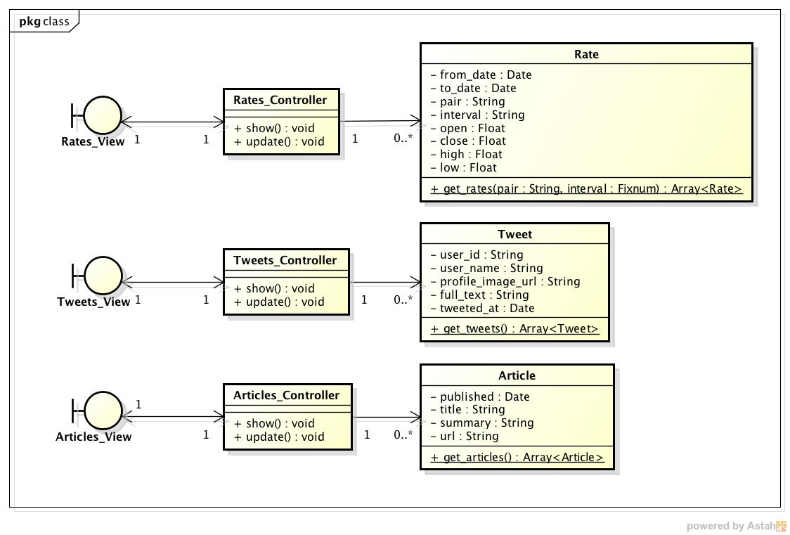
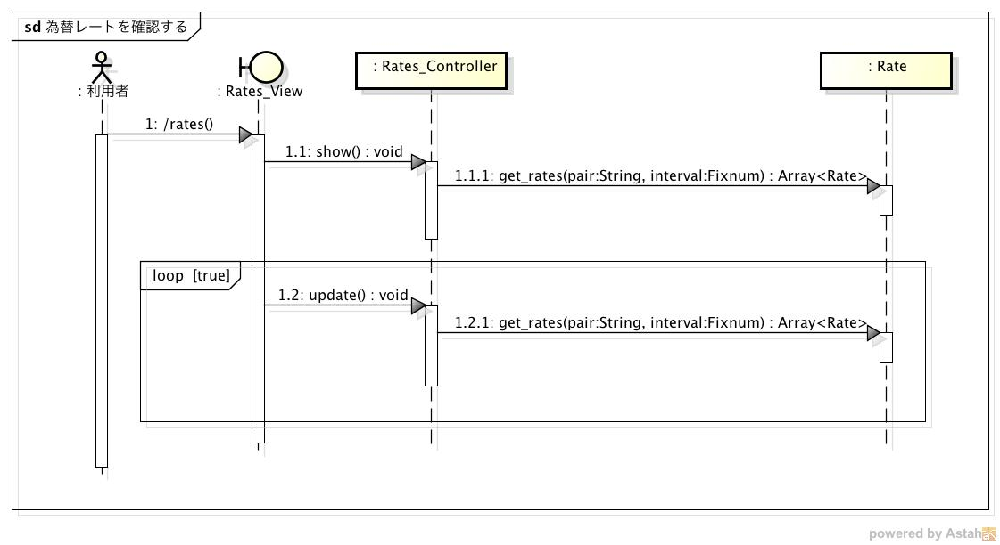
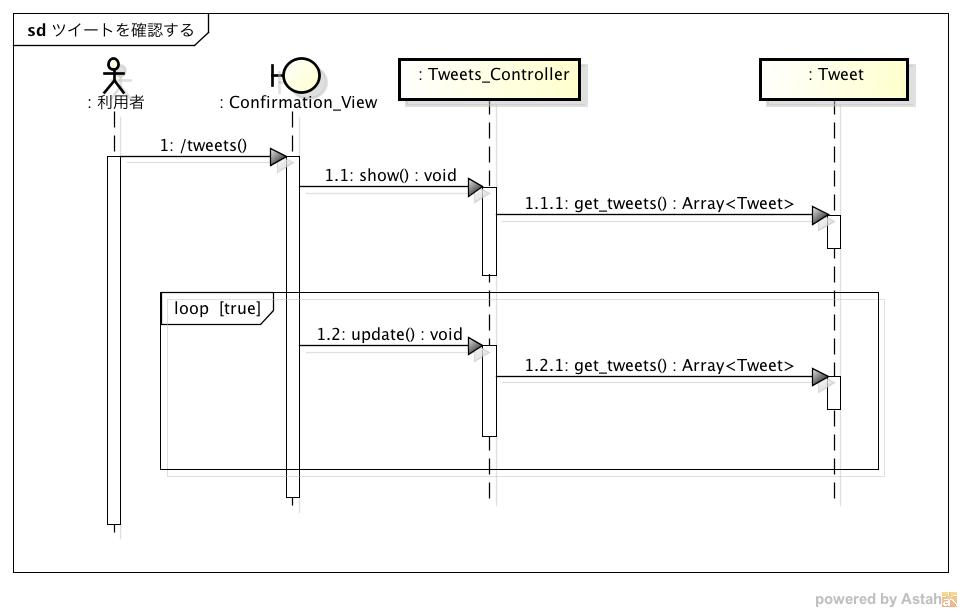
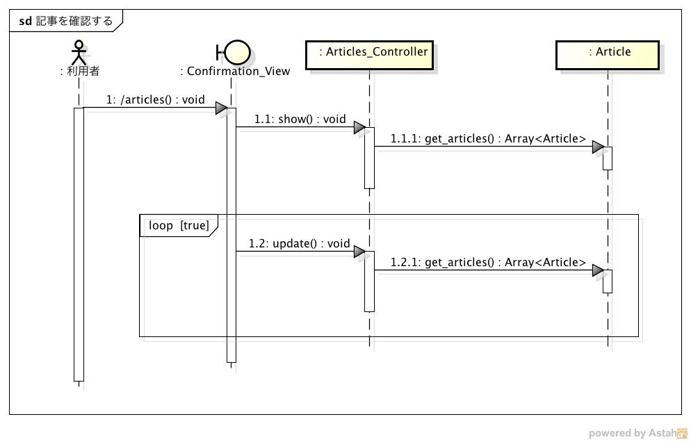

設計仕様
========

設計仕様では以下を定義する

- `モジュール構成 <http://localhost/regulus_docs/design_spec.html#id2>`__
- `処理手順 <http://localhost/regulus_docs/design_spec.html#id3>`__
- `データベース構成  <http://localhost/regulus_docs/design_spec.html#id7>`__

モジュール構成
--------------

MVCモデルを利用する

*クラス図*

- Model

  - Rate

    - 為替レートを表すクラス
    - 以下の情報を保持する

      - from_date: 集計対象データの範囲（開始時刻）
      - to_date: 集計対象データの範囲（終了時刻）
      - pair: 為替のペアコード（例：USDJPY）
      - interval: 集計対象期間

	- 以下のいずれかが保持されている

	  - 5-min
	  - 10-min
	  - 20-min
	  - 30-min
	  - 1-hour
	  - 2-hour
	  - 3-hour
          - 4-hour
	  - 6-hour
	  - 12-hour
	  - 1-day
	  - 1-week
	  - 1-month

      - open: 始値
      - close: 終値
      - high: 高値
      - low: 安値

  - Tweet

    - ツイートを表すクラス
    - 以下の情報を保持する

      - tweet_id: ツイートのID
      - user_name: ツイートのユーザー名
      - profile_image_url: アカウントのプロフィール画像のURL
      - full_text: ツイート本文
      - tweeted_at: ツイート日時

  - Article

    - 記事を表すクラス
    - 以下の情報を保持する

      - published: 記事が発行された日時
      - title: 記事のタイトル
      - summary: 記事の要約
      - url: 記事へのURL

  - データベースには `外部スクリプト <http://localhost/regulus_docs/design_spec.html#id8>`__ により定期的にレコードが追加される

    - レート，ツイート・記事の情報を取得するスクリプトが定期的に実行されてMySQLに登録される

|

- View

  - Confirmation\_View

    - Webブラウザ上で表示する画面

|

- Controller

  - Rates\_Controller

    - Rateクラスのコントローラ
    - Rateオブジェクトを取得し，ビューに表示する

  - Tweets\_Controller

    - Tweetクラスのコントローラ
    - Tweetオブジェクトを取得し，ビューに表示する

  - Articles\_Controller

    - Articleクラスのコントローラ
    - Articleオブジェクトを取得し，ビューに表示する

処理手順
--------

- `レートを確認する <http://localhost/regulus_docs/design_spec.html#id4>`__
- `ツイートを取得する <http://localhost/regulus_docs/design_spec.html#id5>`__
- `記事を取得する <http://localhost/regulus_docs/design_spec.html#id6>`__

レートを確認する
^^^^^^^^^^^^^^^^

*シーケンス図*

利用者がWebページにアクセスしてからレートを確認するまでの流れ

1. 利用者がhttps://<ホスト名>/ratesにアクセスする
2. Rates_Controller#showを実行する
3. Rates::get_ratesを実行する
   - 引数にはペアコードと足の種類（5分など）を指定する
4. Rates::get_moving_averageを実行する
   - 引数にはペアコードと足の種類（5分など）を指定する
5. 取得したレートをグラフ化して表示する
6. 以降は10秒ごとにRates_Controller#updateを実行してグラフを更新する

ツイートを確認する
^^^^^^^^^^^^^^^^^^

*シーケンス図*

利用者がWebページにアクセスしてからツイートを確認するまでの流れ

1. 利用者がhttp://<ホスト名>/tweetsにアクセスする
2. Tweets_Controller#showを実行する
3. Tweets::get_tweetsを実行し，最新100件のツイート情報を取得する
4. 取得したツイートを表示する
5. 以降は1秒ごとにTweets_Controller#updateを実行してツイートを更新する

記事を確認する
^^^^^^^^^^^^^^

*シーケンス図*

利用者がWebページにアクセスしてから記事を確認するまでの流れ

1. 利用者がhttp://<ホスト名>/articlesにアクセスする
2. Articles_Controller#showを実行する
3. Articles::get_articlesを実行し，最新100件の記事情報を取得する
4. 取得した記事を表示する
5. 以降は60秒後とにArticles_Controller#updateを実行して記事を更新する

データベース構成
----------------

レート情報を登録するRatesテーブル，ツイートを登録するTweetsテーブル，記事を登録するArticlesテーブルを定義する

- Ratesテーブル

+------------+-----------+--------------------------+--------+------------+
| カラム     | 型        | 内容                     | 主キー | NOT NULL   |
+============+===========+==========================+========+============+
| from_date  | DATETIME  | 足の期間（開始）         | ◯      | ◯          |
+------------+-----------+--------------------------+--------+------------+
| to_date    | DATETIME  | 足の期間（終了）         | ◯      | ◯          |
+------------+-----------+--------------------------+--------+------------+
| pair       | VARCHAR   | 為替のペアコード         | ◯      | ◯          |
+------------+-----------+--------------------------+--------+------------+
| interval   | VARCHAR   | 足の種類                 | ◯      | ◯          |
+------------+-----------+--------------------------+--------+------------+
| open       | FLOAT     | 始値                     |        | ◯          |
+------------+-----------+--------------------------+--------+------------+
| close      | FLOAT     | 終値                     |        | ◯          |
+------------+-----------+--------------------------+--------+------------+
| high       | FLOAT     | 高値                     |        | ◯          |
+------------+-----------+--------------------------+--------+------------+
| low        | FLOAT     | 安値                     |        | ◯          |
+------------+-----------+--------------------------+--------+------------+
| created_at | DATETIME  | レコードが作成された時刻 |        | ◯          |
+------------+-----------+--------------------------+--------+------------+
| updated_at | DATETIME  | レコードが更新された時刻 |        | ◯          |
+------------+-----------+--------------------------+--------+------------+

  - ローソク足に関するデータが1つのレコードとして作成される
  - 足の種類（カッコ内はテーブルに登録される文字列）

    - 5分足(5-min)
    - 10分足(10-min)
    - 20分足(20-min)
    - 30分足(30-min)
    - 1時間足(1-hour)
    - 2時間足(2-hour)
    - 3時間足(3-hour)
    - 4時間足(4-hour)
    - 6時間足(6-hour)
    - 12時間足(12-hour)
    - 1日足(1-day)
    - 1週間足(1-week)
    - 1ヶ月足(1-month)

  - 生データは外部スクリプトを使って取得する
  - ローソク足データは生データを使って定期的に集計される

- Tweetsテーブル

+---------------------+-----------+---------------------------+----------+-------------+
| カラム              | 型        | 内容                      | 主キー   | NOT NULL    |
+=====================+===========+===========================+==========+=============+
| tweet_id            | VARCHAR   | ツイートID                | ◯        | ◯           |
+---------------------+-----------+---------------------------+----------+-------------+
| user_name           | VARCAHR   | ツイートしたユーザ名      |          | ◯           |
+---------------------+-----------+---------------------------+----------+-------------+
| profile_image_url   | VARCHAR   | ユーザのプロフィール画像  |          | ◯           |
+---------------------+-----------+---------------------------+----------+-------------+
| full_text           | TEXT      | ツイート本文              |          | ◯           |
+---------------------+-----------+---------------------------+----------+-------------+
| tweeted_at          | DATETIME  | ツイートした日時          |          | ◯           |
+---------------------+-----------+---------------------------+----------+-------------+
| created_at          | DATETIME  | ツイート取得日            |          | ◯           |
+---------------------+-----------+---------------------------+----------+-------------+

- Articlesテーブル

+--------------+-----------+-------------------------+----------+-------------+
| カラム       | 型        | 内容                    | 主キー   | NOT NULL    |
+==============+===========+=========================+==========+=============+
| published    | DATETIME  | 記事が発行された日時    | ◯        | ◯           |
+--------------+-----------+-------------------------+----------+-------------+
| title        | VARCHAR   | 記事のタイトル          | ◯        | ◯           |
+--------------+-----------+-------------------------+----------+-------------+
| summary      | TEXT      | 記事の要約              |          | ◯           |
+--------------+-----------+-------------------------+----------+-------------+
| url          | VARCHAR   | 記事本文へのURL         |          |             |
+--------------+-----------+-------------------------+----------+-------------+
| created_at   | DATETIME  | 記事取得日              |          | ◯           |
+--------------+-----------+-------------------------+----------+-------------+

外部スクリプト
--------------

レート，ツイート，記事の取得，バックアップなどの管理は外部スクリプトで定期的に実行する

- 取得した情報はアプリが管理するデータベースではなく，専用のデータベースに登録される

- アプリは専用データベースからコピーしたものを使用する

スクリプト一覧
^^^^^^^^^^^^^^

*レート用スクリプト*

+---------------------+-------------------------------------------------------------------+
| スクリプト名        | 処理内容                                                          |
+=====================+===================================================================+
| rates.import.rb     | info.finance.yahoo.co.jpからレート情報を取得&DBに登録する         |
+---------------------+-------------------------------------------------------------------+
| rates.aggregate.rb  | レート情報を集約してローソク足データを作成する                    |
+---------------------+-------------------------------------------------------------------+
| rates.aggregate.sql | 集約するためのSQLクエリ                                           |
+---------------------+-------------------------------------------------------------------+
| rates.dump.rb       | レート情報をバックアップする                                      |
+---------------------+-------------------------------------------------------------------+
| rates.delete.rb     | 古いレート情報を削除する                                          |
+---------------------+-------------------------------------------------------------------+

*ツイート用スクリプト*

+---------------------+-------------------------------------------------------------------+
| スクリプト名        | 処理内容                                                          |
+=====================+===================================================================+
| tweets.import.rb    | Twitter APIを利用してツイート情報を取得&DBに登録する              |
+---------------------+-------------------------------------------------------------------+
| tweets.dump.rb      | ツイート情報をバックアップする                                    |
+---------------------+-------------------------------------------------------------------+
| tweets.delete.rb    | 古いツイート情報を削除する                                        |
+---------------------+-------------------------------------------------------------------+

*記事用スクリプト*

+------------------------+-----------------------------------------------------------+
| スクリプト名           | 処理内容                                                  |
+========================+===========================================================+
| articless.import.rb    | RSSから記事情報を抽出&DBに登録する                        |
+------------------------+-----------------------------------------------------------+
