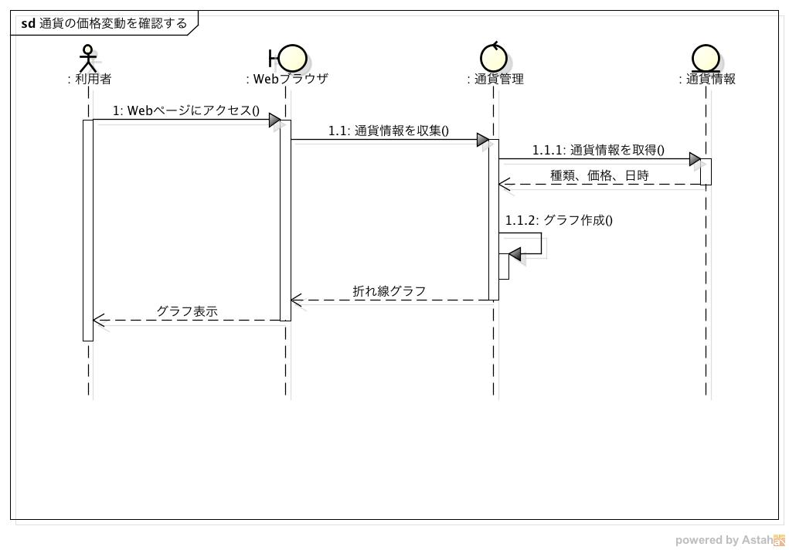
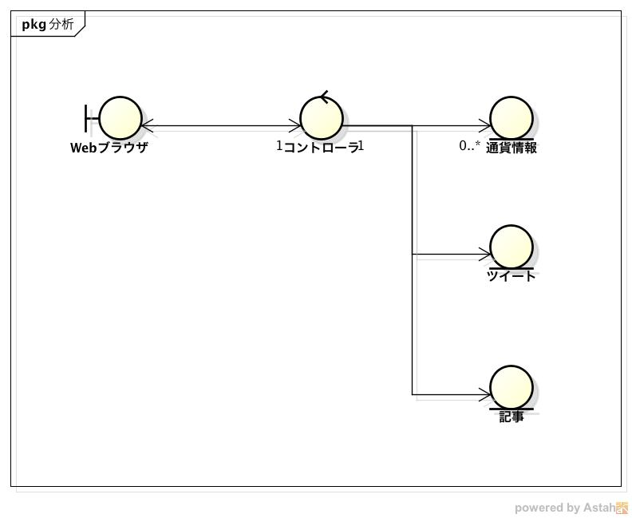

機能仕様
============

-  システムの振る舞いと構造を記載する

   -  `振る舞い <http://localhost/regulus_docs/external.html#id2>`__
   -  `構造 <http://localhost/regulus_docs/external.html#id5>`__

振る舞い
--------

通貨の価格変動を確認する
^^^^^^^^^^^^^^^^^^^^^^^^

シーケンス図
            

- 利用者がWebページにアクセスしてからグラフを確認するまでの流れ

   1. ブラウザにURLを入力してシステムにアクセス
   2. システムがDBから通貨情報を取得
   3. 取得した通貨情報からグラフを作成
   4. 作成したグラフをブラウザに表示

- システムは常にDBから通貨情報を取得してグラフを更新する
- 通貨情報は３０秒間隔でFXサイトから収集され、DBに登録される
- グラフは１０秒間隔で更新される

変動に関連する情報を確認する
^^^^^^^^^^^^^^^^^^^^^^^^^^^^

シーケンス図
            
.. image:: images/seq_info_ext.jpg
   :alt: シーケンス図(変動に関連する情報を確認する)

- 利用者がWebページにアクセスしてから関連情報を確認するまでの流れ

   1. ブラウザにURLを入力してシステムにアクセス
   2. システムがDBからツイートを取得
   3. システムがDBから日経記事を取得
   4. 取得した情報をブラウザに表示

- システムは常にDBからツイート、日経記事を取得する
- 関連情報はTwitter, 日経から収集され、BDに登録される
- ツイートは１秒間隔で更新される
- 日経記事は１０分間隔で更新される

構造
----

クラス図
        

- MVCモデルを利用する

- View

   - Webブラウザ
   - ユーザーが見れるように情報を表示するためのクラス

- Controller

   - コントローラ

      - 必要な通貨情報，ツイート，記事を取得してブラウザ送信するするためのクラス

- Model

   - 通貨情報

      - FXサイトから取得した通貨情報
      - 以下の情報を保持する

         - 通貨情報を取得した日時
         - 通貨の種類
	 - レート

   - ツイート

      - Twitterから取得したツイート
      - 以下の情報を保持する

      	 - ツイートID
	 - ユーザーID
	 - プロフィール画像のURL
         - 本文
	 - ツイート日時
         - ツイートを取得した日時

   - 記事

      - 日経から取得した記事
      - 以下の情報を保持する

	 - 記事が発行された日時
	 - タイトル
	 - 要約
	 - 記事へのURL
         - 記事を取得した日時
