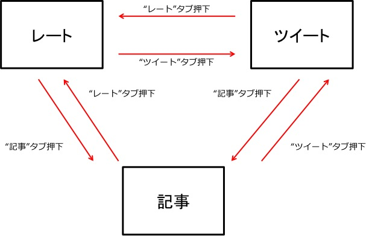
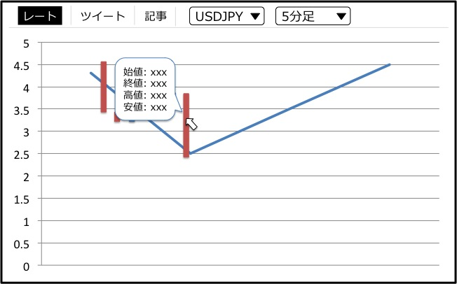
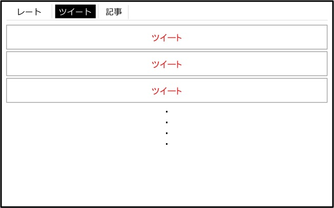
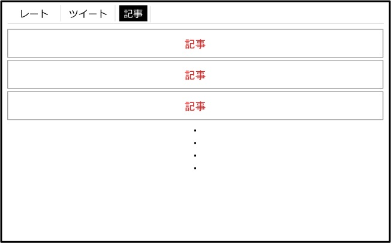

機能仕様
========

機能仕様では以下を定義する

- `ユーザーインターフェース <http://localhost/regulus_docs/functional_spec.html#id2>`__
- `データ構造 <http://localhost/regulus_docs/functional_spec.html#id7>`__

ユーザーインターフェース
------------------------

利用者はブラウザを操作してレート・ツイート・記事を確認する

- 画面にはレート，ツイート，記事のどれかが表示されている

画面遷移図
^^^^^^^^^^

|

- タブを押すことで表示するものを切り替える
- 表示されているタブは白黒反転する

レート表示画面
^^^^^^^^^^^^^^

|

- 指定されたペア・期間のローソク足グラフと移動平均線を表示する

  - 過去と未来のレート情報が表示される
  - 利用者は画面上部のプルダウンからペアと期間を選択する
  - 移動平均線は直近75本分のレート情報から計算される

- グラフは定期的に更新される

- マウスをローソク足に近づけると，始値，終値，高値，安値の情報が表示される

ツイート表示画面
^^^^^^^^^^^^^^^^

|

- 最新100件を表示する
- 新しいツイートほど画面上部に表示される
- スクロールすることで古いツイートを見ることができる

記事表示画面
^^^^^^^^^^^^

|

- 最新100件を表示する
- 新しい記事ほど画面上部に表示される
- スクロールすることで古い記事を見ることができる

データ構造
----------

本システムでは以下のデータを扱う

- `為替レート <http://localhost/regulus_docs/functional_spec.html#id8>`__
- `為替レート（予測） <http://localhost/regulus_docs/functional_spec.html#id10>`__
- `ツイート <http://localhost/regulus_docs/functional_spec.html#id12>`__
- `記事 <http://localhost/regulus_docs/functional_spec.html#id14>`__

為替レート
^^^^^^^^^^

- ある時点での為替レートの情報を表す
- ローソク足グラフを使って為替レートの変動を表す
- 為替レートはYahooから取得する

構成要素
""""""""

.. csv-table::
   :header: "要素", "意味"
   :widths: 10, 90

   "ペア", "為替レートのペア（例：ドル円，ユーロ円）"
   "期間", "1本のローソク足が表す期間（例：5分間，1時間など）"
   "レート", "為替レートの値"

為替レート（予測）
^^^^^^^^^^^^^^^^^^

- 未来の為替レートの予測結果を表す
- ローソク足グラフを使って為替レートの変動を表す
- 為替レートはツールを利用して予測される

構成要素
""""""""

.. csv-table::
   :header: "要素", "意味"
   :widths: 10, 90

   "ペア", "為替レートのペア（例：ドル円，ユーロ円）"
   "期間", "1本のローソク足が表す期間（例：5分間，1時間など）"
   "レート", "為替レートの値"

ツイート
^^^^^^^^

- 為替に関連するツイートを表す
- ツイートやそれに関連する情報はTwitterのAPIを利用して取得する

構成要素
""""""""

.. csv-table::
   :header: "要素", "意味"
   :widths: 10, 30

   "ユーザーID", "ツイートしたユーザーのID"
   "プロフィール画像", "ツイートしたユーザーのプロフィール画像"
   "本文", "ツイート本文"
   "ツイート日時", "ツイートした日時"

記事
^^^^

- 為替に関連する記事を表す
- 記事やそれに関連する情報は取得したRSSから抽出する

構成要素
""""""""

.. csv-table::
   :header: "要素", "意味"
   :widths: 10, 50

   "発行日時", "記事が発行された日時"
   "タイトル", "記事のタイトル"
   "要約", "記事の要約文"
   "URL", "記事が掲載されているRSSへのURL"
