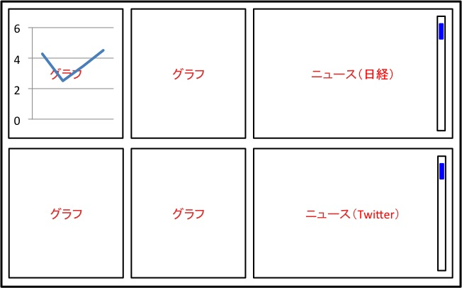

ユーザインターフェース
======================

-  外部インターフェースであるブラウザでの表示について記載する

ブラウザ画面
------------

機能
----

-  ブラウザの左側に４種類の通貨のグラフが表示される

   -  表示される通貨の種類は固定
   -  定期的にグラフが更新される

-  ブラウザの右上に日経から得られた情報が表示される

   -  スクロールさせることで古い情報も閲覧可能
   -  閲覧できる情報の数は固定

-  ブラウザの右下にTwitterから取得したツイートが表示される

   -  スクロールさせることで古いツイートも閲覧可能
   -  閲覧できるツイートの数は固定

-  ブラウザ全体をスクロールさせることはできない
