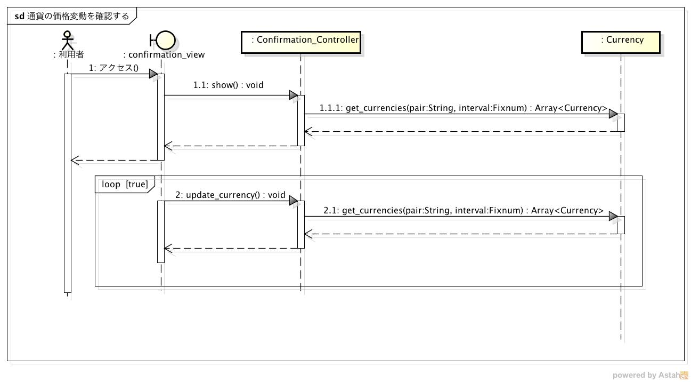
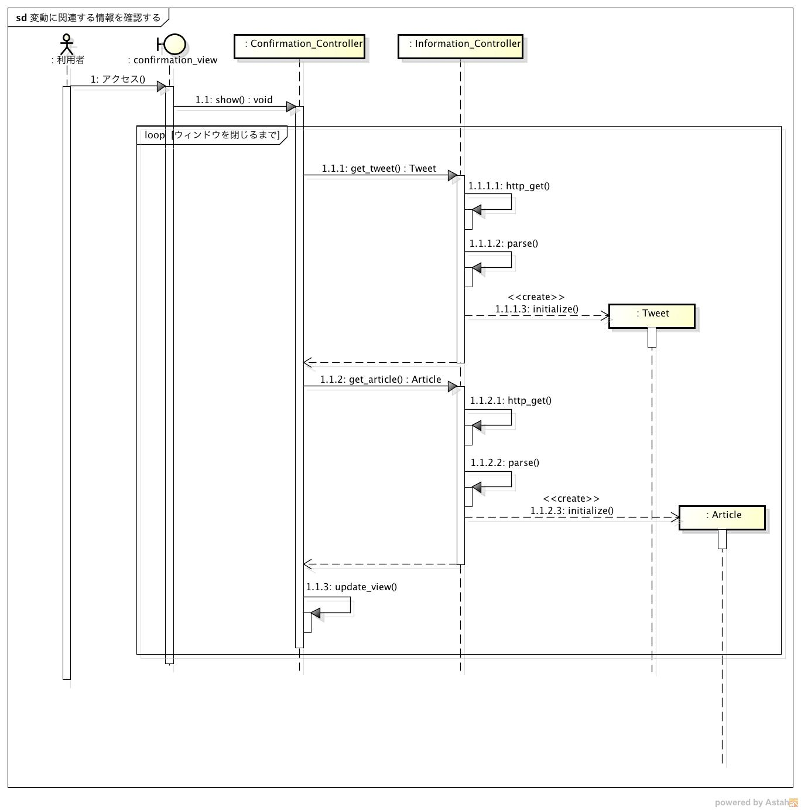
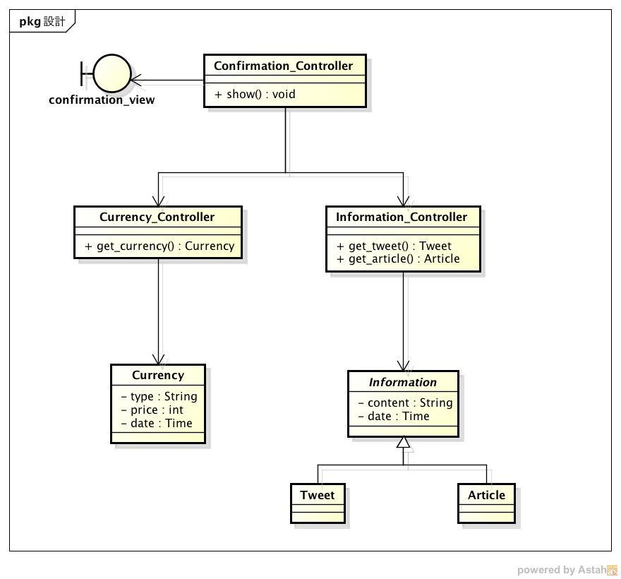

詳細仕様
============

-  システムの詳細な振る舞いと構造を記載する

   -  `振る舞い <http://localhost:8080/regulus_docs/internal.html#id2>`__
   -  `構造 <http://localhost:8080/regulus_docs/internal.html#id5>`__

振る舞い
--------

通貨の価格変動を確認する
^^^^^^^^^^^^^^^^^^^^^^^^

シーケンス図
            

-  利用者がWebページにアクセスしてからグラフを確認するまでの流れ

   1. アクセスを受けたConfirmation\_viewがConfirmation\_Controllerにアクセスの受信を通知する
   2. 受信したConfirmation\_Controllerが通貨取得を開始する
   3. Currencyオブジェクトを取得して返す
   4. ビューにグラフを表示する

-  以降は3〜6を繰り返す

変動に関連する情報を取得する
^^^^^^^^^^^^^^^^^^^^^^^^^^^^

シーケンス図
            

-  利用者がWebページにアクセスしてから関連情報を確認するまでの流れ

   1. アクセスを受けたConfirmation\_viewがConfirmation\_Controllerにアクセスの受信を通知する
   2. 受信したConfirmation\_Controllerが関連情報の取得を開始する
   3. Tweetオブジェクトを取得して返す
   4. Articleオブジェクトを取得して返す
   5. ビューに情報を表示する

-  以降は3〜9を繰り返す

構造
----

クラス図
        

-  MVCモデルを利用する

-  View

   -  confirmation\_view

      -  Webブラウザ上で表示する画面

-  Controller

   -  Confirmation\_Controller

      -  confirmation\_viewのコントローラ
      -  グラフや関連情報の更新を行う

   -  Currency\_Controller

      -  Currencyのコントローラ
      -  通貨情報の取得を行う

   -  Information\_Controller

      -  Tweet, Articleのコントローラ
      -  関連情報の取得を行う

-  Model

   -  Currency

      -  通貨情報を表すクラス
      -  種類，価格，日付を保持する

   -  Information

      -  関連情報を表す抽象クラス
      -  本文，日付を保持する

   -  Tweet

      -  ツイートを表すクラス

   -  Article

      -  記事を表すクラス

   - **データベースには外部スクリプトにより定期的にレコードが追加される**

      - **通貨，ツイート・日経の情報を取得するスクリプトが定期的に実行されてMySQLに登録される**
