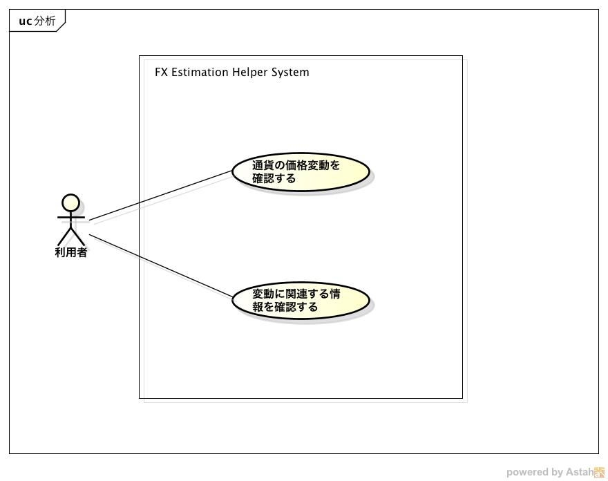

要求仕様
========

本システムは以下の４つの機能を提供する

- `レートの予測 <http://localhost/regulus_docs/requirements_spec.html#id2>`__
- `レートの表示 <http://localhost/regulus_docs/requirements_spec.html#id3>`__
- `ツイートの表示 <http://localhost/regulus_docs/requirements_spec.html#id4>`__
- `記事の表示 <http://localhost/regulus_docs/requirements_spec.html#id5>`__

*ユースケース図*

レートの予測
------------
- 過去のレートの動きから未来のレートを予測する
- 予測したレート情報をグラフとして表示する

*ユースケースシナリオ*

1. 利用者はブラウザからシステムにアクセスする
2. システムはレートを予測した結果を折れ線グラフとして表示する

レートの表示
------------

- レートの変化を表したローソク足グラフをブラウザ上に表示する

  - 移動平均線も同じグラフ上に表示する

- ローソク足グラフと移動平均線は定期的に更新される

*ユースケースシナリオ*

1. 利用者はブラウザからシステムにアクセスする
2. システムはレートの変化を表すグラフを表示する

ツイートの表示
--------------

- Twitterから取得したツイートをブラウザ上に表示する
- 表示されるツイートは「為替」を条件として検索した結果である
- ツイートは定期的に更新される

*ユースケースシナリオ*

1. 利用者はブラウザからシステムにアクセスする
2. システムはツイートを表示する

記事の表示
----------

- 日本経済新聞(日経)のRSSから取得した記事をブラウザ上に表示する
- 記事は定期的に更新される

*ユースケースシナリオ*

1. 利用者はブラウザからシステムにアクセスする
2. システムは記事を表示する
