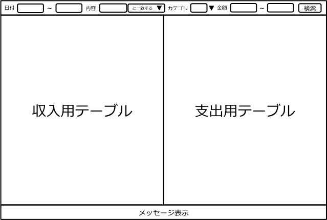

機能仕様
========

機能仕様では以下を定義する

- :ref:`zos-ext-resource`
- :ref:`zos-ext-ui`

.. _zos-ext-resource:

データ構造
----------

本モジュールでは以下のデータを扱う

- :ref:`zos-ext-resource-payment`

.. _zos-ext-resource-payment:

収支
^^^^

- 買い物などで発生した所持金の増減を表す

構成要素
""""""""

.. csv-table::
   :header: "要素", "意味"
   :widths: 10, 30

   "日付", "所持金の増減があった日時"
   "内容", "所持金の増減があった理由など"
   "カテゴリ", "費目（例：食費，水道光熱費）"
   "金額", "所持金の増減"

.. _zos-ext-ui:

ユーザインターフェース
----------------------

利用者はアプリを操作して収支を検索する

検索画面
^^^^^^^^

**機能**

- 画面上部に検索条件を入力するフォームが表示される

  - 日付を指定する場合は期間を指定する

    - 開始日を指定しない場合は過去の収支情報を全て取得する
    - 終了日を指定しない場合は最新の収支情報まで取得する

  - 内容を指定する場合は検索文字列を指定する

    - 「と一致する」を選択した場合は完全一致する収支情報を取得する
    - 「を含む」を選択した場合は部分一致する収支情報を取得する

  - カテゴリを指定する場合はリストから選択する

    - カテゴリ選択ダイアログから複数のカテゴリを選択可能

  - 金額を指定する場合は範囲を指定する

    - 最小値を指定しない場合は最安値以上の収支情報を全て取得する
    - 最大値を指定しない場合は最高値以下の収支情報を全て取得する

- 検索条件を入力して検索ボタンを押すと収支が表示される
- 収支は収入・支出に分けて表示される
- 何も入力せずに検索ボタンを押すと全収支が表示される
- 収支は日付の降順で表示される
- エラー通知などのメッセージは画面下部に表示される
