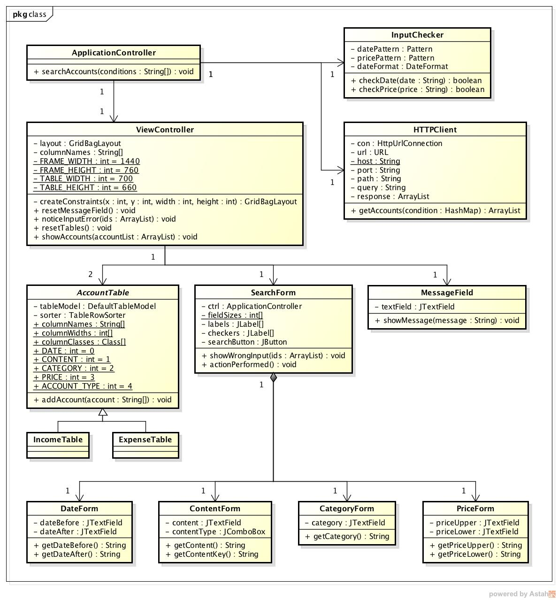
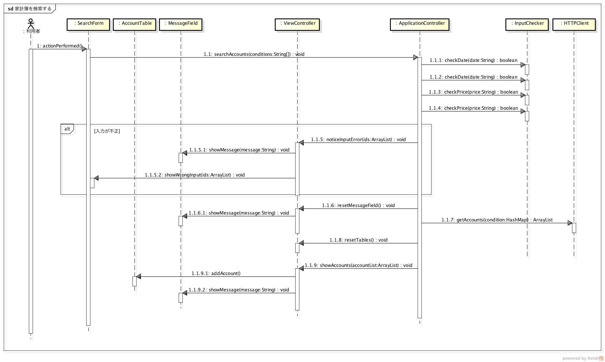

詳細仕様
========

設計仕様では以下を定義する

  - `モジュール構成 <http://localhost/zosma_docs/design_spec.html#id2>`__
  - `処理手順 <http://localhost/zosma_docs/design_spec.html#id3>`__

モジュール構成
--------------

**クラス図**

- MVCモデルを利用する

- Model

  - データベースに登録されている情報を表示するだけのモジュールであるためModelは存在しない

- View

  - AccountTable

    - 取得した家計簿を表示するテーブル

  - SerachForm

    - 検索条件を入力するテキストフィールド

  - MessageField

    - エラー等を表示するテキストフィールド

- Controller

  - ApplicationController

    - アプリ全体を管理するコントローラー

  - ViewController

    - ビューの各コンポーネントを管理するコントローラー

- InputChecker

  - 入力された条件のフォーマットが正しいかどうかをチェックするクラス

- HTTPClient

  - DBサーバにリクエストを送信するクラス

処理手順
--------

- `家計簿を検索する <http://localhost/zosma_docs/design_spec.html#id4>`__

家計簿を検索する
^^^^^^^^^^^^^^^^

**シーケンス図**

- 利用者が検索画面を開いてから家計簿を表示するまでの流れ

  1. 利用者が検索条件を入力して登録ボタンを押すと，actionPerformedメソッドが実行される
  2. 入力された条件を引数にして，searchAccountsメソッドが実行される
  3. checkDateメソッドで日付のフォーマットのチェックを行う
  4. checkPriceメソッドで金額のチェックを行う
  5. 不正な条件があればMessageFieldにエラーを通知する文字列をセットする
  6. さらに，SearchForm内の不正な入力があった項目に対応するラベルにチェックマークをセットする
  7. 入力された条件に問題が無ければ，getAccountsメソッドを実行してリクエストを送信する
  8. 取得した家計簿をテーブルに表示する
  9. 取得した家計簿の数をMessageFieldに表示する
