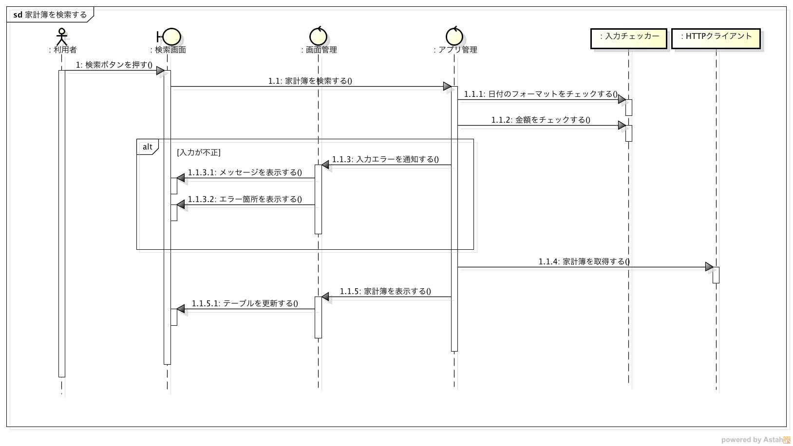
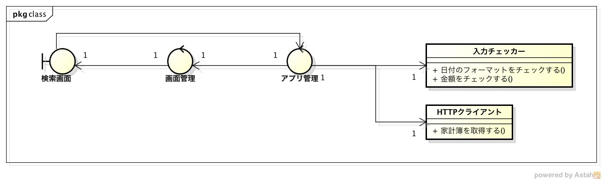

機能仕様
========

- 本モジュールの振る舞いと構造を記載する

  - `振る舞い <http://localhost/zosma_docs/external.html#id2>`__
  - `構造 <http://localhost/zosma_docs/external.html#id4>`__

振る舞い
--------

- `家計簿を検索する <http://localhost/zosma_docs/external.html#id3>`__

家計簿を検索する
^^^^^^^^^^^^^^^^

**シーケンス図**

- 利用者が検索条件を入力して家計簿情報を参照するまでの流れ

  1. 利用者が検索条件を入力して検索ボタンを押す
  2. 入力された検索条件のチェックを行う
  3. 不正な入力があればエラーを通知する
  4. 入力に問題が無ければサーバにリクエストを送信して家計簿を取得する
  5. 取得した家計簿情報を画面に表示する

構造
----

**クラス図**

- MVCモデルを利用する

- Model

- View

  - 検索画面

- Controller

  - 画面管理
