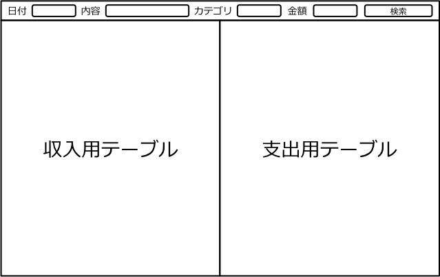

機能仕様
========

機能仕様では以下を定義する

- `ユーザーインターフェース <http://localhost/zosma_docs/functional_spec.html#id2>`__
- `データ構造 <http://localhost/zosma_docs/functional_spec.html#id4>`__

ユーザインターフェース
----------------------

利用者はアプリを操作して家計簿を検索する

検索画面
^^^^^^^^

**機能**

- 画面上部に検索条件を入力するテキストボックスが表示される

- 検索条件を入力して検索ボタンを押すと家計簿が表示される

- 家計簿は収入・支出に分けて表示される

- 何も入力せずに検索ボタンを押すと全家計簿が表示される

- 家計簿は日付の降順で表示される

- エラー通知などのメッセージは画面下部に表示される

データ構造
----------

本モジュールでは以下のデータを扱う

- `家計簿 <http://localhost/zosma_docs/functional_spec.html#id5>`__

家計簿
^^^^^^

- 買い物などで発生した所持金の増減を表す

構成要素
""""""""

.. csv-table::
   :header: "要素", "意味"
   :widths: 10, 30

   "日付", "所持金の増減があった日時"
   "内容", "所持金の増減があった理由など"
   "カテゴリ", "費目（例：食費，水道光熱費）"
   "金額", "所持金の増減"
